# AmazonWebService

## TABLE OF CONTENT 

* [**INTRODUCTION**](#introduction)<!-- style="font-size:20px" -->
* [**SECURITY**](#security) <!-- style="font-size:20px" -->
* **COMPUTE I**<!-- style="font-size:20px" -->
* **COMPUTE II**<!-- style="font-size:20px" -->
* **STORAGE AND DELIVERY**<!-- style="font-size:20px" -->
* **NETWORKING**<!-- style="font-size:20px" -->

## INTRODUCTION 

* AWS stands for Amazon Web Services.
* The AWS service is provided by the Amazon that uses distributed IT infrastructure to provide different IT resources available on demand. It provides different services such as infrastructure as a service (IaaS), platform as a service (PaaS) and packaged software as a service (SaaS).
* Amazon launched AWS, a cloud computing platform to allow the different organizations to take advantage of reliable IT infrastructure.

[**What is Cloud Computing**](#what-is-cloud-computing)

[**Introduction to AWS**](#introduction-to-aws)

[**AWS Global Infrastructure**](#aws-global-infrastructure)

[**Create an AWS Account**](#create-an-aws-account)

### **What is Cloud Computing**

Cloud computing is a model for delivering computing resources, including servers, storage, applications, and services over the internet. It enables users to access a pool of shared computing resources, rather than owning and maintaining their own infrastructure.

Cloud computing can be categorized into three main types of services: 

1. Infrastructure as a Service (IaaS): provides virtualized computing resources, such as servers, storage, and networking, on a pay-per-use basis. 

2. Platform as a Service (PaaS): offers a complete development and deployment environment for applications, including tools, libraries, and frameworks. 

3. Software as a Service (SaaS): delivers applications over the internet on a subscription basis, eliminating the need to install and maintain software locally.

Cloud computing offers several benefits, including scalability, flexibility, cost savings, and ease of use. It allows organizations to quickly provision and deprovision resources, scale up or down based on demand, and pay only for what they use.

### **Introduction to AWS**

Amazon Web Services (AWS) is a comprehensive cloud computing platform provided by Amazon that offers a wide range of services and tools for building and deploying scalable and reliable applications. AWS provides a vast collection of cloud-based services that include computing, storage, databases, analytics, machine learning, and much more.

AWS provides a pay-as-you-go model, where customers are charged based on their usage of each service. The platform is designed to provide scalable, reliable, and secure infrastructure, enabling businesses to quickly and easily deploy their applications and services on a global scale.

AWS offers several benefits, including:

**Scalability**: AWS can automatically scale resources up or down based on application demand, enabling businesses to easily accommodate sudden spikes in traffic or usage.

**Reliability**: AWS provides multiple availability zones and redundancy options, ensuring high availability and uptime for applications and services.

**Security**: AWS offers a comprehensive set of security tools and features, including encryption, identity and access management, and network security, ensuring the safety of data and applications.

**Flexibility**: AWS offers a vast array of services and tools, allowing businesses to choose the ones that best meet their needs and easily integrate with their existing systems.

Overall, AWS is a powerful cloud computing platform that provides businesses with the tools and services they need to build, deploy, and manage their applications and services on a global scale.

### AWS Global Infrastructure

* AWS is a cloud computing platform which is globally available.
* Global infrastructure is a region around the world in which AWS is based. Global infrastructure is a bunch of high-level IT services which is shown below:
* AWS is available in 19 regions, and 57 availability zones in December 2018 and 5 more regions 15 more availability zones for 2019.

The following are the components that make up the AWS infrastructure:

* [**Availability Zones**](#availability-zone-as-a-data-center)
* [**Region**](#region)
* [**Edge locations**](#edge-locations)
* [**Regional Edge Caches**](#regional-edge-cache)

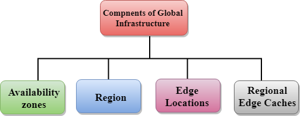

#### Availability zone as a Data Center

* An availability zone is a facility that can be somewhere in a country or in a city. Inside this facility, i.e., Data Centre, we can have multiple servers, switches, load balancing, firewalls. The things which interact with the cloud sits inside the data centers.
* An availability zone can be a several data centers, but if they are close together, they are counted as 1 availability zone.

#### Region

* A region is a geographical area. Each region consists of 2 more availability zones.
* A region is a collection of data centers which are completely isolated from other regions.
* A region consists of more than two availability zones connected to each other through links.

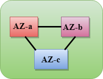

* Availability zones are connected through redundant and isolated metro fibers.

#### Edge Locations

* Edge locations are the endpoints for AWS used for caching content.
* Edge locations consist of CloudFront, Amazon's Content Delivery Network (CDN).
* Edge locations are more than regions. Currently, there are over 150 edge locations.
* Edge location is not a region but a small location that AWS have. It is used for caching the content.
* Edge locations are mainly located in most of the major cities to distribute the content to end users with reduced latency.
* For example, some user accesses your website from Singapore; then this request would be redirected to the edge location closest to Singapore where cached data can be read.

#### Regional Edge Cache

* AWS announced a new type of edge location in November 2016, known as a Regional Edge Cache.
* Regional Edge cache lies between CloudFront Origin servers and the edge locations.
* A regional edge cache has a large cache than an individual edge location.
* Data is removed from the cache at the edge location while the data is retained at the Regional Edge Caches.
* When the user requests the data, then data is no longer available at the edge location. Therefore, the edge location retrieves the cached data from the Regional edge cache instead of the Origin servers that have high latency.

### **Create an AWS Account**

1. First Open your web browser and navigate to [AWS Free Tier Page](https://aws.amazon.com/free/?all-free-tier.sort-by=item.additionalFields.SortRank&all-free-tier.sort-order=asc&awsf.Free%20Tier%20Types=*all&awsf.Free%20Tier%20Categories=*all)

2. On middle click of Create a Free Account

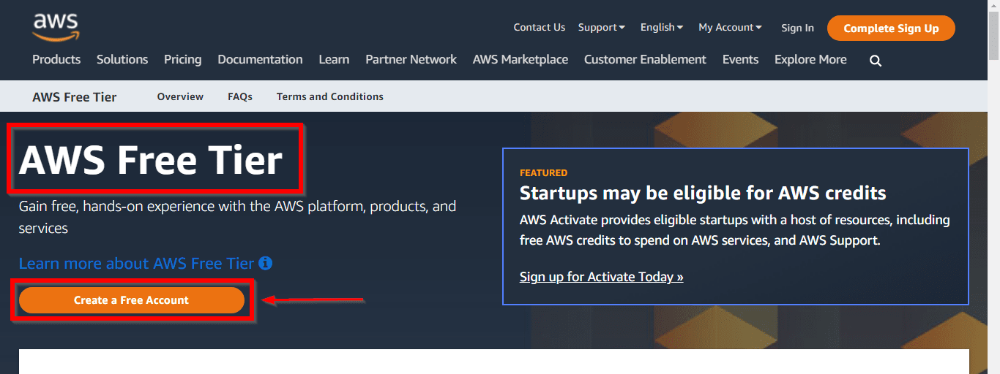

3.  Issue the details which you want to use to log in to your AWS account and click on Continue

* Email address: Provide the mail id which hasn’t been registered yet with Amazon AWS.
* Password: Type your password.
* Confirm password: Authenticate the password.
* AWS Account name: Choose a name for your account. You can change this name in your account settings after you sign up.

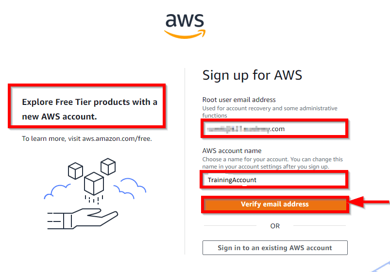

4.  Contact Information

Select your AWS type (Profesional/ Personal) Fill in the correct information to validate your account if you’re going to create personal use then click on “Personal Account” else use “Company Account”, Accepts the Terms and condition and then click on Create Account and Continue

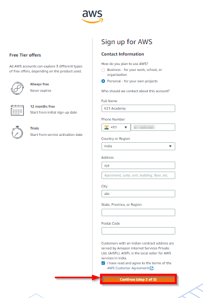

**Note**: Make sure to provide proper contact details and mobile number to get the Verification code from AWS.

5. Payment and PAN information: In this step, you must fill in your credit card /Debit Card info and billing address and click on Secure Submit.

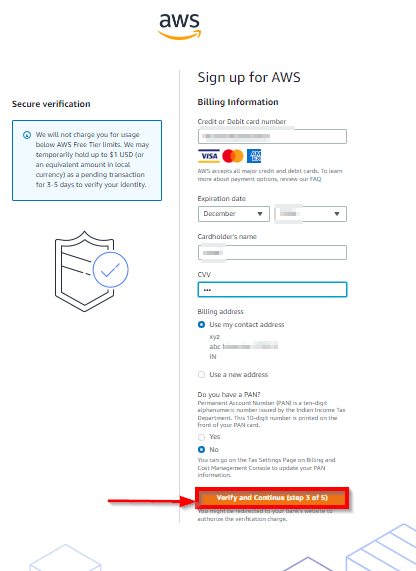

6.  In this step, it will take you to the payment gateway to validate your payment information and for your credit card verification, Amazon will charge the minimum price based on Country. Here I have provided India, so Amazon charged 2 INR.

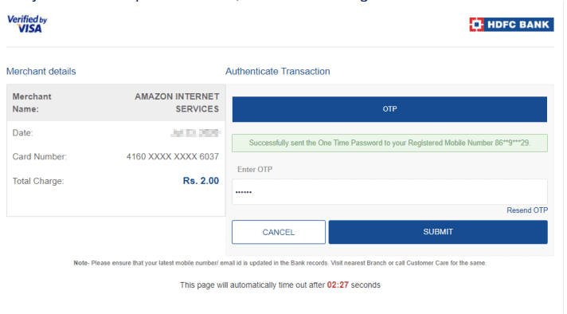

7. Phone verification: Here you will be taken to an identity verification page that will already have your phone number, so you just have to select either “Text message or Voice call” Provide a valid phone number, Solve the captcha, and then click on Send SMS or Call Me Now(depending upon your selection).

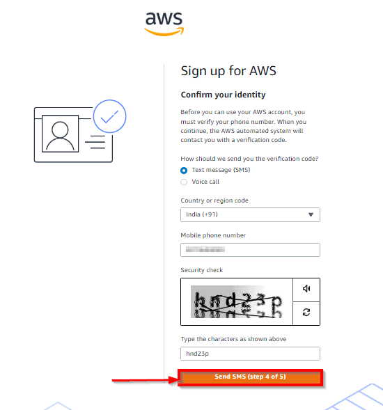

8. After clicking on Send SMS or Call me Now, you will immediately receive a call or SMS from Amazon, for verification code, Enter your code then click on Verify Code.

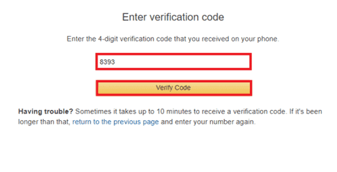

9. Support plan: AWS support offers a selection of plans to meet your business needs.
Select your suitable plan then click continue.

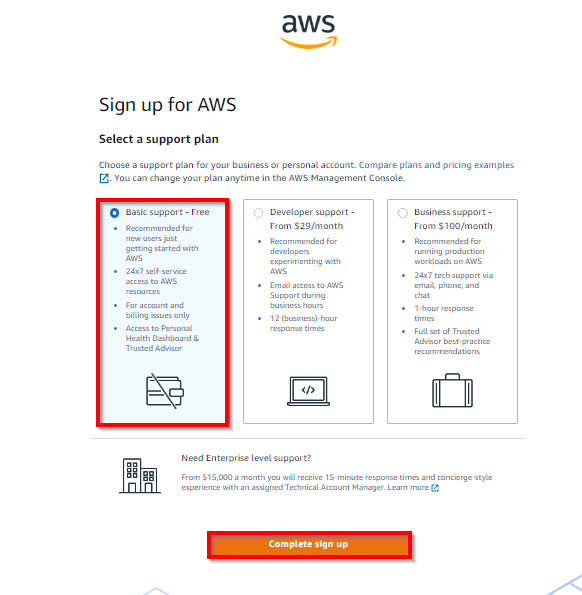

10.  Registration Confirmation page.
Once you completed all the above steps and processes. You’ll get the confirmation page as below. Now your account will be processed for activation. It may take somewhere between 30 minutes to 1 hour for you to receive an email confirmation that your Amazon Cloud Services account has been activated.

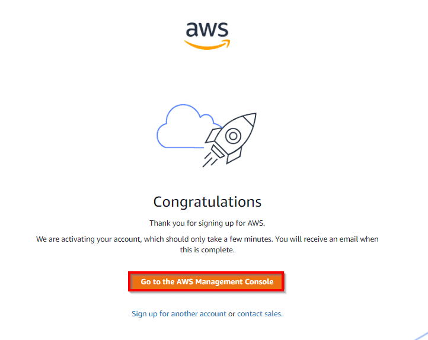

## **SECURITY**

* [**Shared responsibility model**](#shared-responsibility-model)  <!-- style="font-size:18px" -->
* [**Security services overview**](#security-services-overview)  <!-- style="font-size:18px" -->
* [**Identity & Access Management (IAM)**](#identity-and-access-management) <!-- style="font-size:18px" -->
* [**MFA**](#mfa)  <!-- style="font-size:18px" -->
* Users, Groups & Roles  <!-- style="font-size:18px" -->
* Permission management  <!-- style="font-size:18px" -->
* Password policy  <!-- style="font-size:18px" -->

### Shared responsibility model

The AWS shared responsibility model is a concept of dividing responsibilities between AWS and a Customer.

AWS's responsibilities are the security of the cloud.

Customer responsibilities are security in the cloud.

**Responsibility of AWS** <!-- style="font-size:18px" -->

AWS's responsibility is the security of the cloud.

AWS manages all infrastructure layers.

Some of the infrastructure layers are:

* Data centers
* Hardware and software
* Virtualization
* Networking

**Responsibility of a Customer** <!-- style="font-size:18px" -->

Customers' responsibility is the security of everything they make in AWS Cloud.

Customers (you) have complete control over your content.

Customer manages AWS services, software, and access to the data.

### Security services overview

AWS Security is responsible for protecting the global infrastructure that runs all the Amazon Web Services cloud services and the cloud itself. This infrastructure includes the hardware, software, and networks. Amazon Web Services has its priority in protecting this network.

**Benefits of Security Services** <!-- style="font-size:18px" -->

* **Keeps Data Safe**: Infrastructure incorporates strong safeguards to help protect privacy. All data is processed in highly protected data centers.
* **Meets Compliance Requirements**: Manages dozens of compliance programs in its infrastructure. Organizations meet compliance effortlessly
* **Saves Operational Cost**: Operational cost reduces as organizations don't have to maintain on-premise facilities. 
* **Scales Quickly**: Security scales with the organization's usage of Amazon Web Services Cloud. The architecture is built to keep data secure, no matter the size of the enterprise.

Here are some of the most commonly used security services in AWS:

* **IAM (Identity and Access Management)**: This service allows you to manage user access to AWS resources by creating and managing users, groups, and roles. IAM helps you control who can access your resources and what actions they can perform.

* **AWS WAF (Web Application Firewall)**: This service helps protect your web applications from common web exploits such as SQL injection and cross-site scripting (XSS) attacks. You can configure AWS WAF to block or allow traffic based on rules that you define.

* **AWS Shield**: This service provides DDoS (Distributed Denial of Service) protection for your applications running on AWS. AWS Shield helps you mitigate the impact of DDoS attacks by automatically detecting and blocking them.

* **AWS Key Management Service (KMS)**: This service allows you to create and manage encryption keys used to encrypt your data in AWS. You can use AWS KMS to encrypt data at rest and in transit, and to control access to your encryption keys.

* **Amazon GuardDuty**: This service is a threat detection service that continuously monitors your AWS environment for malicious activity. GuardDuty can detect activity such as compromised credentials, reconnaissance, and unauthorized access, and provides alerts for you to take action.

* **Amazon Inspector**: This service helps you assess the security and compliance of your applications and infrastructure on AWS. Inspector analyzes your applications and infrastructure against security best practices and industry standards, and provides a detailed report of findings.

### Identity and Access Management

IAM (Identity and Access Management) is a service offered by AWS that allows you to manage access to AWS resources. IAM provides a way to create and manage users, groups, and roles, and assign permissions to them to control access to AWS resources.

**Features of IAM** <!-- style="font-size:18px" -->

* **Centralized user management**: IAM provides a central location for managing users and their access to AWS resources. This makes it easy to add, remove, or modify user access across multiple AWS services.

* **Fine-grained access control**: IAM allows you to grant permissions at a granular level, specifying which actions a user can perform on specific resources. This gives you precise control over access to resources and helps minimize the risk of accidental or unauthorized access.

* **Multi-factor authentication (MFA)**: IAM supports MFA, which requires users to provide two forms of authentication (such as a password and a code sent to a mobile device) in order to access AWS resources. This helps prevent unauthorized access even if a user's password is compromised.

* **Role-based access control**: IAM allows you to create roles that define a set of permissions that can be assumed by trusted entities such as AWS services, applications, or users. Roles enable you to grant temporary permissions to an entity without requiring long-term access keys.

* **Audit trails**: IAM provides detailed logs that allow you to track who accessed which resources and when. This helps you monitor and detect any unauthorized access attempts or unusual activity.

* **Integration with other AWS services**: IAM integrates with other AWS services such as Amazon S3, EC2, and RDS, allowing you to control access to these resources using IAM policies.

### MFA

**MFA (Multi-Factor Authentication)** is a security feature that adds an extra layer of protection to your AWS account. With MFA, a user is required to provide two or more forms of authentication before being granted access to their AWS resources. This helps protect against unauthorized access even if a user's password is compromised.

There are several types of MFA supported by AWS, including:

* **Virtual MFA**: This type of MFA uses a smartphone app, such as Google Authenticator or Authy, to generate a unique, time-based code that is required in addition to the user's password to access an AWS resource.

* **Hardware MFA**: This type of MFA uses a physical device, such as a YubiKey, to generate a unique code that is required in addition to the user's password to access an AWS resource.

* **SMS MFA**: This type of MFA sends a unique code to the user's mobile phone via SMS that is required in addition to the user's password to access an AWS resource.

MFA is an important security feature that helps protect your AWS resources against unauthorized access. By requiring users to provide an additional form of authentication in addition to their password, MFA can help prevent attackers from gaining access to your account, even if they have obtained your password through phishing or other means. It is recommended that MFA is enabled for all users in your AWS account.