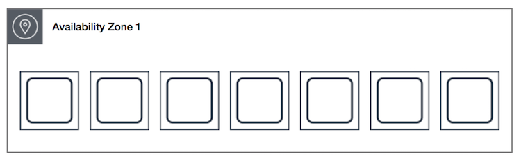

# AmazonWebService


## **TABLE OF CONTENT** 

* [**INTRODUCTION**](#introduction)<!-- style="font-size:20px" -->
* [**SECURITY**](#security) <!-- style="font-size:20px" -->
* [**COMPUTE I**](#compute-i) <!-- style="font-size:20px" -->
* [**COMPUTE II**](#compute-ii)<!-- style="font-size:20px" -->
* **STORAGE AND DELIVERY**<!-- style="font-size:20px" -->
* **NETWORKING**<!-- style="font-size:20px" -->

## **INTRODUCTION** 

* AWS stands for Amazon Web Services.
* The AWS service is provided by the Amazon that uses distributed IT infrastructure to provide different IT resources available on demand. It provides different services such as infrastructure as a service (IaaS), platform as a service (PaaS) and packaged software as a service (SaaS).
* Amazon launched AWS, a cloud computing platform to allow the different organizations to take advantage of reliable IT infrastructure.

[**What is Cloud Computing**](#what-is-cloud-computing)

[**Introduction to AWS**](#introduction-to-aws)

[**AWS Global Infrastructure**](#aws-global-infrastructure)

[**Create an AWS Account**](#create-an-aws-account)

### **What is Cloud Computing**

Cloud computing is a model for delivering computing resources, including servers, storage, applications, and services over the internet. It enables users to access a pool of shared computing resources, rather than owning and maintaining their own infrastructure.

Cloud computing can be categorized into three main types of services: 

1. Infrastructure as a Service (IaaS): provides virtualized computing resources, such as servers, storage, and networking, on a pay-per-use basis. 

2. Platform as a Service (PaaS): offers a complete development and deployment environment for applications, including tools, libraries, and frameworks. 

3. Software as a Service (SaaS): delivers applications over the internet on a subscription basis, eliminating the need to install and maintain software locally.

Cloud computing offers several benefits, including scalability, flexibility, cost savings, and ease of use. It allows organizations to quickly provision and deprovision resources, scale up or down based on demand, and pay only for what they use.

### **Introduction to AWS**

Amazon Web Services (AWS) is a comprehensive cloud computing platform provided by Amazon that offers a wide range of services and tools for building and deploying scalable and reliable applications. AWS provides a vast collection of cloud-based services that include computing, storage, databases, analytics, machine learning, and much more.

AWS provides a pay-as-you-go model, where customers are charged based on their usage of each service. The platform is designed to provide scalable, reliable, and secure infrastructure, enabling businesses to quickly and easily deploy their applications and services on a global scale.

AWS offers several benefits, including:

**Scalability**: AWS can automatically scale resources up or down based on application demand, enabling businesses to easily accommodate sudden spikes in traffic or usage.

**Reliability**: AWS provides multiple availability zones and redundancy options, ensuring high availability and uptime for applications and services.

**Security**: AWS offers a comprehensive set of security tools and features, including encryption, identity and access management, and network security, ensuring the safety of data and applications.

**Flexibility**: AWS offers a vast array of services and tools, allowing businesses to choose the ones that best meet their needs and easily integrate with their existing systems.

Overall, AWS is a powerful cloud computing platform that provides businesses with the tools and services they need to build, deploy, and manage their applications and services on a global scale.

### **AWS Global Infrastructure**

* AWS is a cloud computing platform which is globally available.
* Global infrastructure is a region around the world in which AWS is based. Global infrastructure is a bunch of high-level IT services which is shown below:
* AWS is available in 19 regions, and 57 availability zones in December 2018 and 5 more regions 15 more availability zones for 2019.

The following are the components that make up the AWS infrastructure:

* [**Availability Zones**](#availability-zone-as-a-data-center)
* [**Region**](#region)
* [**Edge locations**](#edge-locations)
* [**Regional Edge Caches**](#regional-edge-cache)


#### **Availability zone as a Data Center**

* An availability zone is a facility that can be somewhere in a country or in a city. Inside this facility, i.e., Data Centre, we can have multiple servers, switches, load balancing, firewalls. The things which interact with the cloud sits inside the data centers.
* An availability zone can be a several data centers, but if they are close together, they are counted as 1 availability zone.

#### **Region**

* A region is a geographical area. Each region consists of 2 more availability zones.
* A region is a collection of data centers which are completely isolated from other regions.
* A region consists of more than two availability zones connected to each other through links.


* Availability zones are connected through redundant and isolated metro fibers.

#### **Edge Locations**

* Edge locations are the endpoints for AWS used for caching content.
* Edge locations consist of CloudFront, Amazon's Content Delivery Network (CDN).
* Edge locations are more than regions. Currently, there are over 150 edge locations.
* Edge location is not a region but a small location that AWS have. It is used for caching the content.
* Edge locations are mainly located in most of the major cities to distribute the content to end users with reduced latency.
* For example, some user accesses your website from Singapore; then this request would be redirected to the edge location closest to Singapore where cached data can be read.

#### **Regional Edge Cache**

* AWS announced a new type of edge location in November 2016, known as a Regional Edge Cache.
* Regional Edge cache lies between CloudFront Origin servers and the edge locations.
* A regional edge cache has a large cache than an individual edge location.
* Data is removed from the cache at the edge location while the data is retained at the Regional Edge Caches.
* When the user requests the data, then data is no longer available at the edge location. Therefore, the edge location retrieves the cached data from the Regional edge cache instead of the Origin servers that have high latency.

### **Create an AWS Account**

1. First Open your web browser and navigate to [AWS Free Tier Page](https://aws.amazon.com/free/?all-free-tier.sort-by=item.additionalFields.SortRank&all-free-tier.sort-order=asc&awsf.Free%20Tier%20Types=*all&awsf.Free%20Tier%20Categories=*all)

2. On middle click of Create a Free Account


3.  Issue the details which you want to use to log in to your AWS account and click on Continue

* Email address: Provide the mail id which hasn’t been registered yet with Amazon AWS.
* Password: Type your password.
* Confirm password: Authenticate the password.
* AWS Account name: Choose a name for your account. You can change this name in your account settings after you sign up.


4.  Contact Information

Select your AWS type (Profesional/ Personal) Fill in the correct information to validate your account if you’re going to create personal use then click on “Personal Account” else use “Company Account”, Accepts the Terms and condition and then click on Create Account and Continue


**Note**: Make sure to provide proper contact details and mobile number to get the Verification code from AWS.

5. Payment and PAN information: In this step, you must fill in your credit card /Debit Card info and billing address and click on Secure Submit.


6.  In this step, it will take you to the payment gateway to validate your payment information and for your credit card verification, Amazon will charge the minimum price based on Country. Here I have provided India, so Amazon charged 2 INR.


7. Phone verification: Here you will be taken to an identity verification page that will already have your phone number, so you just have to select either “Text message or Voice call” Provide a valid phone number, Solve the captcha, and then click on Send SMS or Call Me Now(depending upon your selection).


8. After clicking on Send SMS or Call me Now, you will immediately receive a call or SMS from Amazon, for verification code, Enter your code then click on Verify Code.


9. Support plan: AWS support offers a selection of plans to meet your business needs.
Select your suitable plan then click continue.


10.  Registration Confirmation page.
Once you completed all the above steps and processes. You’ll get the confirmation page as below. Now your account will be processed for activation. It may take somewhere between 30 minutes to 1 hour for you to receive an email confirmation that your Amazon Cloud Services account has been activated.


## **SECURITY**

* [**Shared responsibility model**](#shared-responsibility-model)  <!-- style="font-size:18px" -->
* [**Security services overview**](#security-services-overview)  <!-- style="font-size:18px" -->
* [**Identity & Access Management (IAM)**](#identity-and-access-management) <!-- style="font-size:18px" -->
* [**MFA**](#mfa)  <!-- style="font-size:18px" -->
* [**Users, Groups and Roles**](#users-groups-and-roles)  <!-- style="font-size:18px" -->
* [**Permission management**](#permission-management)  <!-- style="font-size:18px" -->
* [**Password policy**](#password-policy)  <!-- style="font-size:18px" -->

### **Shared responsibility model**

The AWS shared responsibility model is a concept of dividing responsibilities between AWS and a Customer.

AWS's responsibilities are the security of the cloud.

Customer responsibilities are security in the cloud.


**Responsibility of AWS** <!-- style="font-size:18px" -->

AWS's responsibility is the security of the cloud.

AWS manages all infrastructure layers.

Some of the infrastructure layers are:

* Data centers
* Hardware and software
* Virtualization
* Networking

**Responsibility of a Customer** <!-- style="font-size:18px" -->

Customers' responsibility is the security of everything they make in AWS Cloud.

Customers (you) have complete control over your content.

Customer manages AWS services, software, and access to the data.

### **Security services overview**

AWS Security is responsible for protecting the global infrastructure that runs all the Amazon Web Services cloud services and the cloud itself. This infrastructure includes the hardware, software, and networks. Amazon Web Services has its priority in protecting this network.

**Benefits of Security Services** <!-- style="font-size:18px" -->

* **Keeps Data Safe**: Infrastructure incorporates strong safeguards to help protect privacy. All data is processed in highly protected data centers.
* **Meets Compliance Requirements**: Manages dozens of compliance programs in its infrastructure. Organizations meet compliance effortlessly
* **Saves Operational Cost**: Operational cost reduces as organizations don't have to maintain on-premise facilities. 
* **Scales Quickly**: Security scales with the organization's usage of Amazon Web Services Cloud. The architecture is built to keep data secure, no matter the size of the enterprise.

Here are some of the most commonly used security services in AWS:

* **IAM (Identity and Access Management)**: This service allows you to manage user access to AWS resources by creating and managing users, groups, and roles. IAM helps you control who can access your resources and what actions they can perform.

* **AWS WAF (Web Application Firewall)**: This service helps protect your web applications from common web exploits such as SQL injection and cross-site scripting (XSS) attacks. You can configure AWS WAF to block or allow traffic based on rules that you define.

* **AWS Shield**: This service provides DDoS (Distributed Denial of Service) protection for your applications running on AWS. AWS Shield helps you mitigate the impact of DDoS attacks by automatically detecting and blocking them.

* **AWS Key Management Service (KMS)**: This service allows you to create and manage encryption keys used to encrypt your data in AWS. You can use AWS KMS to encrypt data at rest and in transit, and to control access to your encryption keys.

* **Amazon GuardDuty**: This service is a threat detection service that continuously monitors your AWS environment for malicious activity. GuardDuty can detect activity such as compromised credentials, reconnaissance, and unauthorized access, and provides alerts for you to take action.

* **Amazon Inspector**: This service helps you assess the security and compliance of your applications and infrastructure on AWS. Inspector analyzes your applications and infrastructure against security best practices and industry standards, and provides a detailed report of findings.

### **Identity and Access Management**

IAM (Identity and Access Management) is a service offered by AWS that allows you to manage access to AWS resources. IAM provides a way to create and manage users, groups, and roles, and assign permissions to them to control access to AWS resources.


**Features of IAM** <!-- style="font-size:18px" -->

* **Centralized user management**: IAM provides a central location for managing users and their access to AWS resources. This makes it easy to add, remove, or modify user access across multiple AWS services.

* **Fine-grained access control**: IAM allows you to grant permissions at a granular level, specifying which actions a user can perform on specific resources. This gives you precise control over access to resources and helps minimize the risk of accidental or unauthorized access.

* **Multi-factor authentication (MFA)**: IAM supports MFA, which requires users to provide two forms of authentication (such as a password and a code sent to a mobile device) in order to access AWS resources. This helps prevent unauthorized access even if a user's password is compromised.

* **Role-based access control**: IAM allows you to create roles that define a set of permissions that can be assumed by trusted entities such as AWS services, applications, or users. Roles enable you to grant temporary permissions to an entity without requiring long-term access keys.

* **Audit trails**: IAM provides detailed logs that allow you to track who accessed which resources and when. This helps you monitor and detect any unauthorized access attempts or unusual activity.

* **Integration with other AWS services**: IAM integrates with other AWS services such as Amazon S3, EC2, and RDS, allowing you to control access to these resources using IAM policies.

### **MFA**

**MFA (Multi-Factor Authentication)** is a security feature that adds an extra layer of protection to your AWS account. With MFA, a user is required to provide two or more forms of authentication before being granted access to their AWS resources. This helps protect against unauthorized access even if a user's password is compromised.

There are several types of MFA supported by AWS, including:

* **Virtual MFA**: This type of MFA uses a smartphone app, such as Google Authenticator or Authy, to generate a unique, time-based code that is required in addition to the user's password to access an AWS resource.

* **Hardware MFA**: This type of MFA uses a physical device, such as a YubiKey, to generate a unique code that is required in addition to the user's password to access an AWS resource.

* **SMS MFA**: This type of MFA sends a unique code to the user's mobile phone via SMS that is required in addition to the user's password to access an AWS resource.

MFA is an important security feature that helps protect your AWS resources against unauthorized access. By requiring users to provide an additional form of authentication in addition to their password, MFA can help prevent attackers from gaining access to your account, even if they have obtained your password through phishing or other means. It is recommended that MFA is enabled for all users in your AWS account.

### **Users Groups and Roles**

In AWS Identity and Access Management (IAM), users, groups, and roles are three fundamental entities used to manage access to AWS resources.

* [**Users**](#users): An IAM user is an entity that represents a person or application that interacts with AWS resources. You can create IAM users and assign them unique security credentials such as access keys, passwords, or multi-factor authentication (MFA) devices. You can also grant permissions to users by attaching policies to them.

* [**Groups**](#groups): An IAM group is a collection of IAM users. You can use groups to organize users and apply permissions to multiple users at once. By assigning policies to a group, you can ensure that all members of the group have the same level of access to AWS resources.

* [**Roles**](#roles): An IAM role is an entity that defines a set of permissions that can be assumed by AWS resources. You can use roles to grant permissions to an AWS service or resource so that it can access other AWS resources. For example, you can create a role that allows an Amazon EC2 instance to access an Amazon S3 bucket.

Roles are also used for cross-account access, where you can define a role in one account and allow users or resources in another account to assume that role and access resources in the first account. This is a common scenario for organizations that use multiple AWS accounts to isolate and manage their resources.

Overall, users, groups, and roles are used to manage access to AWS resources and ensure that only authorized users and services can interact with them. By assigning appropriate permissions and following the principle of least privilege, you can minimize the risk of unauthorized access and protect the security of your AWS resources.

#### **Users**

To create an IAM user in AWS, you can follow these steps:

* Sign in to the AWS Management Console and open the IAM console.
* In the navigation pane, choose "Users".
* Choose "Add user".
* Enter a name for the new user in the "User name" field.
* If you want to allow programmatic access to the AWS API, select the "Programmatic access" checkbox. If you want to allow the user to sign in to the AWS Management Console, select the "AWS Management Console access" checkbox.
* Depending on whether you selected "Programmatic access" or "AWS Management Console access" (or both), you may need to specify additional options such as a password or permissions.
* If you want to add the user to a group, choose "Add user to group" and select an existing group or create a new one.
* Review the user's settings and choose "Create user".


Once the user is created, you can view their security credentials, including their access key and secret access key, which can be used for programmatic access to AWS resources. You can also assign permissions to the user by creating IAM policies and attaching them to the user or the group to which the user belongs.

Note that when creating an IAM user, it is important to follow the principle of least privilege, which means granting the user only the permissions that are necessary to perform their job duties and no more. This helps minimize the risk of accidental or malicious actions that could compromise the security of your AWS resources.

#### **Groups**

To create an IAM group in AWS, you can follow these steps:

* Sign in to the AWS Management Console and open the IAM console.
* In the navigation pane, choose "Groups".
* Choose "Create New Group".
* Enter a name for the group in the "Group Name" field.
* Choose the policy you want to attach to the group by selecting "Attach Policy" and then selecting a policy from the list. You can also create a custom policy by selecting "Create Policy".
* Choose "Create Group" to create the group and attach the policy.


Once you have created the group, you can add IAM users to the group by selecting the group in the IAM console, choosing the "Users" tab, and then choosing "Add Users to Group". You can then select the users you want to add to the group and choose "Add Users".

You can also manage the policies attached to the group by selecting the group in the IAM console, choosing the "Permissions" tab, and then choosing "Attach Policy" or "Create Policy".

#### **Roles**

To create an IAM role in AWS, you can follow these steps:

* Sign in to the AWS Management Console and open the IAM console.
* In the navigation pane, choose "Roles".
* Choose "Create role".
* Select the type of trusted entity that you want to use to assume the role. You can choose from AWS service, another AWS account, or web identity provider.
* Depending on the trusted entity you selected, you may need to specify additional details such as the service or account ID.
* Choose the permissions you want to grant to the role by selecting one or more policies. You can choose from managed policies, customer managed policies, or inline policies.
* Enter a name for the role in the "Role name" field.
* Review the role's settings and choose "Create role".


Once the role is created, you can assign it to an IAM user or an AWS resource such as an EC2 instance. When the user or resource assumes the role, they inherit the permissions granted to the role.

### **Permission management**

In AWS, permission management is the process of controlling who has access to your resources and what actions they can perform on those resources. AWS Identity and Access Management (IAM) is the service that provides the necessary tools for managing permissions in your AWS environment.

There are three main components to permission management in AWS:

* **Policies**: Policies are documents that define permissions for a specific resource or set of resources. They specify which actions are allowed or denied, and who has access to the resources. Policies can be attached to IAM users, groups, or roles.

* **Roles**: IAM roles are used to grant permissions to AWS resources or services. They can be assigned to EC2 instances, Lambda functions, or other resources, and provide access to other resources in your AWS account or other accounts.

* **Access control lists (ACLs)**: ACLs are used to manage permissions for S3 buckets and objects. They define which AWS accounts or users have permission to access the resources and what actions they can perform.

IAM provides several tools for managing permissions, including the ability to create custom policies, grant temporary permissions using IAM roles, and implement multi-factor authentication (MFA) for additional security. By using these tools and following best practices for permission management, you can help ensure the security and integrity of your AWS resources.

### **Password policy**

In AWS, password policies are used to enforce rules for creating and managing user passwords. Password policies help improve the security of your AWS environment by ensuring that user passwords are strong and regularly updated.

AWS Identity and Access Management (IAM) provides a default password policy that includes the following rules:

1. Passwords must be at least 8 characters long
2. Passwords must contain at least one uppercase letter, one lowercase letter, one number, and one non-alphanumeric character
3. Passwords cannot contain the user's username or any variation of their username
4. Users must change their passwords at least every 90 days
5. Users cannot reuse any of their previous passwords


You can customize the default password policy by changing the values of the above rules or by adding additional rules. To customize the password policy, you can follow these steps:

1. Sign in to the AWS Management Console and open the IAM console.
2. In the navigation pane, choose "Account settings".
3. Scroll down to the "Password Policy" section and choose "Edit".
4. Update the password policy rules as needed.
5. Choose "Save changes" to apply the new policy.


By setting and enforcing a strong password policy, you can help ensure the security of your AWS resources and prevent unauthorized access to your account. It is also important to educate your users on the importance of strong passwords and encourage them to use unique, complex passwords for their accounts.

## **COMPUTE I**

* [**Elastic Cloud Compute (EC2)**](#elastic-cloud-compute) <!-- style="font-size:18px" -->
* [**Types of VMs**](#types-of-vms) <!-- style="font-size:18px" -->
* [**Instance type pricing**](#instance-type-pricing) <!-- style="font-size:18px" -->
* [**Create EC2 Insatnce**](#create-ec2-insatnce) <!-- style="font-size:18px" -->
* [**Boot volume & EBS association**](#boot-volume-and-ebs-association) <!-- style="font-size:18px" -->
* [**Boot volume types**](#boot-volume-types) <!-- style="font-size:18px" -->
* [**Encryption options**](#encryption-options) <!-- style="font-size:18px" -->
* [**Tagging importance**](#tagging-importance) <!-- style="font-size:18px" -->
* [**Security Groups**](#security-groups) <!-- style="font-size:18px" -->
* [**Status check types**](#status-check-types) <!-- style="font-size:18px" -->
* [**Placement Groups**](#placement-groups) <!-- style="font-size:18px" -->
* [**SSH and manage instance**](#ssh-and-manage-instance) <!-- style="font-size:18px" -->
* [**Load balancing (App & Network)**](#load-balancing) <!-- style="font-size:18px" -->
* [**Health checks**](#health-checks) <!-- style="font-size:18px" -->
* [**Path based TG routing**](#path-based-tg-routing) <!-- style="font-size:18px" -->
* [**Lambda TG (with intro to lambda)**](#lambda-tg) <!-- style="font-size:18px" -->
* [**Load Balancer Configuration**](#load-balancer-configuration) <!-- style="font-size:18px" -->
* [**LambdaTG Configuration**](#configure-lambdatg) <!-- style="font-size:18px" -->

### **Elastic Cloud Compute**

Amazon Elastic Compute Cloud (EC2) is a web service that provides resizable compute capacity in the cloud. It is one of the core services in Amazon Web Services (AWS) and enables users to easily provision and manage virtual machines (VMs), also known as instances, on the AWS cloud.

EC2 offers a variety of instance types, each with different CPU, memory, storage, and network capacity configurations to meet the needs of different workloads. Users can launch instances on-demand, reserve them for a fixed period of time, or use spot instances to bid on spare compute capacity and reduce costs.


**Here are some of the key features of EC2:**

* **Scalability**: EC2 enables users to quickly and easily scale compute capacity up or down to meet changing demand, without the need for upfront investments in hardware.

* **Flexibility**: EC2 offers a wide range of instance types, operating systems, and software configurations, giving users the flexibility to choose the configuration that best fits their needs.

* **Security**: EC2 provides several security features to help protect instances and data, including network firewalls, encryption, and security groups.

* **Integration**: EC2 integrates with other AWS services such as Amazon S3, Amazon RDS, and AWS Identity and Access Management (IAM), making it easy to build and deploy complex, multi-tier applications on the AWS cloud.

* **Monitoring**: EC2 provides detailed monitoring and logging capabilities to help users track and troubleshoot performance issues, security incidents, and other events.

### **Types of VMs**

Amazon Elastic Compute Cloud (EC2) offers a wide variety of virtual machine (VM) instance types to meet the needs of different workloads and use cases. Here are some of the most commonly used EC2 instance types:


* [**Micro Instances**](#micro-instances)
* [**General Purpose**](#general-purpose)
* [**Compute Optimized**](#compute-optimized)
* [**Memory Optimized**](#memory-optimized)
* [**Storage Optimized**](#storage-optimized)
* [**GPU Instances**](#gpu-instances)
* [**FPGA Instances**](#fpga-instances)

#### **Micro Instances**

The EC2 micro instance type is a type of general purpose instance that provides a low-cost option for running lightweight workloads and small applications. It is designed for low traffic websites, small development and test workloads, and other low intensity applications.


#### **General Purpose**

General purpose instances are ideal for a wide range of workloads, including web servers, small databases, and development environments. They offer a balance of compute, memory, and network resources.


#### **Compute Optimized**

Compute optimized instances are designed for CPU-intensive workloads, such as high-performance computing (HPC), media encoding, and gaming servers. They offer high CPU-to-memory ratios and fast network performance.


#### **Memory Optimized**

Memory optimized instances are designed for memory-intensive workloads, such as large databases, in-memory analytics, and real-time big data processing. They offer high memory-to-CPU ratios and fast network performance.


#### **Storage Optimized**

Storage optimized instances are designed for storage-intensive workloads, such as NoSQL databases, data warehousing, and Elasticsearch. They offer high disk throughput and low latency, and are often used for applications that require large amounts of sequential read and write operations.


#### **GPU Instances**

GPU instances are designed for workloads that require high-performance graphics processing, such as machine learning, video encoding, and gaming. They offer access to powerful NVIDIA GPUs and are optimized for high-performance computing.


#### **FPGA Instances**

FPGA instances are designed for workloads that require custom hardware acceleration, such as genomics, financial modeling, and encryption. They offer access to field programmable gate arrays (FPGAs) that can be programmed to accelerate specific workloads.


### **Instance type pricing**

There are several pricing options available for EC2 instances:

* [**On-Demand Instances**](#on-demand-instances)
* [**Reserved Instances**](#reserved-instances)
* [**Scheduled Instances**](#scheduled-instances)
* [**Spot Instances**](#spot-instances)
* [**On Demand Capacity Reservations**](#on-demand-capacity-reservations)

#### **On Demand Instances**


#### **Reserved Instances**


#### **Scheduled Instances**


#### **Spot Instances**


#### **On Demand Capacity Reservations**


### **Create EC2 Insatnce**

1. Search EC2 in search bar and Select EC2 Instance 


2. To Create Instance click on Launch instance


3. Give the name for the instance


4. Select Application and OS Image


5. In Key Pair(Login) Select create new key pair


6. Give keypair name ,select Key Pair Type and file format and select create key pair and file will be downloaded


7. Select network settings


8. Connfigure storage


9. After all configuration select Launch Instance which will launch the instance


### **Boot volume and EBS association**

When launching an Amazon EC2 instance, the boot volume refers to the primary storage device that contains the operating system and boot files for the instance. By default, the boot volume is an Amazon Elastic Block Store (EBS) volume.

Here are the key points about boot volumes and EBS association:

* **Amazon EBS**: Amazon Elastic Block Store (EBS) provides block-level storage volumes that can be attached to EC2 instances. EBS volumes are network-attached and can persist independently of the running instance.

* **Boot Volume**: The boot volume is the primary storage device from which the EC2 instance starts up and runs. It contains the operating system, applications, and data. The boot volume is typically an EBS volume but can also be an instance store volume for certain instance types.

* **EBS-Backed Instances**: Most EC2 instances are EBS-backed, which means they use an EBS volume as the boot volume. EBS-backed instances allow for data persistence even if the instance is stopped or terminated.

* **EBS Volume Association**: When launching an EC2 instance, you can specify the EBS volume to be used as the boot volume. You can either create a new EBS volume or select an existing one. The instance will be associated with the specified EBS volume as its boot volume.

* **Elasticity and Management**: By using EBS-backed instances, you can easily manage and scale your EC2 instances. You can take snapshots of EBS volumes for backups, resize volumes, and detach and reattach volumes to other instances.

* **Instance Store Volumes**: Some EC2 instance types offer instance store volumes as the boot volume. Instance store volumes are physically attached to the host computer and provide temporary block-level storage that is lost if the instance is stopped or terminated.

### **Boot volume types**

When launching an Amazon EC2 instance, you have different options for selecting the type of boot volume. The boot volume type determines the characteristics and performance of the storage device used as the primary storage for the instance's operating system and boot files. The available boot volume types include:

**1. Amazon EBS (Elastic Block Store) Boot Volumes:**

* General Purpose SSD (gp2): This is the default boot volume type for most EC2 instances. It offers a balance of price and performance, suitable for a wide range of workloads.
* Provisioned IOPS SSD (io2): This boot volume type is optimized for high-performance applications that require low-latency and consistent I/O performance. It offers configurable IOPS (Input/Output Operations Per Second) to meet specific application requirements.
* Throughput Optimized HDD (st1): This boot volume type is designed for frequently accessed, throughput-intensive workloads, such as big data processing or log processing.
* Cold HDD (sc1): This boot volume type is designed for less frequently accessed workloads, providing low-cost storage for large volumes of data.

**2. Instance Store Boot Volumes:**

Instance store volumes are temporary block-level storage that is physically attached to the host computer where the EC2 instance is running. The data stored on instance store volumes is lost if the instance is stopped or terminated. The performance characteristics and capacity of instance store volumes vary depending on the EC2 instance type.
It's important to note that the availability of boot volume types may vary depending on the EC2 instance type and region. You can choose the appropriate boot volume type based on your workload requirements for performance, durability, and cost.

### **Encryption options**

the encryption options available for data security in Amazon EC2:

* EBS Encryption: Amazon Elastic Block Store (EBS) provides the option to encrypt EBS volumes at rest. EBS encryption uses AWS Key Management Service (KMS) to manage the encryption keys. By enabling EBS encryption, data stored on the EBS volumes is automatically encrypted, providing protection against unauthorized access.

* S3 Server-Side Encryption: If your EC2 instances interact with Amazon S3 for storage, you can enable server-side encryption for S3 objects. This ensures that any data uploaded to S3 is encrypted at rest. S3 supports multiple server-side encryption options, including Amazon S3 Managed Keys (SSE-S3), AWS Key Management Service (SSE-KMS), and Server-Side Encryption with Customer-Provided Keys (SSE-C).

* RDS Encryption: If your EC2 instances utilize Amazon RDS for managing databases, you can enable encryption for RDS database instances. RDS provides the option to encrypt data at rest, ensuring the privacy and security of your database content. RDS encryption supports both AWS Key Management Service (KMS) and Oracle Wallet Manager for managing encryption keys.

* Transit Encryption: To protect data while it is in transit between EC2 instances and other services or clients, you can use encryption protocols such as SSL/TLS. Implementing SSL/TLS encryption secures network communications and prevents eavesdropping or tampering with data in transit.

* Client-Side Encryption: If you have sensitive data that needs to be encrypted before being sent to an EC2 instance, you can implement client-side encryption. This involves encrypting the data on the client side before it is transmitted to the EC2 instance. The encrypted data can then be securely stored or processed on the instance.

### **Tagging importance**

Tagging is an important practice in AWS, including EC2 instances, as it provides numerous benefits for organization, management, and cost allocation. Here are some reasons why tagging is important:

* Resource Organization: Tags allow you to categorize and group your EC2 instances based on different criteria, such as application, environment (development, testing, production), project, or department. This helps in organizing and locating resources efficiently, especially in large-scale deployments.

* Cost Allocation and Budgeting: By assigning tags to EC2 instances, you can track and allocate costs based on specific tags. This enables you to gain visibility into resource usage and allocate expenses accurately across teams, projects, or cost centers. Tags can also help in setting up budget alerts and monitoring costs at a granular level.

* Resource Management and Automation: Tags play a crucial role in resource management and automation. You can use tags to control and manage EC2 instances through AWS services like AWS Identity and Access Management (IAM), AWS Config, and AWS Systems Manager. For example, you can define IAM policies based on tags to grant or restrict access to specific instances.

* Operational and Security Compliance: Tags assist in managing operational and security compliance requirements. You can use tags to identify instances with specific security requirements, compliance standards, or patch levels. This helps in monitoring and enforcing security controls, managing vulnerability assessments, or tracking compliance status.

* Automation and Resource Lifecycle: Tags can be used to automate resource lifecycle management tasks. For instance, you can use tags to define lifecycle policies for EC2 instances, such as automatically stopping or terminating instances after a specific period of inactivity. Tags can also be utilized in resource scheduling and auto-scaling configurations.

* Monitoring and Troubleshooting: Tags can be used for filtering and grouping instances in monitoring and troubleshooting scenarios. For example, you can use tags to create specific Amazon CloudWatch dashboards, aggregate logs, or set up alarms based on tags to track performance or identify issues across specific subsets of instances.

### **Security Groups**

* A security group is a virtual firewall which is controlling the traffic to your EC2 instances.
* When you first launch an EC2 instance, you can associate it with one or more security groups.
* A Security group is the first defence against hackers.

**Some important points to remember:**

* All inbound traffic is blocked by Default, i.e., you need to add the traffic such as HTTP, HTTPs, etc.
* All outbound traffic is allowed automatically.
* You can have any number of EC2 instances within a security group.
* You can have multiple security groups attached to EC2 instance./li>
* Security groups are stateful, i.e., if you create an inbound rule allowing traffic in, that traffic is automatically allowed back out again.


### **Status check types**

When it comes to monitoring the health and status of your Amazon EC2 instances, there are two types of status checks that are performed:

* **System Status Checks**: These checks monitor the underlying infrastructure that supports your EC2 instances. They ensure that the systems essential for the instances to operate properly are functioning correctly. System status checks include monitoring components such as power, network connectivity, and hardware issues of the underlying host server.

* **Instance Status Checks**: These checks monitor the software and operating system running on your EC2 instances. They ensure that the instances are responsive and running as expected. Instance status checks include monitoring components such as system and software issues, improper configurations, and application-level issues.

Both system status checks and instance status checks are performed automatically by AWS on a regular basis. The checks help identify any potential issues or problems with your instances and allow you to take appropriate action to resolve them.

You can view the status checks for your instances in the AWS Management Console, CLI, or programmatically using the AWS SDKs. When a status check fails, it indicates that there may be an issue with your instance, and you should investigate and troubleshoot accordingly.

Monitoring the status checks of your EC2 instances is essential for ensuring the overall health and availability of your infrastructure. By promptly addressing any issues identified through the status checks, you can maintain the reliability and performance of your EC2 instances.

### **Placement Groups**

Placement Groups in Amazon EC2 are a feature that allows you to control the placement of your instances within the AWS infrastructure. Placement Groups provide benefits in terms of performance, network latency, and availability for certain types of workloads. Here are the types of Placement Groups available:

**Cluster Placement Group**:

* Recommended for applications that require low-latency and high-bandwidth communication between instances.
* Instances are placed in a single Availability Zone and are tightly packed within a single rack.
* It provides the highest level of network performance and is suitable for HPC (High-Performance Computing) and tightly coupled applications.


**Spread Placement Group**:

* Recommended for applications that require high availability and can tolerate the failure of individual instances.
* Instances are placed on distinct underlying hardware and spread across different racks within an Availability Zone.
* It reduces the risk of simultaneous failures and provides isolation for critical applications.



**Partition Placement Group**:

* Recommended for large-scale distributed and fault-tolerant applications.
* Instances are spread across multiple partitions, each with its own set of racks within an Availability Zone.
* It enables high availability and fault tolerance, as failures are contained within partitions, minimizing the impact on other partitions.


**Important points to consider**:

* Placement Groups can only be created in a VPC (Virtual Private Cloud).
* Instances in different Placement Groups do not share the same underlying hardware.
* The type of Placement Group cannot be changed once created.
* The availability of Placement Groups may vary across different AWS regions.

### **SSH and manage instance**

To SSH into and manage an Amazon EC2 instance, you can follow these steps:

**Obtain the necessary information**:

* Public IP or DNS name of the EC2 instance: This is required to establish the SSH connection.
* Key pair: Ensure that you have the private key file associated with the key pair used during instance creation.

**Set appropriate permissions for the private key file**:

* In a terminal or command prompt, navigate to the directory where the private key file is stored.
* Set the correct permissions for the private key file to ensure its security:


**Connect to the EC2 instance**:

* Open a terminal or command prompt on your local machine.
* Use the SSH command to connect to the EC2 instance, providing the path to the private key file and the public IP or DNS name of the instance:


Replace `<private_key_file.pem>` with the actual path to your private key file, `<user>` with the appropriate username for the instance's operating system (e.g., "ec2-user" for Amazon Linux, "ubuntu" for Ubuntu), and `<public_ip_or_dns>` with the public IP or DNS name of the EC2 instance.

**Access and manage the EC2 instance**:

* Once connected via SSH, you will have a command line interface to interact with the EC2 instance.
* You can run commands, install software, configure applications, and perform various administrative tasks on the instance, depending on your requirements.

**Some common management tasks you can perform through SSH include**:

* Installing and updating software packages.
* Configuring and managing web servers, databases, and other services.
* Transferring files to and from the instance using tools like SCP or SFTP.
* Monitoring logs and troubleshooting issues.
* Managing user accounts and permissions.
* Configuring firewall settings and security measures.
* Remember to follow security best practices, such as regularly updating your software, using secure protocols, and restricting SSH access to trusted IP addresses or IP ranges, to ensure the security of your EC2 instances.

### **Load balancing** 

Load balancing is a critical component of building scalable and highly available applications. Amazon Web Services (AWS) provides two types of load balancers: Application Load Balancer (ALB) and Network Load Balancer (NLB). Let's explore each type:

**Application Load Balancer (ALB)**:

* ALB operates at the application layer (Layer 7) of the OSI model and is designed to route traffic to multiple targets, such as EC2 instances, containers, and Lambda functions.


**Features of ALB include**:

* **Advanced request routing**: ALB supports path-based routing, host-based routing, and HTTP/HTTPS traffic routing based on specific rules and conditions.
* **Content-based routing**: ALB can route traffic based on the content of the request, such as headers, cookies, or query parameters.
Built-in support for WebSockets and HTTP/2: ALB natively supports WebSockets and HTTP/2 connections.
* **Integrated with other AWS services**: ALB seamlessly integrates with AWS services like AWS Certificate Manager, AWS WAF (Web Application Firewall), and AWS CloudFormation.
* **Target group support**: ALB uses target groups to route traffic to instances or containers within an Auto Scaling group or ECS (Elastic Container Service) service.


**Network Load Balancer (NLB)**:

* NLB operates at the transport layer (Layer 4) and is designed to handle high-throughput, low-latency traffic. It is ideal for TCP and UDP traffic that requires extreme performance.


**Features of NLB include**:

* **Ultra-high performance**: NLB can handle millions of requests per second with very low latencies.
* **Static IP support**: NLB provides a static IP address for your load balancer, enabling you to maintain a fixed entry point to your application.
* **Port-level routing**: NLB routes traffic based on the destination IP address and port number, allowing you to load balance traffic across multiple ports or protocols.
* **Cross-zone load balancing**: NLB evenly distributes traffic across targets in different Availability Zones.
* **Support for Elastic IP addresses**: NLB can be associated with an Elastic IP address, providing a static IP for your load balancer.

Both ALB and NLB offer automatic scaling, health checks, and integration with AWS services like Auto Scaling, AWS Certificate Manager, and AWS CloudFormation. The choice between ALB and NLB depends on your application's requirements, such as the layer at which you need routing capabilities and the type of traffic you are handling (HTTP, HTTPS, TCP, UDP, etc.).

By leveraging AWS load balancers, you can improve the availability, scalability, and fault tolerance of your applications by efficiently distributing incoming traffic across multiple targets and ensuring a seamless user experience.

### **Health checks**

Health checks are an essential feature of load balancers that allow them to monitor the health and availability of the registered targets (such as EC2 instances) and route traffic only to the healthy targets. AWS provides built-in health check capabilities for both the Application Load Balancer (ALB) and Network Load Balancer (NLB). Here's how health checks work:

**1. Configuration**:

* When you create a load balancer, you define a health check configuration. This includes specifying the protocol, ping target, interval, timeout, and thresholds for determining the health of the targets.
* For ALB, you configure health checks at the target group level. Each target group can have its own health check settings.
* For NLB, health checks are configured at the load balancer level. The same health check settings apply to all registered targets.

**2. Health Check Process**:

* The load balancer periodically sends health check requests to the registered targets to determine their health status.
* The health check request typically follows a specific protocol (HTTP, HTTPS, TCP, etc.) and is sent to a specific endpoint or port on the target.
* The load balancer waits for a response within a specified timeout period.
* Based on the response received, the load balancer determines whether the target is healthy or unhealthy.

**3. Target Health States**:

* Healthy: If a target responds to the health check request with a success status code (e.g., HTTP 200 OK), it is considered healthy.
* Unhealthy: If a target fails to respond within the specified timeout period or responds with an error status code, it is considered unhealthy.
* During the health check process, the load balancer continuously monitors the target's health and updates its status accordingly.

**4. Routing Decisions**:

* The load balancer uses the health check results to make routing decisions. It forwards incoming traffic only to the healthy targets.
* If a target becomes unhealthy (fails the health check), the load balancer stops routing traffic to that target until it becomes healthy again.
* When a target recovers and passes the health check, the load balancer resumes routing traffic to that target.

Health checks play a crucial role in maintaining the availability and reliability of your applications. They ensure that traffic is directed only to healthy targets, effectively handling failures and automatically removing unhealthy instances from the load balancing rotation.

By configuring appropriate health check settings, you can ensure that the load balancer consistently monitors the health of your targets and distributes traffic only to the healthy instances, improving the overall performance and availability of your application.

### **Path based TG routing**

Path-based routing is a feature of the Application Load Balancer (ALB) in AWS that allows you to route incoming traffic to different target groups based on the path in the URL. This enables you to direct requests to different applications or microservices running on different instances or containers behind the ALB. Here's how path-based routing works:

**1. Create Target Groups**:

* Define the target groups that correspond to different applications or services you want to route traffic to.
* Each target group represents a set of instances or containers serving a specific application or microservice.

**2. Configure Listener Rules**:

* In the ALB configuration, set up listener rules that specify how to route incoming requests based on the path in the URL.
* Each listener rule consists of a condition and an action.
* The condition includes a path pattern, such as "/app1/" or "/app2/", which matches the desired paths for routing.
* The action specifies the target group to forward the request to when the condition is met.

**3. Route Requests**:

* When a request is received by the ALB, it evaluates the listener rules in order.
* It compares the path in the request URL to the path patterns defined in the listener rules.
* If a match is found, the ALB routes the request to the corresponding target group associated with that rule.
* If no match is found, the default action specified in the listener rule is used.

**4. Backend Server Processing**:

* Once the request is routed to the appropriate target group, the instances or containers associated with that target group process the request.
* Each application or service behind the target group can handle the request based on its own logic and configuration.

Path-based routing allows you to create a single ALB that can handle multiple applications or microservices with different paths. This approach simplifies your architecture, reduces costs, and provides flexibility in scaling and managing your applications.

It's important to note that ALB supports various routing conditions, including path-based routing. You can also combine path-based routing with other conditions, such as host-based routing, query string parameters, and header values, to create more complex routing rules based on specific requirements.

### **Lambda TG**

Lambda Target Groups (Lambda TG) are a feature of the Application Load Balancer (ALB) in AWS that allows you to integrate AWS Lambda functions with ALB. But before we dive into Lambda TG, let's start with a brief introduction to AWS Lambda.

AWS Lambda is a serverless compute service provided by AWS. It allows you to run your code without provisioning or managing servers. With Lambda, you can focus on writing the application logic while AWS handles the underlying infrastructure and scaling. You can write Lambda functions in various programming languages, including Python, Node.js, Java, and more.

Now, let's explore Lambda TG, which combines the power of AWS Lambda with the routing capabilities of ALB:

**1. Create a Lambda Function:**

* To use Lambda with ALB, you need to create a Lambda function that contains the code to process the incoming requests.
* This code can perform various tasks such as data processing, authentication, authorization, validation, or invoking other AWS services.

**2. Configure the Application Load Balancer:**

* Create an Application Load Balancer (ALB) in AWS.
* Set up the necessary listeners and define the routing rules to handle incoming requests.

**3. Create a Lambda Target Group:**

* In the ALB configuration, create a target group specifically for Lambda functions.
* Specify the target type as "lambda" when creating the target group.

**4. Associate Lambda Functions with the Target Group:**

* Associate your Lambda function with the Lambda target group.
* This tells the ALB to forward the incoming requests to the Lambda function for processing.

**5. Process Requests with Lambda:**

* When an HTTP or HTTPS request is received by the ALB, it checks the routing rules.
* If the request matches the conditions defined in the ALB's listeners, it is forwarded to the Lambda function associated with the target group.
* The Lambda function executes the code logic defined in your function, processing the request payload and generating a response.

By using Lambda TG, you can leverage the scalability, fault tolerance, and cost efficiency of AWS Lambda while benefiting from the advanced routing capabilities of ALB. Lambda TG allows you to build serverless architectures with event-driven request processing, offloading the heavy lifting to Lambda functions and enabling you to focus on developing your application logic.

### **Load Balancer Configuration:**

A load balancer takes requests from clients and distributes them across targets in a target group.

Before you begin, ensure that you have a virtual private cloud (VPC) with at least one public subnet in each of the Availability Zones used by your targets.

* [**Step 1: Configure a target group**](#configure-a-target-group)
* [**Step 2: Register targets**](#register-targets)
* [**Step 3: Configure a load balancer and a listener**](#configure-a-load-balancer-and-a-listener)

#### **Configure a target group**

**1.** Open the Amazon EC2 console at https://console.aws.amazon.com/ec2/.

**2.** In the navigation panel, choose Target Groups.

**3.** Choose Create target group.


**4.** In the Basic configuration section, set the following parameters:

* For Choose a target type, select Instances to specify targets by instance ID or IP addresses to specify targets by IP address. If the target type is a Lambda function, you can enable health checks by selecting Enable in the Health checks section.


* For Target group name, enter a name for the target group.


* Modify the Port and Protocol as needed.

* If the target type is IP addresses, choose IPv4 or IPv6 as the IP address type, otherwise skip to the next step.

* Note that only targets that have the selected IP address type can be included in this target group. The IP address type cannot be changed after the target group is created.

* For VPC, select a virtual private cloud (VPC) with the targets that you want to include in your target group.

* For Protocol version, select HTTP1 when the request protocol is HTTP/1.1 or HTTP/2; select HTTP2, when the request protocol is HTTP/2 or gRPC; and select gRPC, when the request protocol is gRPC.


**5.** In the Health checks section, modify the default settings as needed. For Advanced health check settings, choose the health check port, count, timeout, interval, and specify success codes. If health checks consecutively exceed the Unhealthy threshold count, the load balancer takes the target out of service. If health checks consecutively exceed the Healthy threshold count, the load balancer puts the target back in service. For more information, see Health checks for your target groups.


**6.** (Optional) Add one or more tags as follows:

* Expand the Tags section.
* Choose Add tag.
* Enter the tag Key and tag Value. Allowed characters are letters, spaces, numbers (in UTF-8), and the following special characters: + - = . _ : / @. Do not use leading or trailing spaces. Tag values are case-sensitive.


**7.** Choose Next.

#### **Register targets**

**1.** In the Register targets page, add one or more targets as follows:

* If the target type is Instances, select one or more instances, enter one or more ports, and then choose Include as pending below.

* If the target type is IP addresses, do the following:

    => Select a network VPC from the list, or choose Other private IP addresses.

    => Enter the IP address manually, or find the IP address using instance details. You can enter up to five IP addresses at a time.

    => Enter the ports for routing traffic to the specified IP addresses.

    => Choose Include as pending below.

* If the target type is Lambda, select a Lambda function, or enter a Lambda function ARN, and then choose Include as pending below.


**2.** Choose Create target group.


#### **Configure a load balancer and a listener**

**1.** Open the Amazon EC2 console at https://console.aws.amazon.com/ec2/.

**2.** In the navigation panel, choose Load Balancers.

**3.** Choose Create Load Balancer.


**4.** Under Application Load Balancer, choose Create.


**5.** Basic configuration

* For Load balancer name, enter a name for your load balancer. For example, my-alb. The name of your Application Load Balancer must be unique within your set of Application Load Balancers and Network Load Balancers for the Region. Names can have a maximum of 32 characters, and can contain only alphanumeric characters and hyphens. They can not begin or end with a hyphen, or with internal-.

* For Scheme, choose Internet-facing or Internal. An internet-facing load balancer routes requests from clients to targets over the internet. An internal load balancer routes requests to targets using private IP addresses.

* For IP address type, choose IPv4 or Dualstack. Use IPv4 if your clients use IPv4 addresses to communicate with the load balancer. Choose Dualstack if your clients use both IPv4 and IPv6 addresses to communicate with the load balancer.


**6.** Network mapping

* For VPC, select the VPC that you used for your EC2 instances. If you selected Internet-facing for Scheme, only VPCs with an internet gateway are available for selection.

*  For Mappings, select two or more Availability Zones and corresponding subnets. Enabling multiple Availability Zones increases the fault tolerance of your applications.

    For an internal load balancer, you can assign a private IP address from the IPv4 or IPv6 range of each subnet instead of letting AWS assign one for you.

    Select one subnet per zone to enable. If you enabled Dualstack mode for the load balancer, select subnets with associated IPv6 CIDR blocks. You can specify one of the following:

    => Subnets from two or more Availability Zones

    => Subnets from one or more Local Zones

    => One Outpost subnet


**7.** For Security groups, select an existing security group, or create a new one.

    The security group for your load balancer must allow it to communicate with registered targets on both the listener port and the health check port. The console can create a security group for your load balancer on your behalf with rules that allow this communication. You can also create a security group and select it instead. For more information, see Recommended rules.

    (Optional) To create a new security group for your load balancer, choose Create a new security group.


**8.** For Listeners and routing, the default listener accepts HTTP traffic on port 80. You can keep the default protocol and port, or choose different ones. For Default action, choose the target group that you created. You can optionally choose Add listener to add another listener (for example, an HTTPS listener).

    If you create an HTTPS listener, configure the required Secure listener settings. Otherwise, go to the next step.

    When you use HTTPS for your load balancer listener, you must deploy an SSL certificate on your load balancer. The load balancer uses this certificate to terminate the connection and decrypt requests from clients before sending them to the targets. For more information, see SSL certificates. Additionally, specify the security policy that the load balancer uses to negotiate SSL connections with the clients. For more information, see Security policies.

    For Default SSL certificate, do one of the following:

    => If you created or imported a certificate using AWS Certificate Manager, select From ACM, and then select the certificate.

    => If you uploaded a certificate using IAM, select From IAM, and then select the certificate.

    => If you want to import a certificate to ACM or IAM , enter a certificate name. Then, paste the PEM-encoded private key and body.


**9.** (Optional) You can use Add-on services, such as the AWS Global Accelerator to create an accelerator and associate the load balancer with the accelerator. The accelerator name can have up to 64 characters. Allowed characters are a-z, A-Z, 0-9, . and - (hyphen). Once the accelerator is created, you can use the AWS Global Accelerator console to manage it.


**10.** Tag and create

* (Optional) Add a tag to categorize your load balancer. Tag keys must be unique for each load balancer. Allowed characters are letters, spaces, numbers (in UTF-8), and the following special characters: + - = . _ : / @. Do not use leading or trailing spaces. Tag values are case-sensitive.

* Review your configuration, and choose Create load balancer. A few default attributes are applied to your load balancer during creation. You can view and edit them after creating the load balancer. For more information, see Load balancer attributes.


### **Configure LambdaTG**

> **To create a new function (console)**

**1.** Open the Functions page of the Lambda console and choose Create Function.


**2.** Choose Author from scratch.


**3.** Under Basic information, do the following:

* For Function name, enter the name for your function.

* For Runtime, select the runtime you want to use.

* (Optional) For Architecture, choose the instruction set architecture for your function. The default architecture is x86_64. Ensure that the .zip deployment package for your function is compatible with the instruction set architecture you select.


**4.** Advanced Settings


**5.** Choose Create function. Lambda creates a basic 'Hello App' function using your chosen runtime.

> **To upload a .zip or JAR archive from your local machine (console)**

**1.** In the Functions page of the Lambda console, choose the function you want to upload the .zip or JAR file for.


**2.** Select the Code tab.


**3.** In the Code source pane, choose Upload from.

**4.** Choose .zip or .jar file.

**5.** To upload the .zip or JAR file, do the following:

* Select Upload, then select your .zip or JAR file in the file chooser.

* Choose Open.

* Choose Save.

> **To create a target group and register the Lambda function using the new console**

**1.** Open the Amazon EC2 console at https://console.aws.amazon.com/ec2/.

**2.** On the navigation pane, under LOAD BALANCING, choose Target Groups.

**3.** Choose Create target group.

**4.** For Choose a target type, select Lambda function.

**5.** For Target group name, type a name for the target group.


**6.** (Optional) To enable health checks, choose Enable in the Health checks section.


**7.** (Optional) Add one or more tags as follows:

* Expand the Tags section.

* Choose Add tag.

* Enter the tag key and the tag value.


**8.** Choose Next.

**9.** Specify a single Lambda function or omit this step and specify a Lambda function later.

**10.** Choose Create target group.


## COMPUTE II

* [**Auto scaling launch configuration**](#auto-scaling-launch-configuration) <!-- style="font-size:18px" -->
* [**Auto scale groups**](#auto-scale-groups) <!-- style="font-size:18px" -->
* [**Bootstrap scripts**](#bootstrap-scripts) <!-- style="font-size:18px" -->
* [**Instance metadata access**](#instance-metadata-access) <!-- style="font-size:18px" -->
* [**Failure simulation**](#failure-simulation) <!-- style="font-size:18px" -->
* [**Machine image (AMI)**](#machine-image) <!-- style="font-size:18px" -->
* [**AMI across AZ**] <!-- style="font-size:18px" -->
* [**Security aspects of AMI**] <!-- style="font-size:18px" -->
* [**Elastic Beanstalk**] <!-- style="font-size:18px" -->
* [**Command line interface (CLI)**] <!-- style="font-size:18px" -->
* [**Multi AZ EC2 setup**] <!-- style="font-size:18px" -->

### **Auto scaling launch configuration**


### **Auto scale groups**

* Amazon EC2 Auto Scaling helps you ensure that you have the correct number of Amazon EC2 instances available to handle the load for your application. You create collections of EC2 instances, called Auto Scaling groups
* You can specify the minimum number of instances in each Auto Scaling group, and Amazon EC2 Auto Scaling ensures that your group never goes below this size. You can specify the maximum number of instances in each Auto Scaling group, and Amazon EC2 Auto Scaling ensures that your group never goes above this size. If you specify the desired capacity, either when you create the group or at any time thereafter, Amazon EC2 Auto Scaling ensures that your group has this many instances. If you specify scaling policies, then Amazon EC2 Auto Scaling can launch or terminate instances as demand on your application increases or decreases.


### **Bootstrap scripts**

Bootstrap scripts are scripts or commands that are executed automatically when a system or application starts up. They are used to perform initialization tasks, configure the environment, install dependencies, and set up the system for proper operation. Bootstrap scripts are commonly used in various contexts, including server provisioning, application deployment, and cloud infrastructure setup.

In an AWS cluster, the script is called a user-data script.

Add script in user-data while creating instance 

```script
#!/bin/bash
sudo yum update -y
sudo yum -y install nginx
sudo systemctl start nginx
```


Open a terminal or command prompt on your local machine.

Use the SSH command to connect to the EC2 instance, providing the path to the private key file and the public IP or DNS name of the instance

check nginx server as be installed

`nginx -v`


### **Instance metadata access**

Instance metadata access refers to the ability to retrieve information about an instance running in a cloud environment, such as Amazon Web Services (AWS) or Microsoft Azure. Instance metadata provides valuable details about the instance, such as its IP address, instance type, security groups, IAM roles, and much more.

In AWS, instance metadata is available through a metadata service that runs on each EC2 instance. By accessing a well-known URL within the instance, you can retrieve metadata about the instance and its associated resources. The URL for accessing instance metadata in AWS is `http://(Public IPv4 address)/latest/meta-data/`.

Here are a few common use cases for accessing instance metadata:

**1. Dynamic Configuration**: Instance metadata can be used to dynamically configure applications running on the instance. For example, an application can retrieve its own IP address or instance ID from the metadata service to adjust its behavior accordingly.

**2. Auto Scaling and Load Balancing**: When using auto scaling groups or load balancers, you can retrieve instance metadata to gather information about the instances in the group, such as their availability, health status, or launch configuration.

**3. Identity and Access Management (IAM)**: Instance metadata can be used to retrieve IAM role credentials associated with the instance. This allows applications running on the instance to access AWS services securely without having to manage long-term credentials.

**4. Auditing and Logging**: Instance metadata can provide information for auditing and logging purposes. For example, you can retrieve metadata about the instance's launch time, AMI ID, or instance type to track changes or monitor usage patterns.

It's important to note that instance metadata is accessible only from within the instance itself. External requests to the metadata service are not allowed. Additionally, certain sensitive information, such as instance user data, is protected and can only be accessed by the instance itself.

By leveraging instance metadata, you can enhance the automation, configuration, and monitoring of your cloud-based infrastructure. Make sure to consult the documentation of your cloud provider for specific details on accessing and using instance metadata in their environment.

### **Failure simulation**

Failure simulation, also known as fault injection or chaos engineering, is a technique used to proactively test and evaluate the resilience of a system by intentionally introducing failures or faults. The goal of failure simulation is to identify weaknesses and vulnerabilities in a system's design or infrastructure, allowing teams to address them before they cause significant disruptions or outages in production.

Here are some key aspects and benefits of failure simulation:

**1. Identifying Weaknesses:** By simulating failures, you can uncover potential points of failure in your system architecture, software components, or infrastructure. This includes scenarios such as network failures, hardware failures, software bugs, or even human errors. By identifying these weaknesses, you can take proactive measures to strengthen your system and improve its overall reliability.

**2. Resilience Testing:** Failure simulation helps you assess how well your system can handle failures and recover from them. By intentionally introducing failures in controlled environments, you can evaluate the system's response, observe its behavior under stress, and measure its resilience. This testing enables you to identify any single points of failure, bottlenecks, or performance issues that may arise during failure scenarios.

**3. Validation of Redundancy and Disaster Recovery:** Failure simulation allows you to validate the effectiveness of redundancy measures and disaster recovery plans. By intentionally triggering failures, you can verify if backup systems, failover mechanisms, and disaster recovery procedures function as expected. This helps ensure that your system can continue to operate with minimal disruption even in the face of failures.

**4. Improved Incident Response:** Failure simulation exercises can help teams improve their incident response and troubleshooting skills. By experiencing simulated failures and practicing incident response procedures, teams become better equipped to handle real-world incidents with more efficiency and confidence. They can also identify areas where incident response processes or documentation may need refinement.

**5. Continuous Improvement:** Failure simulation is often conducted as an ongoing practice, allowing teams to continually learn and enhance their systems. By regularly introducing controlled failures, teams can iteratively improve the resilience of their infrastructure, identify emerging issues, and make necessary adjustments to prevent future failures.

When conducting failure simulations, it's essential to carefully plan and coordinate the exercises, define the scope and objectives, and have proper rollback or recovery mechanisms in place. It's also crucial to ensure that failure simulations do not impact critical production systems or cause harm to users or data.

Various tools and frameworks are available to facilitate failure simulation, such as Chaos Monkey for AWS, Simian Army, and Gremlin. These tools provide automated ways to inject failures and validate system behavior under stress.

Overall, failure simulation is a valuable practice for building and maintaining robust and resilient systems. It helps teams gain confidence in their system's ability to handle failures, identify weaknesses, and proactively improve system reliability.

### **Machine image**

In the context of cloud computing, a machine image, often referred to as an Amazon Machine Image (AMI) in the case of Amazon Web Services (AWS), is a pre-configured template that contains the necessary software, operating system, and application configurations required to launch instances (virtual servers) in the cloud.

An AMI is essentially a snapshot or a blueprint of a virtual machine, which includes the following components:

**1. Operating System:** The AMI includes the specific operating system (such as Linux, Windows, or other distributions) with a pre-installed set of configurations and software packages.

**2. Software Stack:** It can include additional software, frameworks, libraries, and utilities that are required for your applications or services to run. This can include web servers, databases, programming languages, development tools, and more.

**3. Customizations:** You can customize an AMI to suit your specific needs. This can involve installing additional software, making specific configurations, or applying security settings based on your application requirements.

**4. Disk Image:** The AMI contains a disk image that includes the root file system, applications, data, and any other configurations necessary for the instance to function properly.

AMI provides several benefits, including:

**1. Easy Replication:** With AMIs, you can create multiple identical instances quickly and efficiently. Instead of manually configuring each instance, you can simply launch new instances using the pre-configured AMI, saving time and effort.

**2. Scalability:** AMIs are particularly useful for scaling applications or services. By creating an AMI of a properly configured instance, you can launch multiple instances with the same configuration to handle increased traffic or workload demands.

**3. Rapid Deployment:** AMIs enable rapid deployment of new instances with consistent configurations. This is especially beneficial for auto-scaling groups or when you need to quickly spin up new instances to replace failed or underperforming ones.

**4. Version Control:** AMIs allow you to manage different versions of your application or software stack. You can create new AMIs as you make updates or changes, providing a snapshot of each version that can be easily deployed when needed.

**5. Disaster Recovery:** AMIs can serve as a foundation for disaster recovery plans. By regularly creating and storing AMIs in different regions or availability zones, you can quickly recover your systems in case of failures or disasters.

It's important to note that AMIs are specific to the cloud provider you are using. While AWS refers to them as Amazon Machine Images (AMI), other cloud providers have similar concepts with different names, such as Virtual Machine Image (VMI) in Azure or Compute Image in Google Cloud Platform.

In summary, a machine image or AMI is a pre-configured template that allows you to create instances with specific software configurations and operating systems in the cloud. It simplifies the process of deploying and scaling applications, enables consistent environments, and facilitates disaster recovery planning.

