# AmazonWebService


## **TABLE OF CONTENT** 

* [**INTRODUCTION**](#introduction)<!-- style="font-size:20px" -->
* [**SECURITY**](#security) <!-- style="font-size:20px" -->
* [**COMPUTE I**](#compute-i) <!-- style="font-size:20px" -->
* [**COMPUTE II**](#compute-ii)<!-- style="font-size:20px" -->
* [**STORAGE AND DELIVERY**](#storage-and-delivery) <!-- style="font-size:20px" -->
* [**NETWORKING**](#networking)<!-- style="font-size:20px" -->

## **INTRODUCTION** 

* AWS stands for Amazon Web Services.
* The AWS service is provided by the Amazon that uses distributed IT infrastructure to provide different IT resources available on demand. It provides different services such as infrastructure as a service (IaaS), platform as a service (PaaS) and packaged software as a service (SaaS).
* Amazon launched AWS, a cloud computing platform to allow the different organizations to take advantage of reliable IT infrastructure.

[**What is Cloud Computing**](#what-is-cloud-computing)

[**Introduction to AWS**](#introduction-to-aws)

[**AWS Global Infrastructure**](#aws-global-infrastructure)

[**Create an AWS Account**](#create-an-aws-account)

### **What is Cloud Computing**

Cloud computing is a model for delivering computing resources, including servers, storage, applications, and services over the internet. It enables users to access a pool of shared computing resources, rather than owning and maintaining their own infrastructure.

Cloud computing can be categorized into three main types of services: 

1. Infrastructure as a Service (IaaS): provides virtualized computing resources, such as servers, storage, and networking, on a pay-per-use basis. 

2. Platform as a Service (PaaS): offers a complete development and deployment environment for applications, including tools, libraries, and frameworks. 

3. Software as a Service (SaaS): delivers applications over the internet on a subscription basis, eliminating the need to install and maintain software locally.

Cloud computing offers several benefits, including scalability, flexibility, cost savings, and ease of use. It allows organizations to quickly provision and deprovision resources, scale up or down based on demand, and pay only for what they use.

### **Introduction to AWS**

Amazon Web Services (AWS) is a comprehensive cloud computing platform provided by Amazon that offers a wide range of services and tools for building and deploying scalable and reliable applications. AWS provides a vast collection of cloud-based services that include computing, storage, databases, analytics, machine learning, and much more.

AWS provides a pay-as-you-go model, where customers are charged based on their usage of each service. The platform is designed to provide scalable, reliable, and secure infrastructure, enabling businesses to quickly and easily deploy their applications and services on a global scale.

AWS offers several benefits, including:

**Scalability**: AWS can automatically scale resources up or down based on application demand, enabling businesses to easily accommodate sudden spikes in traffic or usage.

**Reliability**: AWS provides multiple availability zones and redundancy options, ensuring high availability and uptime for applications and services.

**Security**: AWS offers a comprehensive set of security tools and features, including encryption, identity and access management, and network security, ensuring the safety of data and applications.

**Flexibility**: AWS offers a vast array of services and tools, allowing businesses to choose the ones that best meet their needs and easily integrate with their existing systems.

Overall, AWS is a powerful cloud computing platform that provides businesses with the tools and services they need to build, deploy, and manage their applications and services on a global scale.

### **AWS Global Infrastructure**

* AWS is a cloud computing platform which is globally available.
* Global infrastructure is a region around the world in which AWS is based. Global infrastructure is a bunch of high-level IT services which is shown below:
* AWS is available in 19 regions, and 57 availability zones in December 2018 and 5 more regions 15 more availability zones for 2019.

The following are the components that make up the AWS infrastructure:

* [**Availability Zones**](#availability-zone-as-a-data-center)
* [**Region**](#region)
* [**Edge locations**](#edge-locations)
* [**Regional Edge Caches**](#regional-edge-cache)


#### **Availability zone as a Data Center**

* An availability zone is a facility that can be somewhere in a country or in a city. Inside this facility, i.e., Data Centre, we can have multiple servers, switches, load balancing, firewalls. The things which interact with the cloud sits inside the data centers.
* An availability zone can be a several data centers, but if they are close together, they are counted as 1 availability zone.

#### **Region**

* A region is a geographical area. Each region consists of 2 more availability zones.
* A region is a collection of data centers which are completely isolated from other regions.
* A region consists of more than two availability zones connected to each other through links.


* Availability zones are connected through redundant and isolated metro fibers.

#### **Edge Locations**

* Edge locations are the endpoints for AWS used for caching content.
* Edge locations consist of CloudFront, Amazon's Content Delivery Network (CDN).
* Edge locations are more than regions. Currently, there are over 150 edge locations.
* Edge location is not a region but a small location that AWS have. It is used for caching the content.
* Edge locations are mainly located in most of the major cities to distribute the content to end users with reduced latency.
* For example, some user accesses your website from Singapore; then this request would be redirected to the edge location closest to Singapore where cached data can be read.

#### **Regional Edge Cache**

* AWS announced a new type of edge location in November 2016, known as a Regional Edge Cache.
* Regional Edge cache lies between CloudFront Origin servers and the edge locations.
* A regional edge cache has a large cache than an individual edge location.
* Data is removed from the cache at the edge location while the data is retained at the Regional Edge Caches.
* When the user requests the data, then data is no longer available at the edge location. Therefore, the edge location retrieves the cached data from the Regional edge cache instead of the Origin servers that have high latency.

### **Create an AWS Account**

1. First Open your web browser and navigate to [AWS Free Tier Page](https://aws.amazon.com/free/?all-free-tier.sort-by=item.additionalFields.SortRank&all-free-tier.sort-order=asc&awsf.Free%20Tier%20Types=*all&awsf.Free%20Tier%20Categories=*all)

2. On middle click of Create a Free Account


3.  Issue the details which you want to use to log in to your AWS account and click on Continue

* Email address: Provide the mail id which hasn’t been registered yet with Amazon AWS.
* Password: Type your password.
* Confirm password: Authenticate the password.
* AWS Account name: Choose a name for your account. You can change this name in your account settings after you sign up.


4.  Contact Information

Select your AWS type (Profesional/ Personal) Fill in the correct information to validate your account if you’re going to create personal use then click on “Personal Account” else use “Company Account”, Accepts the Terms and condition and then click on Create Account and Continue


**Note**: Make sure to provide proper contact details and mobile number to get the Verification code from AWS.

5. Payment and PAN information: In this step, you must fill in your credit card /Debit Card info and billing address and click on Secure Submit.


6.  In this step, it will take you to the payment gateway to validate your payment information and for your credit card verification, Amazon will charge the minimum price based on Country. Here I have provided India, so Amazon charged 2 INR.


7. Phone verification: Here you will be taken to an identity verification page that will already have your phone number, so you just have to select either “Text message or Voice call” Provide a valid phone number, Solve the captcha, and then click on Send SMS or Call Me Now(depending upon your selection).


8. After clicking on Send SMS or Call me Now, you will immediately receive a call or SMS from Amazon, for verification code, Enter your code then click on Verify Code.


9. Support plan: AWS support offers a selection of plans to meet your business needs.
Select your suitable plan then click continue.


10.  Registration Confirmation page.
Once you completed all the above steps and processes. You’ll get the confirmation page as below. Now your account will be processed for activation. It may take somewhere between 30 minutes to 1 hour for you to receive an email confirmation that your Amazon Cloud Services account has been activated.


## **SECURITY**

* [**Shared responsibility model**](#shared-responsibility-model)  <!-- style="font-size:18px" -->
* [**Security services overview**](#security-services-overview)  <!-- style="font-size:18px" -->
* [**Identity & Access Management (IAM)**](#identity-and-access-management) <!-- style="font-size:18px" -->
* [**MFA**](#mfa)  <!-- style="font-size:18px" -->
* [**Users, Groups and Roles**](#users-groups-and-roles)  <!-- style="font-size:18px" -->
* [**Permission management**](#permission-management)  <!-- style="font-size:18px" -->
* [**Password policy**](#password-policy)  <!-- style="font-size:18px" -->

### **Shared responsibility model**

The AWS shared responsibility model is a concept of dividing responsibilities between AWS and a Customer.

AWS's responsibilities are the security of the cloud.

Customer responsibilities are security in the cloud.


**Responsibility of AWS** <!-- style="font-size:18px" -->

AWS's responsibility is the security of the cloud.

AWS manages all infrastructure layers.

Some of the infrastructure layers are:

* Data centers
* Hardware and software
* Virtualization
* Networking

**Responsibility of a Customer** <!-- style="font-size:18px" -->

Customers' responsibility is the security of everything they make in AWS Cloud.

Customers (you) have complete control over your content.

Customer manages AWS services, software, and access to the data.

### **Security services overview**

AWS Security is responsible for protecting the global infrastructure that runs all the Amazon Web Services cloud services and the cloud itself. This infrastructure includes the hardware, software, and networks. Amazon Web Services has its priority in protecting this network.

**Benefits of Security Services** <!-- style="font-size:18px" -->

* **Keeps Data Safe**: Infrastructure incorporates strong safeguards to help protect privacy. All data is processed in highly protected data centers.
* **Meets Compliance Requirements**: Manages dozens of compliance programs in its infrastructure. Organizations meet compliance effortlessly
* **Saves Operational Cost**: Operational cost reduces as organizations don't have to maintain on-premise facilities. 
* **Scales Quickly**: Security scales with the organization's usage of Amazon Web Services Cloud. The architecture is built to keep data secure, no matter the size of the enterprise.

Here are some of the most commonly used security services in AWS:

* **IAM (Identity and Access Management)**: This service allows you to manage user access to AWS resources by creating and managing users, groups, and roles. IAM helps you control who can access your resources and what actions they can perform.

* **AWS WAF (Web Application Firewall)**: This service helps protect your web applications from common web exploits such as SQL injection and cross-site scripting (XSS) attacks. You can configure AWS WAF to block or allow traffic based on rules that you define.

* **AWS Shield**: This service provides DDoS (Distributed Denial of Service) protection for your applications running on AWS. AWS Shield helps you mitigate the impact of DDoS attacks by automatically detecting and blocking them.

* **AWS Key Management Service (KMS)**: This service allows you to create and manage encryption keys used to encrypt your data in AWS. You can use AWS KMS to encrypt data at rest and in transit, and to control access to your encryption keys.

* **Amazon GuardDuty**: This service is a threat detection service that continuously monitors your AWS environment for malicious activity. GuardDuty can detect activity such as compromised credentials, reconnaissance, and unauthorized access, and provides alerts for you to take action.

* **Amazon Inspector**: This service helps you assess the security and compliance of your applications and infrastructure on AWS. Inspector analyzes your applications and infrastructure against security best practices and industry standards, and provides a detailed report of findings.

### **Identity and Access Management**

IAM (Identity and Access Management) is a service offered by AWS that allows you to manage access to AWS resources. IAM provides a way to create and manage users, groups, and roles, and assign permissions to them to control access to AWS resources.

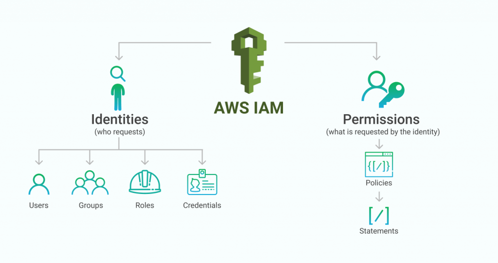

**Features of IAM** <!-- style="font-size:18px" -->

* **Centralized user management**: IAM provides a central location for managing users and their access to AWS resources. This makes it easy to add, remove, or modify user access across multiple AWS services.

* **Fine-grained access control**: IAM allows you to grant permissions at a granular level, specifying which actions a user can perform on specific resources. This gives you precise control over access to resources and helps minimize the risk of accidental or unauthorized access.

* **Multi-factor authentication (MFA)**: IAM supports MFA, which requires users to provide two forms of authentication (such as a password and a code sent to a mobile device) in order to access AWS resources. This helps prevent unauthorized access even if a user's password is compromised.

* **Role-based access control**: IAM allows you to create roles that define a set of permissions that can be assumed by trusted entities such as AWS services, applications, or users. Roles enable you to grant temporary permissions to an entity without requiring long-term access keys.

* **Audit trails**: IAM provides detailed logs that allow you to track who accessed which resources and when. This helps you monitor and detect any unauthorized access attempts or unusual activity.

* **Integration with other AWS services**: IAM integrates with other AWS services such as Amazon S3, EC2, and RDS, allowing you to control access to these resources using IAM policies.

### **MFA**

**MFA (Multi-Factor Authentication)** is a security feature that adds an extra layer of protection to your AWS account. With MFA, a user is required to provide two or more forms of authentication before being granted access to their AWS resources. This helps protect against unauthorized access even if a user's password is compromised.

There are several types of MFA supported by AWS, including:

* **Virtual MFA**: This type of MFA uses a smartphone app, such as Google Authenticator or Authy, to generate a unique, time-based code that is required in addition to the user's password to access an AWS resource.

* **Hardware MFA**: This type of MFA uses a physical device, such as a YubiKey, to generate a unique code that is required in addition to the user's password to access an AWS resource.

* **SMS MFA**: This type of MFA sends a unique code to the user's mobile phone via SMS that is required in addition to the user's password to access an AWS resource.

MFA is an important security feature that helps protect your AWS resources against unauthorized access. By requiring users to provide an additional form of authentication in addition to their password, MFA can help prevent attackers from gaining access to your account, even if they have obtained your password through phishing or other means. It is recommended that MFA is enabled for all users in your AWS account.

### **Users Groups and Roles**

In AWS Identity and Access Management (IAM), users, groups, and roles are three fundamental entities used to manage access to AWS resources.

* [**Users**](#users): An IAM user is an entity that represents a person or application that interacts with AWS resources. You can create IAM users and assign them unique security credentials such as access keys, passwords, or multi-factor authentication (MFA) devices. You can also grant permissions to users by attaching policies to them.

* [**Groups**](#groups): An IAM group is a collection of IAM users. You can use groups to organize users and apply permissions to multiple users at once. By assigning policies to a group, you can ensure that all members of the group have the same level of access to AWS resources.

* [**Roles**](#roles): An IAM role is an entity that defines a set of permissions that can be assumed by AWS resources. You can use roles to grant permissions to an AWS service or resource so that it can access other AWS resources. For example, you can create a role that allows an Amazon EC2 instance to access an Amazon S3 bucket.

Roles are also used for cross-account access, where you can define a role in one account and allow users or resources in another account to assume that role and access resources in the first account. This is a common scenario for organizations that use multiple AWS accounts to isolate and manage their resources.

Overall, users, groups, and roles are used to manage access to AWS resources and ensure that only authorized users and services can interact with them. By assigning appropriate permissions and following the principle of least privilege, you can minimize the risk of unauthorized access and protect the security of your AWS resources.

#### **Users**

To create an IAM user in AWS, you can follow these steps:

* Sign in to the AWS Management Console and open the IAM console.
* In the navigation pane, choose "Users".
* Choose "Add user".
* Enter a name for the new user in the "User name" field.
* If you want to allow programmatic access to the AWS API, select the "Programmatic access" checkbox. If you want to allow the user to sign in to the AWS Management Console, select the "AWS Management Console access" checkbox.
* Depending on whether you selected "Programmatic access" or "AWS Management Console access" (or both), you may need to specify additional options such as a password or permissions.
* If you want to add the user to a group, choose "Add user to group" and select an existing group or create a new one.
* Review the user's settings and choose "Create user".


Once the user is created, you can view their security credentials, including their access key and secret access key, which can be used for programmatic access to AWS resources. You can also assign permissions to the user by creating IAM policies and attaching them to the user or the group to which the user belongs.

Note that when creating an IAM user, it is important to follow the principle of least privilege, which means granting the user only the permissions that are necessary to perform their job duties and no more. This helps minimize the risk of accidental or malicious actions that could compromise the security of your AWS resources.

#### **Groups**

To create an IAM group in AWS, you can follow these steps:

* Sign in to the AWS Management Console and open the IAM console.
* In the navigation pane, choose "Groups".
* Choose "Create New Group".
* Enter a name for the group in the "Group Name" field.
* Choose the policy you want to attach to the group by selecting "Attach Policy" and then selecting a policy from the list. You can also create a custom policy by selecting "Create Policy".
* Choose "Create Group" to create the group and attach the policy.


Once you have created the group, you can add IAM users to the group by selecting the group in the IAM console, choosing the "Users" tab, and then choosing "Add Users to Group". You can then select the users you want to add to the group and choose "Add Users".

You can also manage the policies attached to the group by selecting the group in the IAM console, choosing the "Permissions" tab, and then choosing "Attach Policy" or "Create Policy".

#### **Roles**

To create an IAM role in AWS, you can follow these steps:

* Sign in to the AWS Management Console and open the IAM console.
* In the navigation pane, choose "Roles".
* Choose "Create role".
* Select the type of trusted entity that you want to use to assume the role. You can choose from AWS service, another AWS account, or web identity provider.
* Depending on the trusted entity you selected, you may need to specify additional details such as the service or account ID.
* Choose the permissions you want to grant to the role by selecting one or more policies. You can choose from managed policies, customer managed policies, or inline policies.
* Enter a name for the role in the "Role name" field.
* Review the role's settings and choose "Create role".


Once the role is created, you can assign it to an IAM user or an AWS resource such as an EC2 instance. When the user or resource assumes the role, they inherit the permissions granted to the role.

### **Permission management**

In AWS, permission management is the process of controlling who has access to your resources and what actions they can perform on those resources. AWS Identity and Access Management (IAM) is the service that provides the necessary tools for managing permissions in your AWS environment.

There are three main components to permission management in AWS:

* **Policies**: Policies are documents that define permissions for a specific resource or set of resources. They specify which actions are allowed or denied, and who has access to the resources. Policies can be attached to IAM users, groups, or roles.

* **Roles**: IAM roles are used to grant permissions to AWS resources or services. They can be assigned to EC2 instances, Lambda functions, or other resources, and provide access to other resources in your AWS account or other accounts.

* **Access control lists (ACLs)**: ACLs are used to manage permissions for S3 buckets and objects. They define which AWS accounts or users have permission to access the resources and what actions they can perform.

IAM provides several tools for managing permissions, including the ability to create custom policies, grant temporary permissions using IAM roles, and implement multi-factor authentication (MFA) for additional security. By using these tools and following best practices for permission management, you can help ensure the security and integrity of your AWS resources.

### **Password policy**

In AWS, password policies are used to enforce rules for creating and managing user passwords. Password policies help improve the security of your AWS environment by ensuring that user passwords are strong and regularly updated.

AWS Identity and Access Management (IAM) provides a default password policy that includes the following rules:

1. Passwords must be at least 8 characters long
2. Passwords must contain at least one uppercase letter, one lowercase letter, one number, and one non-alphanumeric character
3. Passwords cannot contain the user's username or any variation of their username
4. Users must change their passwords at least every 90 days
5. Users cannot reuse any of their previous passwords


You can customize the default password policy by changing the values of the above rules or by adding additional rules. To customize the password policy, you can follow these steps:

1. Sign in to the AWS Management Console and open the IAM console.
2. In the navigation pane, choose "Account settings".
3. Scroll down to the "Password Policy" section and choose "Edit".
4. Update the password policy rules as needed.
5. Choose "Save changes" to apply the new policy.


By setting and enforcing a strong password policy, you can help ensure the security of your AWS resources and prevent unauthorized access to your account. It is also important to educate your users on the importance of strong passwords and encourage them to use unique, complex passwords for their accounts.

## **COMPUTE I**

* [**Elastic Cloud Compute (EC2)**](#elastic-cloud-compute) <!-- style="font-size:18px" -->
* [**Types of VMs**](#types-of-vms) <!-- style="font-size:18px" -->
* [**Instance type pricing**](#instance-type-pricing) <!-- style="font-size:18px" -->
* [**Create EC2 Insatnce**](#create-ec2-insatnce) <!-- style="font-size:18px" -->
* [**Boot volume & EBS association**](#boot-volume-and-ebs-association) <!-- style="font-size:18px" -->
* [**Boot volume types**](#boot-volume-types) <!-- style="font-size:18px" -->
* [**Encryption options**](#encryption-options) <!-- style="font-size:18px" -->
* [**Tagging importance**](#tagging-importance) <!-- style="font-size:18px" -->
* [**Security Groups**](#security-groups) <!-- style="font-size:18px" -->
* [**Status check types**](#status-check-types) <!-- style="font-size:18px" -->
* [**Placement Groups**](#placement-groups) <!-- style="font-size:18px" -->
* [**SSH and manage instance**](#ssh-and-manage-instance) <!-- style="font-size:18px" -->
* [**Load balancing (App & Network)**](#load-balancing) <!-- style="font-size:18px" -->
* [**Health checks**](#health-checks) <!-- style="font-size:18px" -->
* [**Path based TG routing**](#path-based-tg-routing) <!-- style="font-size:18px" -->
* [**Lambda TG (with intro to lambda)**](#lambda-tg) <!-- style="font-size:18px" -->
* [**Load Balancer Configuration**](#load-balancer-configuration) <!-- style="font-size:18px" -->
* [**LambdaTG Configuration**](#configure-lambdatg) <!-- style="font-size:18px" -->

### **Elastic Cloud Compute**

Amazon Elastic Compute Cloud (EC2) is a web service that provides resizable compute capacity in the cloud. It is one of the core services in Amazon Web Services (AWS) and enables users to easily provision and manage virtual machines (VMs), also known as instances, on the AWS cloud.

EC2 offers a variety of instance types, each with different CPU, memory, storage, and network capacity configurations to meet the needs of different workloads. Users can launch instances on-demand, reserve them for a fixed period of time, or use spot instances to bid on spare compute capacity and reduce costs.


**Here are some of the key features of EC2:**

* **Scalability**: EC2 enables users to quickly and easily scale compute capacity up or down to meet changing demand, without the need for upfront investments in hardware.

* **Flexibility**: EC2 offers a wide range of instance types, operating systems, and software configurations, giving users the flexibility to choose the configuration that best fits their needs.

* **Security**: EC2 provides several security features to help protect instances and data, including network firewalls, encryption, and security groups.

* **Integration**: EC2 integrates with other AWS services such as Amazon S3, Amazon RDS, and AWS Identity and Access Management (IAM), making it easy to build and deploy complex, multi-tier applications on the AWS cloud.

* **Monitoring**: EC2 provides detailed monitoring and logging capabilities to help users track and troubleshoot performance issues, security incidents, and other events.

### **Types of VMs**

Amazon Elastic Compute Cloud (EC2) offers a wide variety of virtual machine (VM) instance types to meet the needs of different workloads and use cases. Here are some of the most commonly used EC2 instance types:


* [**Micro Instances**](#micro-instances)
* [**General Purpose**](#general-purpose)
* [**Compute Optimized**](#compute-optimized)
* [**Memory Optimized**](#memory-optimized)
* [**Storage Optimized**](#storage-optimized)
* [**GPU Instances**](#gpu-instances)
* [**FPGA Instances**](#fpga-instances)

#### **Micro Instances**

The EC2 micro instance type is a type of general purpose instance that provides a low-cost option for running lightweight workloads and small applications. It is designed for low traffic websites, small development and test workloads, and other low intensity applications.


#### **General Purpose**

General purpose instances are ideal for a wide range of workloads, including web servers, small databases, and development environments. They offer a balance of compute, memory, and network resources.


#### **Compute Optimized**

Compute optimized instances are designed for CPU-intensive workloads, such as high-performance computing (HPC), media encoding, and gaming servers. They offer high CPU-to-memory ratios and fast network performance.


#### **Memory Optimized**

Memory optimized instances are designed for memory-intensive workloads, such as large databases, in-memory analytics, and real-time big data processing. They offer high memory-to-CPU ratios and fast network performance.


#### **Storage Optimized**

Storage optimized instances are designed for storage-intensive workloads, such as NoSQL databases, data warehousing, and Elasticsearch. They offer high disk throughput and low latency, and are often used for applications that require large amounts of sequential read and write operations.


#### **GPU Instances**

GPU instances are designed for workloads that require high-performance graphics processing, such as machine learning, video encoding, and gaming. They offer access to powerful NVIDIA GPUs and are optimized for high-performance computing.


#### **FPGA Instances**

FPGA instances are designed for workloads that require custom hardware acceleration, such as genomics, financial modeling, and encryption. They offer access to field programmable gate arrays (FPGAs) that can be programmed to accelerate specific workloads.


### **Instance type pricing**

There are several pricing options available for EC2 instances:

* [**On-Demand Instances**](#on-demand-instances)
* [**Reserved Instances**](#reserved-instances)
* [**Scheduled Instances**](#scheduled-instances)
* [**Spot Instances**](#spot-instances)
* [**On Demand Capacity Reservations**](#on-demand-capacity-reservations)

#### **On Demand Instances**


#### **Reserved Instances**


#### **Scheduled Instances**


#### **Spot Instances**


#### **On Demand Capacity Reservations**


### **Create EC2 Insatnce**

**Step1.** Search EC2 in search bar and Select EC2 Instance 


**Step2.** To Create Instance click on Launch instance


**Step3.** Give the name for the instance


**Step4.** Select Application and OS Image


**Step5.** In Key Pair(Login) Select create new key pair


**Step6.** Give keypair name ,select Key Pair Type and file format and select create key pair and file will be downloaded


**Step7.** Select network settings


**Step8.** Connfigure storage


**Step9.** After all configuration select Launch Instance which will launch the instance


### **Boot volume and EBS association**

When launching an Amazon EC2 instance, the boot volume refers to the primary storage device that contains the operating system and boot files for the instance. By default, the boot volume is an Amazon Elastic Block Store (EBS) volume.

Here are the key points about boot volumes and EBS association:

* **Amazon EBS**: Amazon Elastic Block Store (EBS) provides block-level storage volumes that can be attached to EC2 instances. EBS volumes are network-attached and can persist independently of the running instance.

* **Boot Volume**: The boot volume is the primary storage device from which the EC2 instance starts up and runs. It contains the operating system, applications, and data. The boot volume is typically an EBS volume but can also be an instance store volume for certain instance types.

* **EBS-Backed Instances**: Most EC2 instances are EBS-backed, which means they use an EBS volume as the boot volume. EBS-backed instances allow for data persistence even if the instance is stopped or terminated.

* **EBS Volume Association**: When launching an EC2 instance, you can specify the EBS volume to be used as the boot volume. You can either create a new EBS volume or select an existing one. The instance will be associated with the specified EBS volume as its boot volume.

* **Elasticity and Management**: By using EBS-backed instances, you can easily manage and scale your EC2 instances. You can take snapshots of EBS volumes for backups, resize volumes, and detach and reattach volumes to other instances.

* **Instance Store Volumes**: Some EC2 instance types offer instance store volumes as the boot volume. Instance store volumes are physically attached to the host computer and provide temporary block-level storage that is lost if the instance is stopped or terminated.

### **Boot volume types**

When launching an Amazon EC2 instance, you have different options for selecting the type of boot volume. The boot volume type determines the characteristics and performance of the storage device used as the primary storage for the instance's operating system and boot files. The available boot volume types include:

**1. Amazon EBS (Elastic Block Store) Boot Volumes:**

* General Purpose SSD (gp2): This is the default boot volume type for most EC2 instances. It offers a balance of price and performance, suitable for a wide range of workloads.
* Provisioned IOPS SSD (io2): This boot volume type is optimized for high-performance applications that require low-latency and consistent I/O performance. It offers configurable IOPS (Input/Output Operations Per Second) to meet specific application requirements.
* Throughput Optimized HDD (st1): This boot volume type is designed for frequently accessed, throughput-intensive workloads, such as big data processing or log processing.
* Cold HDD (sc1): This boot volume type is designed for less frequently accessed workloads, providing low-cost storage for large volumes of data.

**2. Instance Store Boot Volumes:**

Instance store volumes are temporary block-level storage that is physically attached to the host computer where the EC2 instance is running. The data stored on instance store volumes is lost if the instance is stopped or terminated. The performance characteristics and capacity of instance store volumes vary depending on the EC2 instance type.
It's important to note that the availability of boot volume types may vary depending on the EC2 instance type and region. You can choose the appropriate boot volume type based on your workload requirements for performance, durability, and cost.

### **Encryption options**

the encryption options available for data security in Amazon EC2:

* EBS Encryption: Amazon Elastic Block Store (EBS) provides the option to encrypt EBS volumes at rest. EBS encryption uses AWS Key Management Service (KMS) to manage the encryption keys. By enabling EBS encryption, data stored on the EBS volumes is automatically encrypted, providing protection against unauthorized access.

* S3 Server-Side Encryption: If your EC2 instances interact with Amazon S3 for storage, you can enable server-side encryption for S3 objects. This ensures that any data uploaded to S3 is encrypted at rest. S3 supports multiple server-side encryption options, including Amazon S3 Managed Keys (SSE-S3), AWS Key Management Service (SSE-KMS), and Server-Side Encryption with Customer-Provided Keys (SSE-C).

* RDS Encryption: If your EC2 instances utilize Amazon RDS for managing databases, you can enable encryption for RDS database instances. RDS provides the option to encrypt data at rest, ensuring the privacy and security of your database content. RDS encryption supports both AWS Key Management Service (KMS) and Oracle Wallet Manager for managing encryption keys.

* Transit Encryption: To protect data while it is in transit between EC2 instances and other services or clients, you can use encryption protocols such as SSL/TLS. Implementing SSL/TLS encryption secures network communications and prevents eavesdropping or tampering with data in transit.

* Client-Side Encryption: If you have sensitive data that needs to be encrypted before being sent to an EC2 instance, you can implement client-side encryption. This involves encrypting the data on the client side before it is transmitted to the EC2 instance. The encrypted data can then be securely stored or processed on the instance.

### **Tagging importance**

Tagging is an important practice in AWS, including EC2 instances, as it provides numerous benefits for organization, management, and cost allocation. Here are some reasons why tagging is important:

* Resource Organization: Tags allow you to categorize and group your EC2 instances based on different criteria, such as application, environment (development, testing, production), project, or department. This helps in organizing and locating resources efficiently, especially in large-scale deployments.

* Cost Allocation and Budgeting: By assigning tags to EC2 instances, you can track and allocate costs based on specific tags. This enables you to gain visibility into resource usage and allocate expenses accurately across teams, projects, or cost centers. Tags can also help in setting up budget alerts and monitoring costs at a granular level.

* Resource Management and Automation: Tags play a crucial role in resource management and automation. You can use tags to control and manage EC2 instances through AWS services like AWS Identity and Access Management (IAM), AWS Config, and AWS Systems Manager. For example, you can define IAM policies based on tags to grant or restrict access to specific instances.

* Operational and Security Compliance: Tags assist in managing operational and security compliance requirements. You can use tags to identify instances with specific security requirements, compliance standards, or patch levels. This helps in monitoring and enforcing security controls, managing vulnerability assessments, or tracking compliance status.

* Automation and Resource Lifecycle: Tags can be used to automate resource lifecycle management tasks. For instance, you can use tags to define lifecycle policies for EC2 instances, such as automatically stopping or terminating instances after a specific period of inactivity. Tags can also be utilized in resource scheduling and auto-scaling configurations.

* Monitoring and Troubleshooting: Tags can be used for filtering and grouping instances in monitoring and troubleshooting scenarios. For example, you can use tags to create specific Amazon CloudWatch dashboards, aggregate logs, or set up alarms based on tags to track performance or identify issues across specific subsets of instances.

### **Security Groups**

* A security group is a virtual firewall which is controlling the traffic to your EC2 instances.
* When you first launch an EC2 instance, you can associate it with one or more security groups.
* A Security group is the first defence against hackers.

**Some important points to remember:**

* All inbound traffic is blocked by Default, i.e., you need to add the traffic such as HTTP, HTTPs, etc.
* All outbound traffic is allowed automatically.
* You can have any number of EC2 instances within a security group.
* You can have multiple security groups attached to EC2 instance./li>
* Security groups are stateful, i.e., if you create an inbound rule allowing traffic in, that traffic is automatically allowed back out again.


### **Status check types**

When it comes to monitoring the health and status of your Amazon EC2 instances, there are two types of status checks that are performed:

* **System Status Checks**: These checks monitor the underlying infrastructure that supports your EC2 instances. They ensure that the systems essential for the instances to operate properly are functioning correctly. System status checks include monitoring components such as power, network connectivity, and hardware issues of the underlying host server.

* **Instance Status Checks**: These checks monitor the software and operating system running on your EC2 instances. They ensure that the instances are responsive and running as expected. Instance status checks include monitoring components such as system and software issues, improper configurations, and application-level issues.

Both system status checks and instance status checks are performed automatically by AWS on a regular basis. The checks help identify any potential issues or problems with your instances and allow you to take appropriate action to resolve them.

You can view the status checks for your instances in the AWS Management Console, CLI, or programmatically using the AWS SDKs. When a status check fails, it indicates that there may be an issue with your instance, and you should investigate and troubleshoot accordingly.

Monitoring the status checks of your EC2 instances is essential for ensuring the overall health and availability of your infrastructure. By promptly addressing any issues identified through the status checks, you can maintain the reliability and performance of your EC2 instances.

### **Placement Groups**

Placement Groups in Amazon EC2 are a feature that allows you to control the placement of your instances within the AWS infrastructure. Placement Groups provide benefits in terms of performance, network latency, and availability for certain types of workloads. Here are the types of Placement Groups available:

**Cluster Placement Group**:

* Recommended for applications that require low-latency and high-bandwidth communication between instances.
* Instances are placed in a single Availability Zone and are tightly packed within a single rack.
* It provides the highest level of network performance and is suitable for HPC (High-Performance Computing) and tightly coupled applications.


**Spread Placement Group**:

* Recommended for applications that require high availability and can tolerate the failure of individual instances.
* Instances are placed on distinct underlying hardware and spread across different racks within an Availability Zone.
* It reduces the risk of simultaneous failures and provides isolation for critical applications.


**Partition Placement Group**:

* Recommended for large-scale distributed and fault-tolerant applications.
* Instances are spread across multiple partitions, each with its own set of racks within an Availability Zone.
* It enables high availability and fault tolerance, as failures are contained within partitions, minimizing the impact on other partitions.


**Important points to consider**:

* Placement Groups can only be created in a VPC (Virtual Private Cloud).
* Instances in different Placement Groups do not share the same underlying hardware.
* The type of Placement Group cannot be changed once created.
* The availability of Placement Groups may vary across different AWS regions.

### **SSH and manage instance**

To SSH into and manage an Amazon EC2 instance, you can follow these steps:

**Obtain the necessary information**:

* Public IP or DNS name of the EC2 instance: This is required to establish the SSH connection.
* Key pair: Ensure that you have the private key file associated with the key pair used during instance creation.

**Set appropriate permissions for the private key file**:

* In a terminal or command prompt, navigate to the directory where the private key file is stored.
* Set the correct permissions for the private key file to ensure its security:


**Connect to the EC2 instance**:

* Open a terminal or command prompt on your local machine.
* Use the SSH command to connect to the EC2 instance, providing the path to the private key file and the public IP or DNS name of the instance:


Replace `<private_key_file.pem>` with the actual path to your private key file, `<user>` with the appropriate username for the instance's operating system (e.g., "ec2-user" for Amazon Linux, "ubuntu" for Ubuntu), and `<public_ip_or_dns>` with the public IP or DNS name of the EC2 instance.

**Access and manage the EC2 instance**:

* Once connected via SSH, you will have a command line interface to interact with the EC2 instance.
* You can run commands, install software, configure applications, and perform various administrative tasks on the instance, depending on your requirements.

**Some common management tasks you can perform through SSH include**:

* Installing and updating software packages.
* Configuring and managing web servers, databases, and other services.
* Transferring files to and from the instance using tools like SCP or SFTP.
* Monitoring logs and troubleshooting issues.
* Managing user accounts and permissions.
* Configuring firewall settings and security measures.
* Remember to follow security best practices, such as regularly updating your software, using secure protocols, and restricting SSH access to trusted IP addresses or IP ranges, to ensure the security of your EC2 instances.

### **Load balancing** 

Load balancing is a critical component of building scalable and highly available applications. Amazon Web Services (AWS) provides two types of load balancers: Application Load Balancer (ALB) and Network Load Balancer (NLB). Let's explore each type:

**Application Load Balancer (ALB)**:

* ALB operates at the application layer (Layer 7) of the OSI model and is designed to route traffic to multiple targets, such as EC2 instances, containers, and Lambda functions.


**Features of ALB include**:

* **Advanced request routing**: ALB supports path-based routing, host-based routing, and HTTP/HTTPS traffic routing based on specific rules and conditions.
* **Content-based routing**: ALB can route traffic based on the content of the request, such as headers, cookies, or query parameters.
Built-in support for WebSockets and HTTP/2: ALB natively supports WebSockets and HTTP/2 connections.
* **Integrated with other AWS services**: ALB seamlessly integrates with AWS services like AWS Certificate Manager, AWS WAF (Web Application Firewall), and AWS CloudFormation.
* **Target group support**: ALB uses target groups to route traffic to instances or containers within an Auto Scaling group or ECS (Elastic Container Service) service.


**Network Load Balancer (NLB)**:

* NLB operates at the transport layer (Layer 4) and is designed to handle high-throughput, low-latency traffic. It is ideal for TCP and UDP traffic that requires extreme performance.


**Features of NLB include**:

* **Ultra-high performance**: NLB can handle millions of requests per second with very low latencies.
* **Static IP support**: NLB provides a static IP address for your load balancer, enabling you to maintain a fixed entry point to your application.
* **Port-level routing**: NLB routes traffic based on the destination IP address and port number, allowing you to load balance traffic across multiple ports or protocols.
* **Cross-zone load balancing**: NLB evenly distributes traffic across targets in different Availability Zones.
* **Support for Elastic IP addresses**: NLB can be associated with an Elastic IP address, providing a static IP for your load balancer.

Both ALB and NLB offer automatic scaling, health checks, and integration with AWS services like Auto Scaling, AWS Certificate Manager, and AWS CloudFormation. The choice between ALB and NLB depends on your application's requirements, such as the layer at which you need routing capabilities and the type of traffic you are handling (HTTP, HTTPS, TCP, UDP, etc.).

By leveraging AWS load balancers, you can improve the availability, scalability, and fault tolerance of your applications by efficiently distributing incoming traffic across multiple targets and ensuring a seamless user experience.

### **Health checks**

Health checks are an essential feature of load balancers that allow them to monitor the health and availability of the registered targets (such as EC2 instances) and route traffic only to the healthy targets. AWS provides built-in health check capabilities for both the Application Load Balancer (ALB) and Network Load Balancer (NLB). Here's how health checks work:

**1. Configuration**:

* When you create a load balancer, you define a health check configuration. This includes specifying the protocol, ping target, interval, timeout, and thresholds for determining the health of the targets.
* For ALB, you configure health checks at the target group level. Each target group can have its own health check settings.
* For NLB, health checks are configured at the load balancer level. The same health check settings apply to all registered targets.

**2. Health Check Process**:

* The load balancer periodically sends health check requests to the registered targets to determine their health status.
* The health check request typically follows a specific protocol (HTTP, HTTPS, TCP, etc.) and is sent to a specific endpoint or port on the target.
* The load balancer waits for a response within a specified timeout period.
* Based on the response received, the load balancer determines whether the target is healthy or unhealthy.

**3. Target Health States**:

* Healthy: If a target responds to the health check request with a success status code (e.g., HTTP 200 OK), it is considered healthy.
* Unhealthy: If a target fails to respond within the specified timeout period or responds with an error status code, it is considered unhealthy.
* During the health check process, the load balancer continuously monitors the target's health and updates its status accordingly.

**4. Routing Decisions**:

* The load balancer uses the health check results to make routing decisions. It forwards incoming traffic only to the healthy targets.
* If a target becomes unhealthy (fails the health check), the load balancer stops routing traffic to that target until it becomes healthy again.
* When a target recovers and passes the health check, the load balancer resumes routing traffic to that target.

Health checks play a crucial role in maintaining the availability and reliability of your applications. They ensure that traffic is directed only to healthy targets, effectively handling failures and automatically removing unhealthy instances from the load balancing rotation.

By configuring appropriate health check settings, you can ensure that the load balancer consistently monitors the health of your targets and distributes traffic only to the healthy instances, improving the overall performance and availability of your application.

### **Path based TG routing**

Path-based routing is a feature of the Application Load Balancer (ALB) in AWS that allows you to route incoming traffic to different target groups based on the path in the URL. This enables you to direct requests to different applications or microservices running on different instances or containers behind the ALB. Here's how path-based routing works:

**1. Create Target Groups**:

* Define the target groups that correspond to different applications or services you want to route traffic to.
* Each target group represents a set of instances or containers serving a specific application or microservice.

**2. Configure Listener Rules**:

* In the ALB configuration, set up listener rules that specify how to route incoming requests based on the path in the URL.
* Each listener rule consists of a condition and an action.
* The condition includes a path pattern, such as "/app1/" or "/app2/", which matches the desired paths for routing.
* The action specifies the target group to forward the request to when the condition is met.

**3. Route Requests**:

* When a request is received by the ALB, it evaluates the listener rules in order.
* It compares the path in the request URL to the path patterns defined in the listener rules.
* If a match is found, the ALB routes the request to the corresponding target group associated with that rule.
* If no match is found, the default action specified in the listener rule is used.

**4. Backend Server Processing**:

* Once the request is routed to the appropriate target group, the instances or containers associated with that target group process the request.
* Each application or service behind the target group can handle the request based on its own logic and configuration.

Path-based routing allows you to create a single ALB that can handle multiple applications or microservices with different paths. This approach simplifies your architecture, reduces costs, and provides flexibility in scaling and managing your applications.

It's important to note that ALB supports various routing conditions, including path-based routing. You can also combine path-based routing with other conditions, such as host-based routing, query string parameters, and header values, to create more complex routing rules based on specific requirements.

### **Lambda TG**

Lambda Target Groups (Lambda TG) are a feature of the Application Load Balancer (ALB) in AWS that allows you to integrate AWS Lambda functions with ALB. But before we dive into Lambda TG, let's start with a brief introduction to AWS Lambda.

AWS Lambda is a serverless compute service provided by AWS. It allows you to run your code without provisioning or managing servers. With Lambda, you can focus on writing the application logic while AWS handles the underlying infrastructure and scaling. You can write Lambda functions in various programming languages, including Python, Node.js, Java, and more.

Now, let's explore Lambda TG, which combines the power of AWS Lambda with the routing capabilities of ALB:

**1. Create a Lambda Function:**

* To use Lambda with ALB, you need to create a Lambda function that contains the code to process the incoming requests.
* This code can perform various tasks such as data processing, authentication, authorization, validation, or invoking other AWS services.

**2. Configure the Application Load Balancer:**

* Create an Application Load Balancer (ALB) in AWS.
* Set up the necessary listeners and define the routing rules to handle incoming requests.

**3. Create a Lambda Target Group:**

* In the ALB configuration, create a target group specifically for Lambda functions.
* Specify the target type as "lambda" when creating the target group.

**4. Associate Lambda Functions with the Target Group:**

* Associate your Lambda function with the Lambda target group.
* This tells the ALB to forward the incoming requests to the Lambda function for processing.

**5. Process Requests with Lambda:**

* When an HTTP or HTTPS request is received by the ALB, it checks the routing rules.
* If the request matches the conditions defined in the ALB's listeners, it is forwarded to the Lambda function associated with the target group.
* The Lambda function executes the code logic defined in your function, processing the request payload and generating a response.

By using Lambda TG, you can leverage the scalability, fault tolerance, and cost efficiency of AWS Lambda while benefiting from the advanced routing capabilities of ALB. Lambda TG allows you to build serverless architectures with event-driven request processing, offloading the heavy lifting to Lambda functions and enabling you to focus on developing your application logic.

### **Load Balancer Configuration:**

A load balancer takes requests from clients and distributes them across targets in a target group.

Before you begin, ensure that you have a virtual private cloud (VPC) with at least one public subnet in each of the Availability Zones used by your targets.

* [**Step 1: Configure a target group**](#configure-a-target-group)
* [**Step 2: Register targets**](#register-targets)
* [**Step 3: Configure a load balancer and a listener**](#configure-a-load-balancer-and-a-listener)

#### **Configure a target group**

**Step1.** Open the Amazon EC2 console at https://console.aws.amazon.com/ec2/.

**Step2.** In the navigation panel, choose Target Groups.

**Step3.** Choose Create target group.


**Step4.** In the Basic configuration section, set the following parameters:

* For Choose a target type, select Instances to specify targets by instance ID or IP addresses to specify targets by IP address. If the target type is a Lambda function, you can enable health checks by selecting Enable in the Health checks section.

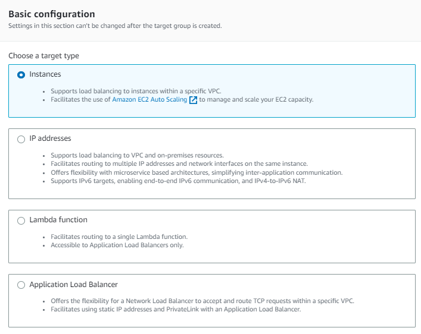

* For Target group name, enter a name for the target group.

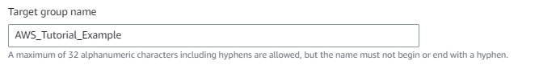

* Modify the Port and Protocol as needed.

* If the target type is IP addresses, choose IPv4 or IPv6 as the IP address type, otherwise skip to the next step.

* Note that only targets that have the selected IP address type can be included in this target group. The IP address type cannot be changed after the target group is created.

* For VPC, select a virtual private cloud (VPC) with the targets that you want to include in your target group.

* For Protocol version, select HTTP1 when the request protocol is HTTP/1.1 or HTTP/2; select HTTP2, when the request protocol is HTTP/2 or gRPC; and select gRPC, when the request protocol is gRPC.


**Step5.** In the Health checks section, modify the default settings as needed. For Advanced health check settings, choose the health check port, count, timeout, interval, and specify success codes. If health checks consecutively exceed the Unhealthy threshold count, the load balancer takes the target out of service. If health checks consecutively exceed the Healthy threshold count, the load balancer puts the target back in service.


**Step6.** (Optional) Add one or more tags as follows:

* Expand the Tags section.
* Choose Add tag.
* Enter the tag Key and tag Value. Allowed characters are letters, spaces, numbers (in UTF-8), and the following special characters: + - = . _ : / @. Do not use leading or trailing spaces. Tag values are case-sensitive.


**Step7.** Choose Next.

#### **Register targets**

**Step1.** In the Register targets page, add one or more targets as follows:

* If the target type is Instances, select one or more instances, enter one or more ports, and then choose Include as pending below.

* If the target type is IP addresses, do the following:

    => Select a network VPC from the list, or choose Other private IP addresses.

    => Enter the IP address manually, or find the IP address using instance details. You can enter up to five IP addresses at a time.

    => Enter the ports for routing traffic to the specified IP addresses.

    => Choose Include as pending below.

* If the target type is Lambda, select a Lambda function, or enter a Lambda function ARN, and then choose Include as pending below.


**Step2.** Choose Create target group.


#### **Configure a load balancer and a listener**

**Step1.** Open the Amazon EC2 console at https://console.aws.amazon.com/ec2/.

**Step2.** In the navigation panel, choose Load Balancers.

**Step3.** Choose Create Load Balancer.


**Step4.** Under Application Load Balancer, choose Create.

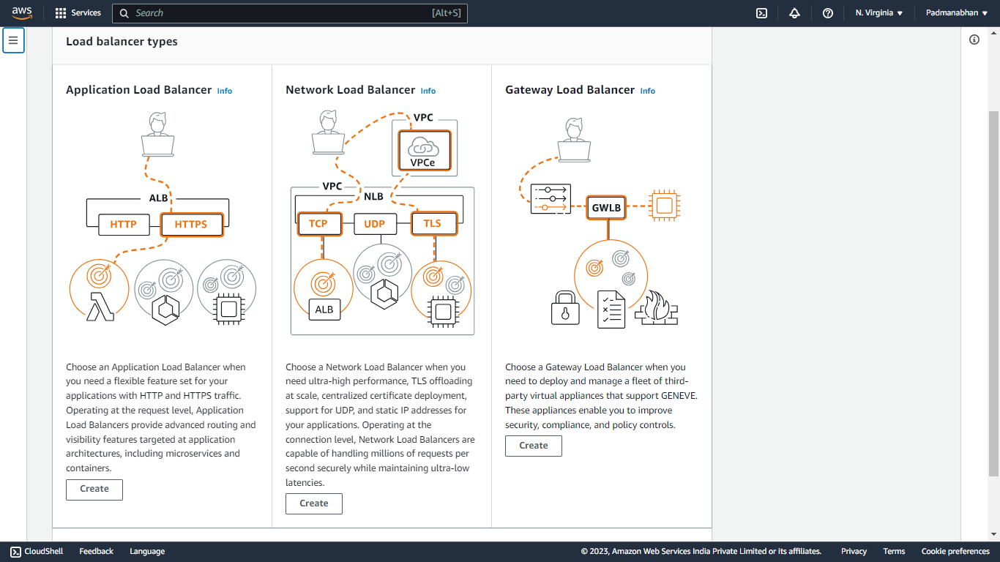

**Step5.** Basic configuration

* For Load balancer name, enter a name for your load balancer. For example, my-alb. The name of your Application Load Balancer must be unique within your set of Application Load Balancers and Network Load Balancers for the Region. Names can have a maximum of 32 characters, and can contain only alphanumeric characters and hyphens. They can not begin or end with a hyphen, or with internal-.

* For Scheme, choose Internet-facing or Internal. An internet-facing load balancer routes requests from clients to targets over the internet. An internal load balancer routes requests to targets using private IP addresses.

* For IP address type, choose IPv4 or Dualstack. Use IPv4 if your clients use IPv4 addresses to communicate with the load balancer. Choose Dualstack if your clients use both IPv4 and IPv6 addresses to communicate with the load balancer.


**Step6.** Network mapping

* For VPC, select the VPC that you used for your EC2 instances. If you selected Internet-facing for Scheme, only VPCs with an internet gateway are available for selection.

*  For Mappings, select two or more Availability Zones and corresponding subnets. Enabling multiple Availability Zones increases the fault tolerance of your applications.

    For an internal load balancer, you can assign a private IP address from the IPv4 or IPv6 range of each subnet instead of letting AWS assign one for you.

    Select one subnet per zone to enable. If you enabled Dualstack mode for the load balancer, select subnets with associated IPv6 CIDR blocks. You can specify one of the following:

    => Subnets from two or more Availability Zones

    => Subnets from one or more Local Zones

    => One Outpost subnet


**Step7.** For Security groups, select an existing security group, or create a new one.

    The security group for your load balancer must allow it to communicate with registered targets on both the listener port and the health check port. The console can create a security group for your load balancer on your behalf with rules that allow this communication. You can also create a security group and select it instead.

    (Optional) To create a new security group for your load balancer, choose Create a new security group.


**Step8.** For Listeners and routing, the default listener accepts HTTP traffic on port 80. You can keep the default protocol and port, or choose different ones. For Default action, choose the target group that you created. You can optionally choose Add listener to add another listener (for example, an HTTPS listener).

    If you create an HTTPS listener, configure the required Secure listener settings. Otherwise, go to the next step.

    When you use HTTPS for your load balancer listener, you must deploy an SSL certificate on your load balancer. The load balancer uses this certificate to terminate the connection and decrypt requests from clients before sending them to the targets. For more information, see SSL certificates. Additionally, specify the security policy that the load balancer uses to negotiate SSL connections with the clients. For more information, see Security policies.

    For Default SSL certificate, do one of the following:

    => If you created or imported a certificate using AWS Certificate Manager, select From ACM, and then select the certificate.

    => If you uploaded a certificate using IAM, select From IAM, and then select the certificate.

    => If you want to import a certificate to ACM or IAM , enter a certificate name. Then, paste the PEM-encoded private key and body.


**Step9.** (Optional) You can use Add-on services, such as the AWS Global Accelerator to create an accelerator and associate the load balancer with the accelerator. The accelerator name can have up to 64 characters. Allowed characters are a-z, A-Z, 0-9, . and - (hyphen). Once the accelerator is created, you can use the AWS Global Accelerator console to manage it.


**Step10.** Tag and create

* (Optional) Add a tag to categorize your load balancer. Tag keys must be unique for each load balancer. Allowed characters are letters, spaces, numbers (in UTF-8), and the following special characters: + - = . _ : / @. Do not use leading or trailing spaces. Tag values are case-sensitive.

* Review your configuration, and choose Create load balancer. A few default attributes are applied to your load balancer during creation. You can view and edit them after creating the load balancer.


### **Configure LambdaTG**

> **To create a new function (console)**

**Step1.** Open the Functions page of the Lambda console and choose Create Function.


**Step2.** Choose Author from scratch.


**Step3.** Under Basic information, do the following:

* For Function name, enter the name for your function.

* For Runtime, select the runtime you want to use.

* (Optional) For Architecture, choose the instruction set architecture for your function. The default architecture is x86_64. Ensure that the .zip deployment package for your function is compatible with the instruction set architecture you select.


**Step4.** Advanced Settings


**Step5.** Choose Create function. Lambda creates a basic 'Hello App' function using your chosen runtime.

> **To upload a .zip or JAR archive from your local machine (console)**

**Step1.** In the Functions page of the Lambda console, choose the function you want to upload the .zip or JAR file for.


**Step2.** Select the Code tab.


**Step3.** In the Code source pane, choose Upload from.

**Step4.** Choose .zip or .jar file.

**Step5.** To upload the .zip or JAR file, do the following:

* Select Upload, then select your .zip or JAR file in the file chooser.

* Choose Open.

* Choose Save.

> **To create a target group and register the Lambda function using the new console**

**Step1.** Open the Amazon EC2 console at https://console.aws.amazon.com/ec2/.

**Step2.** On the navigation pane, under LOAD BALANCING, choose Target Groups.

**Step3.** Choose Create target group.

**Step4.** For Choose a target type, select Lambda function.

**Step5.** For Target group name, type a name for the target group.


**Step6.** (Optional) To enable health checks, choose Enable in the Health checks section.


**Step7.** (Optional) Add one or more tags as follows:

* Expand the Tags section.

* Choose Add tag.

* Enter the tag key and the tag value.


**Step8.** Choose Next.

**Step9.** Specify a single Lambda function or omit this step and specify a Lambda function later.

**Step10.** Choose Create target group.


## COMPUTE II

* [**Auto scaling launch configuration**](#auto-scaling-launch-configuration) <!-- style="font-size:18px" -->
* [**Auto scale groups**](#auto-scale-groups) <!-- style="font-size:18px" -->
* [**Bootstrap scripts**](#bootstrap-scripts) <!-- style="font-size:18px" -->
* [**Instance metadata access**](#instance-metadata-access) <!-- style="font-size:18px" -->
* [**Failure simulation**](#failure-simulation) <!-- style="font-size:18px" -->
* [**Machine image (AMI)**](#machine-image) <!-- style="font-size:18px" -->
* [**AMI across AZ**](#ami-across-az) <!-- style="font-size:18px" -->
* [**Security aspects of AMI**](#security-aspects-of-ami) <!-- style="font-size:18px" -->
* [**Elastic Beanstalk**](#elastic-beanstalk) <!-- style="font-size:18px" -->
* [**Command line interface (CLI)**](#command-line-interface) <!-- style="font-size:18px" -->

### **Auto scaling launch configuration**

An Auto Scaling launch configuration is a template that defines the configuration settings for instances that are launched by an Auto Scaling group. It specifies the Amazon Machine Image (AMI), instance type, security groups, key pair, block device mapping, and other parameters required to launch instances.

**Start launch template creation**

**Step 1.** Open the Amazon EC2 console at https://console.aws.amazon.com/ec2/.

**Step 2.** In the navigation pane, choose Launch Templates, and then choose Create launch template.

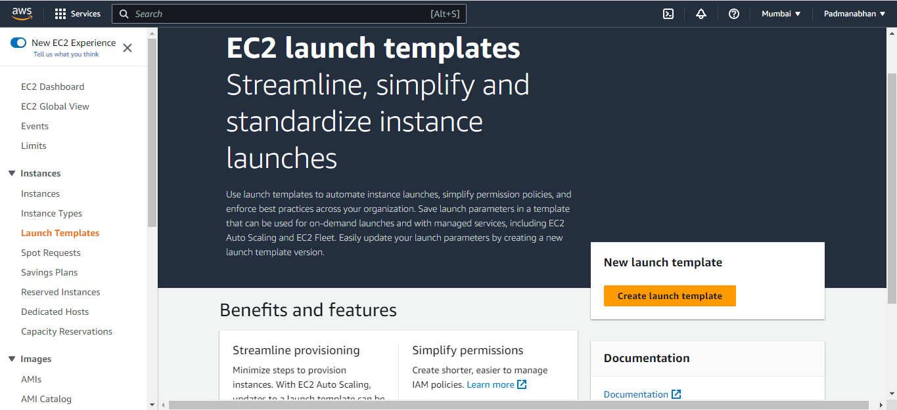

**Step 3.** Launch template name, description, and tags


**Step 4.** Application and OS Images (Amazon Machine Image)


**Step 5.** Instance type


**Step 6.** Key pair (login)


**Step 7.** Network settings

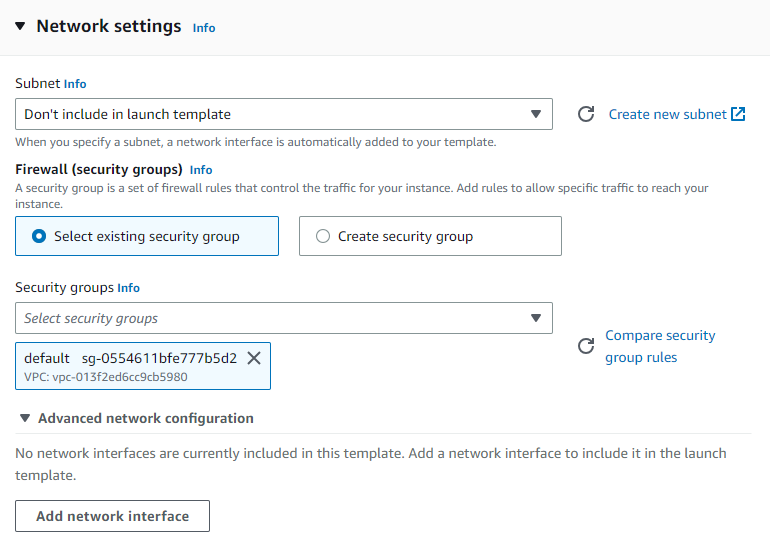

**Step 8.** Configure storage


**Step 9.** Resource tags


**Step 10.** Summary

Use the Summary panel to review your launch template configuration and to create your launch template.

Review the details of your launch template, and make any necessary changes. You can navigate directly to a section by choosing its link in the Summary panel.

When you're ready to create your launch template, choose Create launch template.


### **Auto scale groups**

* Amazon EC2 Auto Scaling helps you ensure that you have the correct number of Amazon EC2 instances available to handle the load for your application. You create collections of EC2 instances, called Auto Scaling groups
* You can specify the minimum number of instances in each Auto Scaling group, and Amazon EC2 Auto Scaling ensures that your group never goes below this size. You can specify the maximum number of instances in each Auto Scaling group, and Amazon EC2 Auto Scaling ensures that your group never goes above this size. If you specify the desired capacity, either when you create the group or at any time thereafter, Amazon EC2 Auto Scaling ensures that your group has this many instances. If you specify scaling policies, then Amazon EC2 Auto Scaling can launch or terminate instances as demand on your application increases or decreases.


**To create an Auto Scaling group using a launch template (console)**

**Step1.** Open the Amazon EC2 console at https://console.aws.amazon.com/ec2/, and choose Auto Scaling Groups from the navigation panel.

**Step2.** On the navigation bar at the top of the screen, choose the same AWS Region that you used when you created the launch template.

**Step3.** Choose Create an Auto Scaling group.

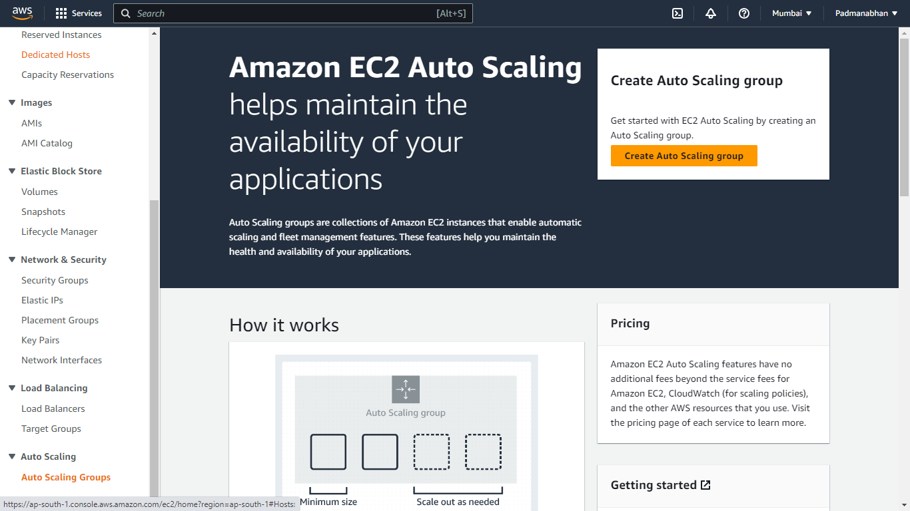

**Step4.** On the Choose launch template or configuration page, do the following:

* For Auto Scaling group name, enter a name for your Auto Scaling group.
* For Launch template, choose an existing launch template.
* For Launch template version, choose whether the Auto Scaling group uses the default, the latest, or a specific version of the launch template when scaling out.
* Verify that your launch template supports all of the options that you are planning to use, and then choose Next.


**Step5.** On the Choose instance launch options page, under Network, for VPC, choose a VPC. The Auto Scaling group must be created in the same VPC as the security group you specified in your launch template.

**Step6.** For Availability Zones and subnets, choose one or more subnets in the specified VPC. Use subnets in multiple Availability Zones for high availability.

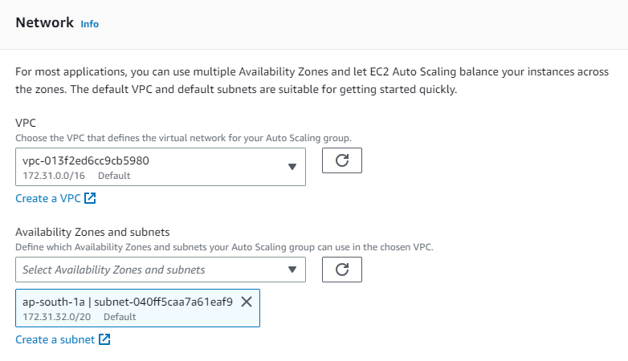

**Step7.** If you created a launch template with an instance type specified, then you can continue to the next step to create an Auto Scaling group that uses the instance type in the launch template.

Alternatively, you can choose the Override launch template option if no instance type is specified in your launch template or if you want to use multiple instance types for auto scaling.


**Step8.** Choose Next to continue to the next step.

Or, you can accept the rest of the defaults, and choose Skip to review.

**Step9.** (Optional) On the Configure advanced options page, configure the following options, and then choose Next:

* To register your Amazon EC2 instances with a load balancer, choose an existing load balancer or create a new one.

* (Optional) For Health checks, Additional health check types, select Turn on Elastic Load Balancing health checks.

* (Optional) For Health check grace period, enter the amount of time, in seconds. This is how long Amazon EC2 Auto Scaling needs to wait before checking the health status of an instance after it enters the InService state.

* Under Additional settings, Monitoring, choose whether to enable CloudWatch group metrics collection. These metrics provide measurements that can be indicators of a potential issue, such as number of terminating instances or number of pending instances. 

* For Enable default instance warmup, select this option and choose the warm-up time for your application. If you are creating an Auto Scaling group that has a scaling policy, the default instance warmup feature improves the Amazon CloudWatch metrics used for dynamic scaling.


**Step10.** (Optional) On the Configure group size and scaling policies page, configure the following options, and then choose **Next**:

* For Desired capacity, enter the initial number of instances to launch. When you change this number to a value outside of the minimum or maximum capacity limits, you must update the values of Minimum capacity or Maximum capacity.

* To automatically scale the size of the Auto Scaling group, choose Target tracking scaling policy and follow the directions. 

* Under Instance scale-in protection, choose whether to enable instance scale-in protection. 


**Step11.** (Optional) To receive notifications, for Add notification, configure the notification, and then choose Next. 


**Step12.** (Optional) To add tags, choose Add tag, provide a tag key and value for each tag, and then choose Next. 


**Step13.** On the Review page, choose Create Auto Scaling group.

### **Bootstrap scripts**

Bootstrap scripts are scripts or commands that are executed automatically when a system or application starts up. They are used to perform initialization tasks, configure the environment, install dependencies, and set up the system for proper operation. Bootstrap scripts are commonly used in various contexts, including server provisioning, application deployment, and cloud infrastructure setup.

In an AWS cluster, the script is called a user-data script.

Add script in user-data while creating instance 

```script
#!/bin/bash
sudo yum update -y
sudo yum -y install nginx
sudo systemctl start nginx
```


Open a terminal or command prompt on your local machine.

Use the SSH command to connect to the EC2 instance, providing the path to the private key file and the public IP or DNS name of the instance

check nginx server as be installed

`nginx -v`


### **Instance metadata access**

Instance metadata access refers to the ability to retrieve information about an instance running in a cloud environment, such as Amazon Web Services (AWS) or Microsoft Azure. Instance metadata provides valuable details about the instance, such as its IP address, instance type, security groups, IAM roles, and much more.

In AWS, instance metadata is available through a metadata service that runs on each EC2 instance. By accessing a well-known URL within the instance, you can retrieve metadata about the instance and its associated resources. The URL for accessing instance metadata in AWS is `http://(Public IPv4 address)/latest/meta-data/`.

Here are a few common use cases for accessing instance metadata:

**1. Dynamic Configuration**: Instance metadata can be used to dynamically configure applications running on the instance. For example, an application can retrieve its own IP address or instance ID from the metadata service to adjust its behavior accordingly.

**2. Auto Scaling and Load Balancing**: When using auto scaling groups or load balancers, you can retrieve instance metadata to gather information about the instances in the group, such as their availability, health status, or launch configuration.

**3. Identity and Access Management (IAM)**: Instance metadata can be used to retrieve IAM role credentials associated with the instance. This allows applications running on the instance to access AWS services securely without having to manage long-term credentials.

**4. Auditing and Logging**: Instance metadata can provide information for auditing and logging purposes. For example, you can retrieve metadata about the instance's launch time, AMI ID, or instance type to track changes or monitor usage patterns.

It's important to note that instance metadata is accessible only from within the instance itself. External requests to the metadata service are not allowed. Additionally, certain sensitive information, such as instance user data, is protected and can only be accessed by the instance itself.

By leveraging instance metadata, you can enhance the automation, configuration, and monitoring of your cloud-based infrastructure. Make sure to consult the documentation of your cloud provider for specific details on accessing and using instance metadata in their environment.

### **Failure simulation**

Failure simulation, also known as fault injection or chaos engineering, is a technique used to proactively test and evaluate the resilience of a system by intentionally introducing failures or faults. The goal of failure simulation is to identify weaknesses and vulnerabilities in a system's design or infrastructure, allowing teams to address them before they cause significant disruptions or outages in production.

Here are some key aspects and benefits of failure simulation:

**1. Identifying Weaknesses:** By simulating failures, you can uncover potential points of failure in your system architecture, software components, or infrastructure. This includes scenarios such as network failures, hardware failures, software bugs, or even human errors. By identifying these weaknesses, you can take proactive measures to strengthen your system and improve its overall reliability.

**2. Resilience Testing:** Failure simulation helps you assess how well your system can handle failures and recover from them. By intentionally introducing failures in controlled environments, you can evaluate the system's response, observe its behavior under stress, and measure its resilience. This testing enables you to identify any single points of failure, bottlenecks, or performance issues that may arise during failure scenarios.

**3. Validation of Redundancy and Disaster Recovery:** Failure simulation allows you to validate the effectiveness of redundancy measures and disaster recovery plans. By intentionally triggering failures, you can verify if backup systems, failover mechanisms, and disaster recovery procedures function as expected. This helps ensure that your system can continue to operate with minimal disruption even in the face of failures.

**4. Improved Incident Response:** Failure simulation exercises can help teams improve their incident response and troubleshooting skills. By experiencing simulated failures and practicing incident response procedures, teams become better equipped to handle real-world incidents with more efficiency and confidence. They can also identify areas where incident response processes or documentation may need refinement.

**5. Continuous Improvement:** Failure simulation is often conducted as an ongoing practice, allowing teams to continually learn and enhance their systems. By regularly introducing controlled failures, teams can iteratively improve the resilience of their infrastructure, identify emerging issues, and make necessary adjustments to prevent future failures.

When conducting failure simulations, it's essential to carefully plan and coordinate the exercises, define the scope and objectives, and have proper rollback or recovery mechanisms in place. It's also crucial to ensure that failure simulations do not impact critical production systems or cause harm to users or data.

Various tools and frameworks are available to facilitate failure simulation, such as Chaos Monkey for AWS, Simian Army, and Gremlin. These tools provide automated ways to inject failures and validate system behavior under stress.

Overall, failure simulation is a valuable practice for building and maintaining robust and resilient systems. It helps teams gain confidence in their system's ability to handle failures, identify weaknesses, and proactively improve system reliability.

### **Machine image**

In the context of cloud computing, a machine image, often referred to as an Amazon Machine Image (AMI) in the case of Amazon Web Services (AWS), is a pre-configured template that contains the necessary software, operating system, and application configurations required to launch instances (virtual servers) in the cloud.

An AMI is essentially a snapshot or a blueprint of a virtual machine, which includes the following components:

**1. Operating System:** The AMI includes the specific operating system (such as Linux, Windows, or other distributions) with a pre-installed set of configurations and software packages.

**2. Software Stack:** It can include additional software, frameworks, libraries, and utilities that are required for your applications or services to run. This can include web servers, databases, programming languages, development tools, and more.

**3. Customizations:** You can customize an AMI to suit your specific needs. This can involve installing additional software, making specific configurations, or applying security settings based on your application requirements.

**4. Disk Image:** The AMI contains a disk image that includes the root file system, applications, data, and any other configurations necessary for the instance to function properly.

AMI provides several benefits, including:

**1. Easy Replication:** With AMIs, you can create multiple identical instances quickly and efficiently. Instead of manually configuring each instance, you can simply launch new instances using the pre-configured AMI, saving time and effort.

**2. Scalability:** AMIs are particularly useful for scaling applications or services. By creating an AMI of a properly configured instance, you can launch multiple instances with the same configuration to handle increased traffic or workload demands.

**3. Rapid Deployment:** AMIs enable rapid deployment of new instances with consistent configurations. This is especially beneficial for auto-scaling groups or when you need to quickly spin up new instances to replace failed or underperforming ones.

**4. Version Control:** AMIs allow you to manage different versions of your application or software stack. You can create new AMIs as you make updates or changes, providing a snapshot of each version that can be easily deployed when needed.

**5. Disaster Recovery:** AMIs can serve as a foundation for disaster recovery plans. By regularly creating and storing AMIs in different regions or availability zones, you can quickly recover your systems in case of failures or disasters.

It's important to note that AMIs are specific to the cloud provider you are using. While AWS refers to them as Amazon Machine Images (AMI), other cloud providers have similar concepts with different names, such as Virtual Machine Image (VMI) in Azure or Compute Image in Google Cloud Platform.

In summary, a machine image or AMI is a pre-configured template that allows you to create instances with specific software configurations and operating systems in the cloud. It simplifies the process of deploying and scaling applications, enables consistent environments, and facilitates disaster recovery planning.


### **AMI across AZ**

When working with Amazon Web Services (AWS), an Amazon Machine Image (AMI) can be created and used across multiple Availability Zones (AZs). An Availability Zone is an isolated location within a region that is designed to provide fault tolerance and high availability.

Here's how you can use an AMI across AZs in AWS:

**1. Create an AMI:** First, you need to create an AMI from an existing instance. This can be done using the AWS Management Console, AWS CLI (Command Line Interface), or SDKs (Software Development Kits). When creating the AMI, ensure that the source instance is running in the desired AZ.

**2. Copy the AMI to other AZs:** After creating the initial AMI, you can copy it to other AZs within the same region. This step allows you to have the same machine image available in multiple AZs for redundancy and load balancing purposes. The AWS Management Console or AWS CLI can be used to initiate the AMI copy process.

**3. Launch instances from the AMI in different AZs:** Once the AMI is available in multiple AZs, you can launch instances from the AMI in each AZ. When launching instances, you can choose the specific AZ for each instance to ensure they are distributed across different AZs. This helps in achieving higher availability and fault tolerance.

**4. Load balancing and scaling:** By having instances launched from the same AMI across multiple AZs, you can use AWS load balancing services like Elastic Load Balancing (ELB) or AWS Auto Scaling to distribute traffic evenly among the instances and scale up or down based on demand. These services are designed to work seamlessly with instances in different AZs.

**5. Monitoring and managing instances across AZs:** It's important to monitor and manage your instances across different AZs to ensure they are functioning properly. AWS provides various monitoring and management tools like Amazon CloudWatch, AWS Systems Manager, and AWS Management Console that allow you to monitor and control instances across AZs from a centralized location.


### **Security aspects of AMI**

the security aspects of Amazon Machine Images (AMIs), there are several important considerations to keep in mind:

**1. Secure Image Sources:** Ensure that the source of the AMI is trusted and comes from a reliable and reputable source. If you're using public AMIs, verify that they are published by trusted vendors or the official AWS Marketplace.

**2. Patch Management:** Regularly update and patch the operating system and software installed in the AMI to address security vulnerabilities. It's essential to keep the AMI up to date with the latest security patches to mitigate potential risks.

**3. Image Hardening:** Apply security hardening measures to the AMI, such as disabling unnecessary services, removing default credentials, and configuring firewall rules. Follow industry best practices and security guidelines to secure the operating system and software configurations within the AMI.

**4. Secure Image Distribution:** Ensure the secure distribution of AMIs by using encrypted channels, such as HTTPS or SSL/TLS, when transferring or sharing AMIs between AWS accounts or regions. This helps protect against unauthorized access or tampering of the image during transit.

**5. Data Sensitivity:** Take into account the sensitivity of the data stored within the AMI. If the AMI contains sensitive information, consider implementing encryption mechanisms to protect the data at rest. AWS provides services like AWS Key Management Service (KMS) to manage encryption keys for securing data within AMIs.

**6. Access Control:** Implement proper access controls and restrict access to the AMI to authorized users or accounts. Utilize AWS Identity and Access Management (IAM) policies and roles to control who can launch instances from the AMI, modify the AMI, or share the AMI with others.

**7. Image Lifecycle Management:** Regularly review and update the AMIs in use. Remove or deprecate outdated or unused AMIs to reduce the attack surface and minimize the risk associated with potentially vulnerable or unsupported images.

**8. Monitoring and Logging:** Implement robust monitoring and logging mechanisms to capture and analyze activities related to the AMIs. This helps detect any suspicious or unauthorized activities, provides visibility into image usage, and aids in incident response and forensic analysis if security incidents occur.

**9. Compliance and Auditing:** Ensure compliance with relevant security standards and regulations. Regularly audit and assess the security posture of the AMIs to identify and address any security gaps or vulnerabilities.

### **Elastic Beanstalk**

Elastic Beanstalk is a fully managed service provided by AWS that simplifies the deployment, scaling, and management of applications. It allows you to quickly deploy your web applications and services on popular platforms like Java, .NET, PHP, Node.js, Python, Ruby, Go, and Docker.


Here are some key aspects and features of Elastic Beanstalk:

**1. Application Management:** Elastic Beanstalk handles the infrastructure provisioning and configuration for you, allowing you to focus on developing and deploying your application code. It supports a variety of application types, frameworks, and languages.

**2. Easy Deployment:** With Elastic Beanstalk, you can deploy your applications using different methods, such as uploading your code through the AWS Management Console, using the AWS CLI (Command Line Interface), or integrating with source control systems like Git.

**3. Auto Scaling and Load Balancing:** Elastic Beanstalk automatically scales your application environment based on the incoming traffic and load. It provisions the necessary compute resources and load balancers to handle traffic spikes and ensure high availability and performance.

**4. Environment Management:** You can create multiple environments (e.g., development, testing, production) within Elastic Beanstalk to separate and manage different stages of your application's lifecycle. Each environment can have its own configuration settings and resources.

**5. Monitoring and Logging:** Elastic Beanstalk integrates with AWS CloudWatch, allowing you to monitor the health, performance, and resource utilization of your application environment. It provides metrics, logs, and alarms to help you troubleshoot issues and optimize your application's performance.

**6. Customization and Configuration:** Elastic Beanstalk provides flexibility for customization. You can configure environment variables, modify instance types, specify scaling options, set up security groups, and define other application-specific configurations.

**7. Integration with Other AWS Services:** Elastic Beanstalk seamlessly integrates with various AWS services, such as Amazon RDS for managing databases, Amazon S3 for storing static files, and Amazon CloudFront for content delivery. This allows you to leverage other AWS services to enhance the functionality and performance of your applications.

**8. Platform Updates and Patching:** AWS regularly updates and patches the underlying platform managed by Elastic Beanstalk, including the operating system, web server, and language runtime environments. This ensures that your applications benefit from the latest security updates and performance improvements.

**9. Managed Database Support:** Elastic Beanstalk provides support for managing databases by integrating with AWS RDS (Relational Database Service). You can easily configure and deploy your database along with your application, making it convenient to manage the entire application stack.

Elastic Beanstalk simplifies the deployment and management of applications, making it an ideal choice for developers and teams looking for a streamlined and scalable deployment solution without the need for managing the underlying infrastructure.


### **Command line interface**

The AWS Command Line Interface (AWS CLI) is a unified tool to manage your AWS services. With just one tool to download and configure, you can control multiple AWS services from the command line and automate them through scripts.

AWS CLI Reference [click here](https://docs.aws.amazon.com/cli/latest/reference/)

key features and benefits of the AWS CLI:

**Cross-Platform Compatibility:** The AWS CLI is available for Windows, macOS, and Linux, providing a consistent experience across different operating systems.

**Easy Installation and Setup:** The AWS CLI can be easily installed using a package manager or a standalone installer. Once installed, you can configure it with your AWS credentials, including access keys, to authenticate and authorize your CLI commands.

**Broad AWS Service Coverage:** The AWS CLI supports a wide range of AWS services, allowing you to manage and interact with resources such as EC2 instances, S3 buckets, RDS databases, IAM users, CloudFormation stacks, and more.

**Command Line Syntax:** The AWS CLI follows a consistent command syntax, with commands structured as aws <service> <operation> [parameters]. It provides various options and parameters to customize and refine your commands based on your specific needs.

**Scripting and Automation:** The AWS CLI is scriptable, which means you can write scripts and automate repetitive tasks by combining multiple CLI commands. This allows for efficient management and configuration of AWS resources.

**Output Formatting:** The AWS CLI provides different output formats, including JSON, text, and table formats, making it flexible to work with the output of CLI commands. You can also customize the output format using filters and queries.

**Integration with Other Tools:** The AWS CLI integrates well with other command line tools and scripting languages. You can incorporate AWS CLI commands into shell scripts, batch files, or automation frameworks to build more complex workflows and integrations.

**AWS SDK Compatibility:** The AWS CLI is built on top of the AWS SDKs (Software Development Kits), which are available in various programming languages. This allows developers to use the CLI for quick command execution and switch to the SDKs for more advanced programming and integration requirements.

**Security and Encryption:** The AWS CLI supports secure communication with AWS services using HTTPS protocols. It also provides options for encrypting sensitive data, such as credentials and output files.

## Storage and Delivery 

* [**Elastic Block Store (EBS volumes)**](#elastic-block-store) <!-- style="font-size:18px" -->
* [**Status checks and monitoring**](#status-checks-and-monitoring) <!-- style="font-size:18px" -->
* [**Attaching, preparing & mounting**](#attaching-preparing-and-mounting) <!-- style="font-size:18px" -->
* [**Snapshots from Volumes**](#snapshots-from-volumes) <!-- style="font-size:18px" -->
* [**Volumes from snapshots**](#volumes-from-snapshots) <!-- style="font-size:18px" -->
* [**Data migration strategies**](#data-migration-strategies) <!-- style="font-size:18px" -->
* [**Elastic File System (EFS)**](#elastic-file-system) <!-- style="font-size:18px" -->
* [**Simple Storage Service (S3)**](#simple-storage-service) <!-- style="font-size:18px" -->
* [**Create your first S3 bucket**](#create-your-first-s3-bucket) <!-- style="font-size:18px" -->
* [**Permissions**](#permissions) <!-- style="font-size:18px" -->
* [**Storage class**](#storage-class) <!-- style="font-size:18px" -->
* [**Metadata & Tags**](#metadata-and-tags) <!-- style="font-size:18px" -->
* [**Version management**](#version-management) <!-- style="font-size:18px" -->
* [**Cross region replication**](#cross-region-replication) <!-- style="font-size:18px" -->
* [**Lifecycle management**](#lifecycle-management) <!-- style="font-size:18px" -->
* [**Glacier (discussion)**](#glacier) <!-- style="font-size:18px" -->
* [**Transfer acceleration**](#transfer-acceleration) <!-- style="font-size:18px" -->

### **Elastic Block Store**

* EBS stands for Elastic Block Store.
* EC2 is a virtual server in a cloud while EBS is a virtual disk in a cloud.
* Amazon EBS allows you to create storage volumes and attach them to the EC2 instances.
* Once the storage volume is created, you can create a file system on the top of these volumes, and then you can run a database, store the files, applications or you can even use them as a block device in some other way.
* Amazon EBS volumes are placed in a specific availability zone, and they are automatically replicated to protect you from the failure of a single component.
* EBS volume does not exist on one disk, it spreads across the Availability Zone. EBS volume is a disk which is attached to an EC2 instance.
* EBS volume attached to the EC2 instance where windows or Linux is installed known as Root device of volume.

**EBS Volume Types**

Amazon EBS provides two types of volume that differ in performance characteristics and price. EBS Volume types fall into two parts:


* [**SSD-backed volumes**](#ssd-backed-volumes)
* [**HDD-backed volumes**](#hdd-backed-volumes)

#### **SSD backed volumes**

* SSD stands for solid-state Drives.
* In June 2014, SSD storage was introduced.
* It is a general purpose storage.
* It supports up to 4000 IOPS which is quite very high.
* SSD storage is very high performing, but it is quite expensive as compared to HDD (Hard Disk Drive) storage.
* SSD volume types are optimized for transactional workloads such as frequent read/write operations with small I/O size, where the performance attribute is IOPS.

**SSD is further classified into two parts:**


* General Purpose SSD
* Provisioned IOPS SSD

**General Purpose SSD**

* General Purpose SSD is also sometimes referred to as a GP2.
* It is a General purpose SSD volume that balances both price and performance.
* You can get a ratio of 3 IOPS per GB with up to 10,000 IOPS and the ability to burst up to 3000 IOPS for an extended period of time for volumes at 3334 GiB and above. For example, if you get less than 10,000 IOPS, then GP2 is preferable as it gives you the best performance and price.

**Provisioned IOPS SSD**

* It is also referred to as IO1.
* It is mainly used for high-performance applications such as intense applications, relational databases.
* It is designed for I/O intensive applications such as large relational or NOSQL databases.
* It is used when you require more than 10,000 IOPS.

#### **HDD backed volumes** 

* It stands for Hard Disk Drive.
* HDD based storage was introduced in 2008.
* The size of the HDD based storage could be between 1 GB to 1TB.
* It can support up to 100 IOPS which is very low.


**Throughput Optimized HDD (st1)**

* It is also referred to as ST1.
* Throughput Optimized HDD is a low-cost HDD designed for those applications that require higher throughput up to 500 MB/s.
* It is useful for those applications that require the data to be frequently accessed.
* It is used for Big data, Data warehouses, Log processing, etc.
* It cannot be a boot volume, so it contains some additional volume. For example, if we have Windows server installed in a C: drive, then C drive cannot be a Throughput Optimized Hard disk, D: drive or some other drive could be a Throughput Optimized Hard disk.
* The size of the Throughput Hard disk can be 500 GiB to 16 TiB.
* It supports up to 500 IOPS.

**Cold HDD (sc1)**

* It is also known as SC1.
* It is the lowest cost storage designed for the applications where the workloads are infrequently accessed.
* It is useful when data is rarely accessed.
* It is mainly used for a File server.
* It cannot be a boot volume.
* The size of the Cold Hard disk can be 500 GiB to 16 TiB.
* It supports up to 250 IOPS.

**Magnetic Volume**

* It is the lowest cost storage per gigabyte of all EBS volume types.
* It is ideal for the applications where the data is accessed infrequently
* It is useful for applications where the lowest storage cost is important.
* Magnetic volume is the only hard disk which is bootable. Therefore, we can say that it can be used as a boot volume.

#### **Create Volume** 

To create an empty EBS volume using the console

**Step1.** Open the Amazon EC2 console at https://console.aws.amazon.com/ec2/.

**Step2.** In the navigation pane, choose Volumes.

**Step3.** Choose Create volume.

**Step4.** For Volume type, choose the type of volume to create. For more information, see Amazon EBS volume types.

**Step5.** For Size, enter the size of the volume, in GiB. For more information, see Constraints on the size and configuration of an EBS volume.

**Step6.** (io1, io2, and gp3 only) For IOPS, enter the maximum number of input/output operations per second (IOPS) that the volume should provide.

**Step7.** (gp3 only) For Throughput, enter the throughput that the volume should provide, in MiB/s.

**Step8.** For Availability Zone, choose the Availability Zone in which to create the volume. A volume can be attached only to an instance that is in the same Availability Zone.

**Step9.** For Snapshot ID, keep the default value (Don't create volume from a snapshot).

**Step10.** (io1 and io2 only) To enable the volume for Amazon EBS Multi-Attach, select Enable Multi-Attach. For more information, see Attach a volume to multiple instances with Amazon EBS Multi-Attach.

**Step11.** Set the encryption status for the volume.

If your account is enabled for encryption by default, then encryption is automatically enabled and you can't disable it. You can choose the KMS key to use to encrypt the volume.

If your account is not enabled for encryption by default, encryption is optional. To encrypt the volume, for Encryption, choose Encrypt this volume and then select the KMS key to use to encrypt the volume.


**Step12.** (Optional) To assign custom tags to the volume, in the Tags section, choose Add tag, and then enter a tag key and value pair. For more information, see Tag your Amazon EC2 resources.

**Step13.** Choose Create volume.


### **Status checks and monitoring**

Status checks and monitoring play a crucial role in ensuring the health and availability of your infrastructure components, including EC2 instances and EBS volumes. Here's an overview of status checks and monitoring in AWS:

**1. EBS Volume Status Checks:**

* EBS volume status checks verify the integrity of the data stored on the volume and the overall health of the volume.
* These checks are automatically performed by AWS on a regular basis.
* The status of the volume can be either "ok" or "impaired".
* You can view the status checks for your EBS volumes in the AWS Management Console, AWS CLI, or through the Amazon CloudWatch API.


**2. CloudWatch Monitoring for EBS:**

* Amazon CloudWatch provides various metrics for monitoring EBS volumes, including:

    => VolumeReadOps: The number of read operations per second on the volume.

    => VolumeWriteOps: The number of write operations per second on the volume.

    => VolumeIdleTime: The amount of time the volume has been idle.

    => VolumeQueueLength: The number of read and write operation requests waiting to be completed on the volume.


* These metrics can help you understand the performance and usage patterns of your EBS volumes.
* You can set alarms based on these metrics to receive notifications when specific thresholds are breached.


**3. EBS Performance Monitoring:**

* In addition to CloudWatch metrics, you can also monitor EBS volume performance using the AWS Command Line Interface (CLI) or SDKs.
* The AWS CLI provides the describe-volume-performance command to retrieve performance information for an EBS volume.
* This command provides details such as the volume's burst balance, throughput, and IOPS performance.


**4. CloudWatch Logs for EBS:**

* You can configure Amazon CloudWatch Logs to capture EBS-related log events, including volume creation, attachment, detachment, and deletion.
* By collecting and analyzing EBS logs, you can gain insights into volume-related activities and troubleshoot any issues that arise.


### **Attaching preparing and mounting**

To attach an EBS volume to an instance using the console

**Step1.** Open the Amazon EC2 console at https://console.aws.amazon.com/ec2/.

**Step2.** In the navigation panel, choose Volumes.

**Step3.** Select the volume to attach and choose Actions, Attach volume.

> Note:
> 
> You can attach only volumes that are in the Available state.


**Step4.** For Instance, enter the ID of the instance or select the instance from the list of options.

> Note:
> 
> * The volume must be attached to an instance in the same Availability Zone.
> * If the volume is encrypted, it can only be attached to instance types that support Amazon EBS encryption. For more information, see Amazon EBS encryption.

**Step5.** For Device name, enter a supported device name for the volume. This device name is used by Amazon EC2. The block device driver for the instance might assign a different device name when mounting the volume. For more information, see Device names on Linux instances.

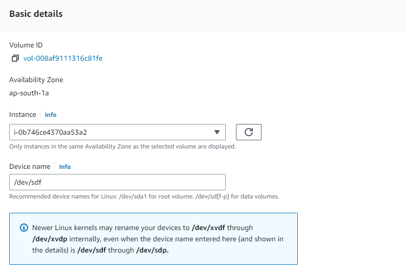

**Step6.** Choose Attach volume.

**Step7.** Connect to the instance and mount the volume

* Now, login to your ec2 instance and list the available disks using the following command.

```markdown
 lsblk
```


*  Check if the volume has any data using the following command

```markdown
sudo file -s /dev/xvdf
```


If the above command output shows “/dev/xvdf: data“, it means your volume is empty.

* Format the volume to the ext4 filesystem using the following command.

```markdown
sudo mkfs -t ext4 /dev/xvdf
```


Alternatively, you can also use the xfs format. You have to use either ext4 or xfs.

```markdown
sudo mkfs -t xfs /dev/xvdf
```

* Create a directory of your choice to mount our new ext4 volume. I am using the name “newvolume“. You can name it something meaningful to you.

```markdown
sudo mkdir /newvolume
```

*  Mount the volume to “newvolume” directory using the following command.

```markdown
sudo mount /dev/xvdf /newvolume/
```

* cd into newvolume directory and check the disk space to validate the volume mount.

```markdown
cd /newvolume
df -h .
```


The above command should show the free space in the newvolume directory.

* To unmount the volume, use the unmount command as shown below..

```markdown
sudo umount /dev/xvdf
```

### **Snapshots from Volumes**

Snapshots are a crucial feature of Amazon Elastic Block Store (EBS) that allow you to create point-in-time backups of your EBS volumes. 

To create a snapshot using the console

**Step1.** Open the Amazon EC2 console at https://console.aws.amazon.com/ec2/.

**Step2.** In the navigation panel, choose Snapshots, Create snapshot.

**Step3.** For Resource type, choose Volume.

**Step4.** For Volume ID, select the volume from which to create the snapshot.

The Encryption field indicates the selected volume's encryption status. If the selected volume is encrypted, the snapshot is automatically encrypted using the same KMS key. If the selected volume is unencrypted, the snapshot is not encrypted.

**Step5.** (Optional) For Description, enter a brief description for the snapshot.


**Step6.** (Optional) To assign custom tags to the snapshot, in the Tags section, choose Add tag, and then enter the key-value pair. You can add up to 50 tags.

**Step7.** Choose Create snapshot.


### **Volumes from snapshots**

Volumes from snapshots refer to the process of creating new Amazon Elastic Block Store (EBS) volumes using existing EBS snapshots as the source.

To create an EBS volume from a snapshot using the console

**Step1.** Open the Amazon EC2 console at https://console.aws.amazon.com/ec2/.

**Step2.** In the navigation panel, choose Volumes.

**Step3.** Choose Create volume.

**Step4.** For Volume type, choose the type of volume to create. For more information, see Amazon EBS volume types.

**Step5.** For Size, enter the size of the volume, in GiB. For more information, see Constraints on the size and configuration of an EBS volume.

**Step6.** (io1, io2, and gp3 only) For IOPS, enter the maximum number of input/output operations per second (IOPS) that the volume should provide.

**Step7.** (gp3 only) For Throughput, enter the throughput that the volume should provide, in MiB/s.

**Step8.** For Availability Zone, choose the Availability Zone in which to create the volume. A volume can be attached only to instances that are in the same Availability Zone.

**Step9.** For Snapshot ID, select the snapshot from which to create the volume.

**Step10.** Set the encryption status for the volume.

**Step11.** If the selected snapshot is encrypted, or if your account is enabled for encryption by default, then encryption is automatically enabled and you can't disable it. You can choose the KMS key to use to encrypt the volume.

If the selected snapshot is unencrypted and your account is not enabled for encryption by default, encryption is optional. To encrypt the volume, for Encryption, choose Encrypt this volume and then select the KMS key to use to encrypt the volume.

> Note
>
> Encrypted volumes can be attached only to instances that support Amazon EBS encryption. For more information, see Amazon EBS encryption.


**Step12.** (Optional) To assign custom tags to the volume, in the Tags section, choose Add tag, and then enter a tag key and value pair.

**Step13.** Choose Create Volume.

> Note
> 
> The volume is ready for use when the Volume state is available.


To use the volume, attach it to an instance. 

### **Data migration strategies**

Data migration refers to the process of transferring data from one system or storage environment to another. There are several data migration strategies available, depending on the specific requirements and constraints of the migration project. Here are some common data migration strategies:

**1. Big Bang Migration:** In this strategy, the entire data set is migrated from the source system to the target system in a single operation. This approach is suitable when there is a limited amount of data, minimal downtime is acceptable, and data dependencies are straightforward.

**2. Phased Migration:** Phased migration involves migrating data in stages or phases. Each phase focuses on a subset of the data or specific functionality. It allows for incremental migration, reduces risks, and provides opportunities for testing and validation between each phase.

**3. Trickle Migration:** Trickle migration involves a continuous and gradual transfer of data from the source system to the target system over an extended period. It is suitable for scenarios where minimizing downtime and ensuring continuous availability are critical. This approach requires synchronization mechanisms to keep data consistent between the source and target systems during the migration period.

**4. Parallel Migration:** Parallel migration involves running the source and target systems simultaneously and gradually transferring data from the source to the target in parallel. This approach minimizes downtime and allows for continuous operation during the migration process. Once the data transfer is complete, the target system takes over full operation.

**5. Data Replication:** Data replication involves replicating data in real-time or near real-time from the source system to the target system. It is often used in scenarios where the source system needs to remain operational during the migration process. Once the data replication is in sync, the source system is switched off or put into a read-only mode, and the target system takes over.

**6. Hybrid Migration:** Hybrid migration involves a combination of different migration strategies, tailored to specific data sets or components. It allows for flexibility and customization based on the unique requirements of each subset of data.

### **Elastic File System**

Amazon EFS provides scalable file storage for use with Amazon EC2. You can use an EFS file system as a common data source for workloads and applications running on multiple instances

To create an EFS file system using Amazon EFS Quick Create

**Step1.** Open the Amazon EC2 console at https://console.aws.amazon.com/ec2/.

**Step2.** Choose Launch instance.

**Step3.** (Optional) Under Name and tags, for Name, enter a name to identify your instance.

**Step4.** Under Application and OS Images (Amazon Machine Image), choose a Linux operating system, and then for Amazon Machine Image (AMI), select a Linux AMI.

**Step5.** Under Instance type, for Instance type, select an instance type or keep the default.

**Step6.** Under Key pair (login), for Key pair name, choose an existing key pair or create a new one.

**Step7.** Under Network settings, choose Edit (at right), and then for Subnet, select a subnet.

> Note
>
> You must select a subnet before you can add an EFS file system.

**Step8.** Under Configure storage, choose Edit (at bottom right), and then do the following:

* Make sure that EFS is selected.

* Choose Add shared file system.

> Troubleshooting tip
> 
> If Add shared file system is not visible, you must first select a subnet.

* For File system, select an existing file system, or choose Create new shared file system and create a file system using Amazon EFS Quick Create.

* For Mount point, specify a mount point or keep the default.

* To enable access to the file system, select Automatically create and attach security groups. By selecting this check box, the necessary security groups will automatically be created and attached to the instance and the mount targets of the file system, as follows:

    => Instance security group – Includes an outbound rule that allows traffic over the NFS 2049 port, but includes no inbound rules.

    => File system mount targets security group – Includes an inbound rule that allows traffic over the NFS 2049 port from the instance security group (described above), and an outbound rule that allows traffic over the NFS 2049 port.

You can choose to manually create and attach the security groups. If you want to manually create and attach the security groups, clear Automatically create and attach the required security groups.

* To automatically mount the shared file system when the instance launches, select Automatically mount shared file system by attaching required user data script. To view the user data that is automatically generated, expand Advanced details, and scroll down to User data.

> Note
> 
> If you added user data before selecting this check box, the original user data is overwritten by the user data that is automatically generated.

**Step9.** Configure any other instance configuration settings as needed.

**Step10.** In the Summary panel, review your instance configuration, and then choose Launch instance. 

### **Simple Storage Service**

* S3 is a safe place to store the files.
* It is Object-based storage, i.e., you can store the images, word files, pdf files, etc.
* The files which are stored in S3 can be from 0 Bytes to 5 TB.
* It has unlimited storage means that you can store the data as much you want.
* Files are stored in Bucket. A bucket is like a folder available in S3 that stores the files.
* S3 is a universal namespace, i.e., the names must be unique globally. Bucket contains a DNS address. Therefore, the bucket must contain a unique name to generate a unique DNS address.

If you create a bucket, URL look like:


* If you upload a file to S3 bucket, then you will receive an HTTP 200 code means that the uploading of a file is successful.


**S3 is object-based. Objects consist of the following:**

* **Key:** It is simply the name of the object. For example, hello.txt, spreadsheet.xlsx, etc. You can use the key to retrieve the object.
* **Value:** It is simply the data which is made up of a sequence of bytes. It is actually a data inside the file.
* **Version ID:** Version ID uniquely identifies the object. It is a string generated by S3 when you add an object to the S3 bucket.
* **Metadata:** It is the data about data that you are storing. A set of a name-value pair with which you can store the information regarding an object. Metadata can be assigned to the objects in Amazon S3 bucket.
* **Subresources:** Subresource mechanism is used to store object-specific information.
* **Access control information:** You can put the permissions individually on your files.

### **Create your first S3 bucket**

**Step1.** Sign in to the AWS Management Console and open the Amazon S3 console at https://console.aws.amazon.com/s3/.

**Step2.** In the left navigation pane, choose Buckets.

**Step3.** Choose Create bucket.


* The Create bucket page opens.

**Step4.** For Bucket name, enter a name for your bucket.

The bucket name must:

* Be unique within a partition. A partition is a grouping of Regions. AWS currently has three partitions: aws (Standard Regions), aws-cn (China Regions), and aws-us-gov (AWS GovCloud (US) Regions).

* Be between 3 and 63 characters long.

* Consist only of lowercase letters, numbers, dots (.), and hyphens (-). For best compatibility, we recommend that you avoid using dots (.) in bucket names, except for buckets that are used only for static website hosting.

* Begin and end with a letter or number.

After you create the bucket, you cannot change its name.

**Step5.** For Region, choose the AWS Region where you want the bucket to reside.

To minimize latency and costs and address regulatory requirements, choose a Region close to you. Objects stored in a Region never leave that Region unless you explicitly transfer them to another Region.


**Step6.** Under Object Ownership, to disable or enable ACLs and control ownership of objects uploaded in your bucket, choose one of the following settings:

ACLs disabled

* Bucket owner enforced (default) – ACLs are disabled, and the bucket owner automatically owns and has full control over every object in the bucket. ACLs no longer affect access permissions to data in the S3 bucket. The bucket uses policies exclusively to define access control.

By default, ACLs are disabled. A majority of modern use cases in Amazon S3 no longer require the use of ACLs. We recommend that you keep ACLs disabled, except in unusual circumstances where you must control access for each object individually. 

ACLs enabled

* Bucket owner preferred – The bucket owner owns and has full control over new objects that other accounts write to the bucket with the bucket-owner-full-control canned ACL.

* If you apply the Bucket owner preferred setting, to require all Amazon S3 uploads to include the bucket-owner-full-control canned ACL, you can add a bucket policy that allows only object uploads that use this ACL.

* Object writer – The AWS account that uploads an object owns the object, has full control over it, and can grant other users access to it through ACLs.

> Note
> 
> The default setting is Bucket owner enforced. To apply the default setting and keep ACLs disabled, only the s3:CreateBucket permission is needed. To enable ACLs, you must have the s3:PutBucketOwnershipControls permission.


**Step7.**  Under Block Public Access settings for this bucket, choose the Block Public Access settings that you want to apply to the bucket.

By default, all four Block Public Access settings are enabled. We recommend that you keep all settings enabled, unless you know that you need to turn off one or more of them for your specific use case. 

> Note
>
> To enable all Block Public Access settings, only the s3:CreateBucket permission is required. To turn off any Block Public Access settings, you must have the s3:PutBucketPublicAccessBlock permission.


**Step8.** (Optional) Under Bucket Versioning, you can choose if you wish to keep variants of objects in your bucket. 

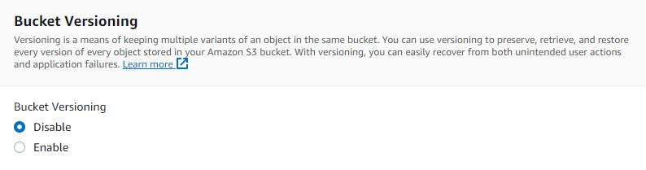

**Step9.** (Optional) Under Tags, you can choose to add tags to your bucket. Tags are key-value pairs used to categorize storage.

To add a bucket tag, enter a Key and optionally a Value and choose Add Tag.


**Step10.** Under Default encryption, choose Edit.

**Step11.** To configure default encryption, under Encryption type, choose one of the following:

* Amazon S3 managed key (SSE-S3)


* AWS Key Management Service key (SSE-KMS)

Buckets and new objects are encrypted with server-side encryption with an Amazon S3 managed key as the base level of encryption configuration. 


**Step12.** If you chose AWS Key Management Service key (SSE-KMS), do the following:

-> Under AWS KMS key, specify your KMS key in one of the following ways:

* To choose from a list of available KMS keys, choose Choose from your AWS KMS keys, and choose your KMS key from the list of available keys.

* Both the AWS managed key (aws/s3) and your customer managed keys appear in this list.

* To enter the KMS key ARN, choose Enter AWS KMS key ARN, and enter your KMS key ARN in the field that appears.

* To create a new customer managed key in the AWS KMS console, choose Create a KMS key.

-> When you configure your bucket to use default encryption with SSE-KMS, you can also enable S3 Bucket Keys. S3 Bucket Keys lower the cost of encryption by decreasing request traffic from Amazon S3 to AWS KMS. 


To use S3 Bucket Keys, under Bucket Key, choose Enable.

**Step13.** (Optional) If you want to enable S3 Object Lock, do the following:

* Choose Advanced settings.

* If you want to enable Object Lock, choose Enable, read the warning that appears, and acknowledge it.


**14.** Choose Create bucket.


#### **To upload an object to a bucket**

**Step1.** Open the Amazon S3 console at https://console.aws.amazon.com/s3/.

**Step2.** In the Buckets list, choose the name of the bucket that you want to upload your object to.


**Step3.** On the Objects tab for your bucket, choose Upload.


**Step4.** Under Files and folders, choose Add files.


**Step5.** Choose a file to upload, and then choose Open.


**Step6.** Choose Upload.


### **Permissions**

In AWS S3, permissions are managed using the AWS Identity and Access Management (IAM) service. IAM allows you to control access to your S3 buckets and objects by defining policies and assigning them to IAM users, groups, or roles.

**Example:**

Allows read and write access to objects in an S3 Bucket, programmatically and in the console

This example shows how you might create an identity-based policy that allows Read and Write access to objects in a specific S3 bucket. This policy defines permissions for programmatic and console access. To use this policy, replace the italicized placeholder text in the example policy with your own information. Then, follow the directions in [create a policy](https://docs.aws.amazon.com/IAM/latest/UserGuide/access_policies_create.html) or [edit a policy](https://docs.aws.amazon.com/IAM/latest/UserGuide/access_policies_manage-edit.html).

The s3:*Object action uses a wildcard as part of the action name. The AllObjectActions statement allows the GetObject, DeleteObject, PutObject, and any other Amazon S3 action that ends with the word "Object".

```json
{
    "Version": "2012-10-17",
    "Statement": [
        {
            "Sid": "S3ConsoleAccess",
            "Effect": "Allow",
            "Action": [
                "s3:GetAccountPublicAccessBlock",
                "s3:GetBucketAcl",
                "s3:GetBucketLocation",
                "s3:GetBucketPolicyStatus",
                "s3:GetBucketPublicAccessBlock",
                "s3:ListAccessPoints",
                "s3:ListAllMyBuckets"
            ],
            "Resource": "*"
        },
        {
            "Sid": "ListObjectsInBucket",
            "Effect": "Allow",
            "Action": "s3:ListBucket",
            "Resource": ["arn:aws:s3:::bucket-name"]
        },
        {
            "Sid": "AllObjectActions",
            "Effect": "Allow",
            "Action": "s3:*Object",
            "Resource": ["arn:aws:s3:::bucket-name/*"]
        }
    ]
}
```


you can add the above policy in the edit policy tab


### **Storage class**

* S3 storage classes are used to assist the concurrent loss of data in one or two facilities.
* S3 storage classes maintain the integrity of the data using checksums.
* S3 provides lifecycle management for the automatic migration of objects for cost savings.

**S3 contains four types of storage classes:**

* [**S3 Standard**](#s3-standard)
* [**S3 Standard IA**](#s3-standard-ia)
* [**S3 one zone-infrequent access**](#s3-one-zone-infrequent-access)
* [**S3 Glacier**](#s3-glacier)


####  **S3 Standard**

* Standard storage class stores the data redundantly across multiple devices in multiple facilities.
* It is designed to sustain the loss of 2 facilities concurrently.
* Standard is a default storage class if none of the storage class is specified during upload.
* It provides low latency and high throughput performance.
* It designed for 99.99% availability and 99.999999999% durability

#### **S3 Standard IA**

* IA stands for infrequently accessed.
* Standard IA storage class is used when data is accessed less frequently but requires rapid access when needed.
* It has a lower fee than S3, but you will be charged for a retrieval fee.
* It is designed to sustain the loss of 2 facilities concurrently.
* It is mainly used for larger objects greater than 128 KB kept for atleast 30 days.
* It provides low latency and high throughput performance.
* It designed for 99.99% availability and 99.999999999% durability

#### **S3 one zone infrequent access**

* S3 one zone-infrequent access storage class is used when data is accessed less frequently but requires rapid access when needed.
* It stores the data in a single availability zone while other storage classes store the data in a minimum of three availability zones. Due to this reason, its cost is 20% less than Standard IA storage class.
* It is an optimal choice for the less frequently accessed data but does not require the availability of Standard or Standard IA storage class.
* It is a good choice for storing the backup data.
* It is cost-effective storage which is replicated from other AWS region using S3 Cross Region replication.
* It has the same durability, high performance, and low latency, with a low storage price and low retrieval fee.
* It designed for 99.5% availability and 99.999999999% durability of objects in a single availability zone.
* It provides lifecycle management for the automatic migration of objects to other S3 storage classes.
* The data can be lost at the time of the destruction of an availability zone as it stores the data in a single availability zone.

#### **S3 Glacier**

* S3 Glacier storage class is the cheapest storage class, but it can be used for archive only.
* You can store any amount of data at a lower cost than other storage classes.
* S3 Glacier provides three types of models:

    => Expedited: In this model, data is stored for a few minutes, and it has a very higher fee.

    => Standard: The retrieval time of the standard model is 3 to 5 hours.

    => Bulk: The retrieval time of the bulk model is 5 to 12 hours.

* You can upload the objects directly to the S3 Glacier.
* It is designed for 99.999999999% durability of objects across multiple availability zones.

### **Metadata and Tags**

In AWS S3, you can use metadata and tags to add additional information to your S3 objects (files) and buckets. Both metadata and tags provide a way to organize and categorize your objects, but they serve different purposes:

**1. Metadata**:

* Metadata in S3 is a set of key-value pairs that you can assign to individual objects. 
* It allows you to provide custom information about the object, such as author, creation date, or any other relevant details. Metadata is stored as part of the object's properties and is accessible when retrieving the object. You can use metadata to add descriptive information or to enable custom logic in your applications.
* To add metadata to an S3 object, you include custom headers when uploading the object or by updating the object's metadata after it has been uploaded. Here's an example of adding metadata using the AWS CLI:


```markdown
aws s3 cp myobject.txt s3://mybucket/myobject.txt --metadata author=John --metadata creation_date=2023-05-16
```

To retrieve an object's metadata, you can use the HEAD request or access it through the object's properties in your application code.

**2. Tags**: 

* Tags in S3 are key-value pairs that you can assign to buckets and objects. 
* Tags are used for categorizing and organizing resources. They can be useful for purposes such as cost allocation, access control, or resource management. Unlike metadata, which is specific to individual objects, tags are associated with the bucket or object as a whole.
* You can assign tags to S3 buckets and objects using the AWS Management Console, AWS CLI, or programmatically through SDKs and APIs. Here's an example of adding tags to an S3 bucket using the AWS CLI:

```markdown
aws s3api put-bucket-tagging --bucket mybucket --tagging 'TagSet=[{Key=Environment,Value=Production},{Key=Department,Value=Finance}]'
```

### **Version management**

You can use S3 Versioning to keep multiple versions of an object in one bucket. This section provides examples of how to enable versioning on a bucket using the console, REST API, AWS SDKs, and AWS Command Line Interface (AWS CLI).

Before using version management,Enable the version management.

**Step1.** In S3 console,Select bucket name 


**Step2.** Upload the updated object or a file 

* select upload option


* Select Add files,Open the uploaded file of the existing file.


* click on upload ,the object will be updated

**Step3.** Click on the file name

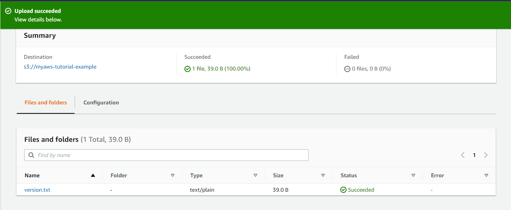

**Step4.** Select the version tab and you can see the versions of the s3 object.


### **Cross region replication**

S3 Cross-Region Replication (CRR) is used to copy objects across Amazon S3 buckets in different AWS Regions. CRR can help you do the following:

**1. Meet compliance requirements** – Although Amazon S3 stores your data across multiple geographically distant Availability Zones by default, compliance requirements might dictate that you store data at even greater distances. To satisfy these requirements, use Cross-Region Replication to replicate data between distant AWS Regions.

**2. Minimize latency** – If your customers are in two geographic locations, you can minimize latency in accessing objects by maintaining object copies in AWS Regions that are geographically closer to your users.

**3. Increase operational efficiency** – If you have compute clusters in two different AWS Regions that analyze the same set of objects, you might choose to maintain object copies in those Regions.

#### **Steps to configure Replication rule**:

**Step1.** Sign in to the AWS Management Console and open the Amazon S3 console at https://console.aws.amazon.com/s3/.

**Step2.** In the left navigation pane, choose Buckets.

**Step3.** In the Buckets list, choose the name of the bucket that you want.


**Step4.** Choose the Management tab, scroll down to Replication rules, and then choose Create replication rule.


**Step5.** In the Replication rule configuration section, under Replication rule name, enter a name for your rule to help identify the rule later. The name is required and must be unique within the bucket.

**Step6.** Under Status, Enabled is selected by default. An enabled rule starts to work as soon as you save it. If you want to enable the rule later, choose Disabled.

**Step7.** If the bucket has existing replication rules, you are instructed to set a priority for the rule. You must set a priority for the rule to avoid conflicts caused by objects that are included in the scope of more than one rule. In the case of overlapping rules, Amazon S3 uses the rule priority to determine which rule to apply. The higher the number, the higher the priority. 


**Step8.** Under Source bucket, you have the following options for setting the replication source:

* To replicate the whole bucket, choose Apply to all objects in the bucket.

* To replicate all objects that have the same prefix, choose Limit the scope of this rule using one or more filters. This limits replication to all objects that have names that begin with the prefix that you specify (for example pictures). Enter a prefix in the Prefix box.

> Note
> 
> If you enter a prefix that is the name of a folder, you must use / (forward slash) as the last character (for example, pictures/).

* To replicate all objects with one or more object tags, choose Add tag and enter the key-value pair in the boxes. Repeat the procedure to add another tag. You can combine a prefix and tags.


**Step9.** Under Destination, choose the bucket where you want Amazon S3 to replicate objects.

> Note
> 
> The number of destination buckets is limited to the number of AWS Regions in a given partition. A partition is a grouping of Regions. AWS currently has three partitions: aws (Standard Regions), aws-cn (China Regions), and aws-us-gov (AWS GovCloud (US) Regions). To request an increase in your destination bucket quota, you can use service quotas.

* To replicate to a bucket or buckets in your account, choose Choose a bucket in this account, and enter or browse for the destination bucket names.

* To replicate to a bucket or buckets in a different AWS account, choose Specify a bucket in another account, and enter the destination bucket account ID and bucket name.

* If the destination is in a different account from the source bucket, you must add a bucket policy to the destination buckets to grant the owner of the source bucket account permission to replicate objects. 

* Optionally, if you want to help standardize ownership of new objects in the destination bucket, choose Change object ownership to the destination bucket owner. 

> Note
> 
> If versioning is not enabled on the destination bucket, you get a warning that contains an Enable versioning button. Choose this button to enable versioning on the bucket.


**Step10.** Set up an AWS Identity and Access Management (IAM) role that Amazon S3 can assume to replicate objects on your behalf.

To set up an IAM role, in the IAM role section, select one of the following from the IAM role dropdown list:

* We highly recommend that you choose Create new role to have Amazon S3 create a new IAM role for you. When you save the rule, a new policy is generated for the IAM role that matches the source and destination buckets that you choose.

* You can choose to use an existing IAM role. If you do, you must choose a role that grants Amazon S3 the necessary permissions for replication. Replication fails if this role does not grant Amazon S3 sufficient permissions to follow your replication rule.

> Important
>
> When you add a replication rule to a bucket, you must have the iam:PassRole permission to be able to pass the IAM role that grants Amazon S3 replication permissions.


**Step11.** To replicate objects in the source bucket that are encrypted with server-side encryption with AWS Key Management Service (AWS KMS) keys (SSE-KMS), under Encryption, select Replicate objects encrypted with AWS KMS. Under AWS KMS keys for encrypting destination objects are the source keys that you allow replication to use. All source KMS keys are included by default. To narrow the KMS key selection, you can choose an alias or key ID.

Objects encrypted by AWS KMS keys that you do not select are not replicated. A KMS key or a group of KMS keys is chosen for you, but you can choose the KMS keys if you want.

If you chose to replicate objects encrypted with AWS KMS, do the following:

-> Under AWS KMS key for encrypting destination objects , specify your KMS key in one of the following ways:

* To choose from a list of available KMS keys, choose Choose from your AWS KMS keys, and choose your KMS key from the list of available keys.

* Both the AWS managed key (aws/s3) and your customer managed keys appear in this list. For more information about customer managed keys, see Customer keys and AWS keys in the AWS Key Management Service Developer Guide.

* To enter the KMS key Amazon Resource Name (ARN), choose Enter AWS KMS key ARN, and enter your KMS key ARN in the field that appears. This encrypts the replicas in the destination bucket. You can find the ARN for your KMS key in the IAM console, under Encryption keys.

* To create a new customer managed key in the AWS KMS console, choose Create a KMS key.


**Step12.** Under Destination storage class, if you want to replicate your data into a specific storage class in the destination, choose Change the storage class for the replicated objects. Then choose the storage class that you want to use for the replicated objects in the destination. If you don't choose this option, the storage class for replicated objects is the same class as the original objects.


**Step13.** You have the following additional options while setting the Additional replication options:

* If you want to enable S3 Replication Time Control (S3 RTC) in your replication configuration, select Replication Time Control (RTC).
* If you want to enable S3 Replication metrics in your replication configuration, select Replication metrics and events. 
* If you want to enable delete marker replication in your replication configuration, select Delete marker replication. 
* If you want to enable Amazon S3 replica modification sync in your replication configuration, select Replica modification sync. 

> Note
>
> When you use S3 RTC or S3 Replication metrics, additional fees apply.


**Step14.** To finish, choose Save and replicate existing objects(if object exists) 


**Step15.** After you save your rule, you can edit, enable, disable, or delete your rule by selecting your rule and choosing Edit rule.

### **Lifecycle management**

Define S3 Lifecycle configuration rules for objects that have a well-defined lifecycle. For example:

* If you upload periodic logs to a bucket, your application might need them for a week or a month. After that, you might want to delete them.

* Some documents are frequently accessed for a limited period of time. After that, they are infrequently accessed. At some point, you might not need real-time access to them, but your organization or regulations might require you to archive them for a specific period. After that, you can delete them.

* You might upload some types of data to Amazon S3 primarily for archival purposes. For example, you might archive digital media, financial and healthcare records, raw genomics sequence data, long-term database backups, and data that must be retained for regulatory compliance.

With S3 Lifecycle configuration rules, you can tell Amazon S3 to transition objects to less-expensive storage classes, or archive or delete them.

#### **To create a lifecycle rule**

**Step1.** Sign in to the AWS Management Console and open the Amazon S3 console at https://console.aws.amazon.com/s3/.

**Step2.** In the Buckets list, choose the name of the bucket that you want to create a lifecycle rule for.

**Step3.** Choose the Management tab, and choose Create lifecycle rule.


**Step4.** In Lifecycle rule name, enter a name for your rule.

    The name must be unique within the bucket.


**Step5.** Choose the scope of the lifecycle rule:

* To apply this lifecycle rule to all objects with a specific prefix or tag, choose Limit the scope to specific prefixes or tags.

* To limit the scope by prefix, in Prefix, enter the prefix.

* To limit the scope by tag, choose Add tag, and enter the tag key and value.

To apply this lifecycle rule to all objects in the bucket, choose This rule applies to all objects in the bucket, and choose I acknowledge that this rule applies to all objects in the bucket.


**Step6.** To filter a rule by object size, you can check Specify minimum object size, Specify maximum object size, or both options.

* When you're specifying a minimum object size or maximum object size, the value must be larger than 0 bytes and up to 5TB. You can specify this value in bytes, KB, MB, or GB.

* When you're specifying both, the maximum object size must be larger than the minimum object size.


**Step7.** Under Lifecycle rule actions, choose the actions that you want your lifecycle rule to perform:

* Transition current versions of objects between storage classes
* Transition previous versions of objects between storage classes
* Expire current versions of objects
* Permanently delete previous versions of objects
* Delete expired delete markers or incomplete multipart uploads

Depending on the actions that you choose, different options appear.


**Step8.** To transition current versions of objects between storage classes, under Transition current versions of objects between storage classes:

**a.** In Storage class transitions, choose the storage class to transition to:

* Standard-IA
* Intelligent-Tiering
* One Zone-IA
* S3 Glacier Flexible Retrieval
* Glacier Deep Archive

**b.** In Days after object creation, enter the number of days after creation to transition the object.


**Step9.** To transition non-current versions of objects between storage classes, under Transition non-current versions of objects between storage classes:

**a.** In Storage class transitions, choose the storage class to transition to:

* Standard-IA
* Intelligent-Tiering
* One Zone-IA
* S3 Glacier Flexible Retrieval
* Glacier Deep Archive

**b.** In Days after object becomes non-current, enter the number of days after creation to transition the object.


**Step10.** To expire current versions of objects, under Expire current versions of objects, in Number of days after object creation, enter the number of days.


**Step11.** To permanently delete previous versions of objects, under Permanently delete noncurrent versions of objects, in Days after objects become noncurrent, enter the number of days. You can optionally specify the number of newer versions to retain by entering a value under Number of newer versions to retain.


**12.** Under Delete expired delete markers or incomplete multipart uploads, choose Delete expired object delete markers and Delete incomplete multipart uploads. Then, enter the number of days after the multipart upload initiation that you want to end and clean up incomplete multipart uploads.

**Step13.** Choose Create rule.

If the rule does not contain any errors, Amazon S3 enables it, and you can see it on the Management tab under Lifecycle rules.

### **Glacier**

* S3 Glacier storage class is the cheapest storage class, but it can be used for archive only.
* You can store any amount of data at a lower cost than other storage classes.
* S3 Glacier provides three types of models:

    => Expedited: In this model, data is stored for a few minutes, and it has a very higher fee.

    => Standard: The retrieval time of the standard model is 3 to 5 hours.

    => Bulk: The retrieval time of the bulk model is 5 to 12 hours.

* You can upload the objects directly to the S3 Glacier.
* It is designed for 99.999999999% durability of objects across multiple availability zones.

### **Transfer acceleration**

* S3 Transfer Acceleration utilizes the CloudFront Edge Network to accelerate uploads to S3.
* Instead of directly uploading the file to S3 bucket, you will get a distinct URL that will upload the data to the nearest edge location which in turn transfer the file to S3 bucket.


**To activate Transfer Acceleration**

**Step1.** Click on the bucket that you have created.

**Step2.** Move to the properties of the bucket.

**Step3.** In properties, go to the Transfer Acceleration property of a bucket.


**Step4.** Click on the Enabled and then save changes.


## Networking

* [**Route 53 overview (Discussion)**](#route-53-overview) <!-- style="font-size:18px" -->
* [**Virtual Private Cloud overview**](#virtual-private-cloud-overview) <!-- style="font-size:18px" -->
* [**Subnets - AZ**](#subnets-az) <!-- style="font-size:18px" -->
* [**Public and private subnets**](#public-and-private-subnets) <!-- style="font-size:18px" -->
* [**Internet Gateway**](#internet-gateway) <!-- style="font-size:18px" -->
* [**Route Tables**](#route-tables) <!-- style="font-size:18px" -->
* [**NAT instance & Gateway**](#nat-instance-and-gateway) <!-- style="font-size:18px" -->
* [**ACL management**](#acl-management) <!-- style="font-size:18px" -->
* [**Bastion hosts and use**](#bastion-hosts-and-use) <!-- style="font-size:18px" -->
* [**Peering**](#peering) <!-- style="font-size:18px" -->

### **Route 53 overview**

Amazon Route 53 is a highly available and scalable Domain Name System (DNS) web service. It is designed for developers and corporates to route the end users to Internet applications by translating human readable names like www.mydomain.com, into the numeric IP addresses like 192.0.2.1 that computers use to connect to each other.


### **Virtual Private Cloud overview**

* VPC stands for Virtual Private Cloud.
* Amazon Virtual Private Cloud (Amazon VPC) provides a logically isolated area of the AWS cloud where you can launch AWS resources in a virtual network that you define.
* You have complete control over your virtual networking environment, including a selection of your IP address range, the creation of subnets, and configuration of route tables and network gateways.
* You can easily customize the network configuration for your Amazon Virtual Private Cloud. For example, you can create a public-facing subnet for web servers that can access to the internet and can also place your backend system such as databases or application servers to a private-facing subnet.
* You can provide multiple layers of security, including security groups and network access control lists, to help control access to Amazon EC2 instances in each subnet.

**Architecture of VPC**

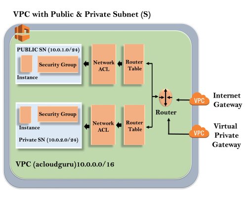

#### **Create a VPC**

Create a VPC with two public subnets. AWS Directory Service requires two subnets in your VPC, and each subnet must be in a different Availability Zone.

**Step1.** Open the Amazon VPC console at https://console.aws.amazon.com/vpc/.

**Step2.** In the VPC Dashboard, choose Create VPC.


**Step3.** Under Resources to create choose VPC and more.


**Step4.** Complete these fields as follows:

**Name tag auto-generation (clear Auto-generate)**

ADS VPC


**IPv4 CIDR block**

10.0.0.0/16


**IPv6 CIDR block**

No IPv6 CIDR block


**Tenancy**

Default


**Number of Availability Zones (AZs)**

Choose 1 or 2, depending on your needs.


**Number of public subnets**

2

**Number of private subnets**

0


**Step5.** Choose Create VPC. It takes several minutes for the VPC to be created.

**Preview**


### **Subnets AZ**

A subnet is a range of IP addresses in your VPC. You can create AWS resources, such as EC2 instances, in specific subnets.

Each subnet must reside entirely within one Availability Zone and cannot span zones. By launching AWS resources in separate Availability Zones, you can protect your applications from the failure of a single Availability Zone.

**Subnet IP address range**

When you create a subnet, you specify its IP addresses, depending on the configuration of the VPC:

* **IPv4 only** – The subnet has an IPv4 CIDR block but does not have an IPv6 CIDR block. Resources in an IPv4-only subnet must communicate over IPv4.

* **Dual stack** – The subnet has both an IPv4 CIDR block and an IPv6 CIDR block. The VPC must have both an IPv4 CIDR block and an IPv6 CIDR block. Resources in a dual-stack subnet can communicate over IPv4 and IPv6.

* **IPv6 only** – The subnet has an IPv6 CIDR block but does not have an IPv4 CIDR block. The VPC must have an IPv6 CIDR block. Resources in an IPv6-only subnet must communicate over IPv6.

**Subnet diagram**

The following diagram shows two VPCs in a Region. Each VPC has public and private subnets and an internet gateway. You can optionally add subnets in a Local Zone, as shown in the diagram. A Local Zone is an AWS infrastructure deployment that places compute, storage, and database services closer to your end users. When you use a Local Zone, your end users can run applications that require single-digit millisecond latencies. For more information, see [AWS Local Zones](https://docs.aws.amazon.com/local-zones/latest/ug/).


### **Public and private subnets**

**Public Subnet**

A public subnet is a subnet that is associated with a Route Table that has a route to an Internet Gateway (Igw). This route allows access from the Public Internet to the subnet.


**Private Subnet**

A private subnet is a subnet that is associated with a route table that doesn’t have a route to an internet gateway. Resources in private subnets cannot communicate with the public internet.

AWS resources within the same VPC CIDR can communicate via their private IP addresses.

Resources in a private subnet can use the NAT Gateway to communicate to the Internet. A NAT Gateway is deployed in a public subnet.


### **Internet Gateway**

An internet gateway is a horizontally scaled, redundant, and highly available VPC component that allows communication between your VPC and the internet. It supports IPv4 and IPv6 traffic. It does not cause availability risks or bandwidth constraints on your network traffic.

An internet gateway enables resources in your public subnets (such as EC2 instances) to connect to the internet if the resource has a public IPv4 address or an IPv6 address. Similarly, resources on the internet can initiate a connection to resources in your subnet using the public IPv4 address or IPv6 address. For example, an internet gateway enables you to connect to an EC2 instance in AWS using your local computer.


### **Route Tables**

A route table contains a set of rules, called routes, that are used to determine where network traffic from your subnet or gateway is directed. To put it simply, a route table tells network packets which way they need to go to get to their destination.

**There are two types of routes in a route table:**

* Local routes: These routes apply to traffic within the VPC. Every VPC has a default local route that allows traffic to flow between subnets within the VPC.
* Internet Gateway routes: These routes apply to traffic going to and from the internet. Every VPC has a default Internet Gateway route that allows traffic to flow between the VPC and the internet.


### **NAT instance and Gateway**

* NAT stands for Network Address Translation.
* If you want your EC2 instance in a private subnet can access the internet, this can be achieved only when it can communicate to the internet. However, we do not want to make a subnet public as we want to maintain the degree of control. To overcome the problem, we need to create either NAT Gateways or NAT Instances.
* In real time, NAT Gateways are highly used than NAT instances as NAT instances are an individual EC2 instances, and NAT Gateways are highly available across multiple availability zones, and they are not on a single EC2 instance.


**Important points related to NAT instance:**

* When creating a NAT instance, you need to disable source/destination check on the instance.
* NAT instances must be available in a public subnet.
* There must be some route from private subnet to NAT instance, in order to work for this.
* The amount of traffic that NAT instances can support depends upon the instance size.
* You can create high availability using Autoscaling groups, multiple subnets in different AZ's.
* NAT instance is configured with the security group.

**Important points related to NAT Gateways:**

* It is redundant inside the availability zone.
* It is preferred by an enterprise.
* It starts at 5Gbps and scales up to 45 Gbps.
* It is not configured with the security groups.
* In NAT Gateways, there is no need to disable the source/destination checks.

### **ACL management**

* NACL stands for Network Access Control Lists.
* It is a security layer for your VPC that controls the traffic in and out of one or more subnets.
* It is an optional layer for your VPC.
* You can set up a Network ACL similar to the security group that adds an additional layer of security to your VPC.

**Some important related to Network ACL:**

* Your custom VPC automatically comes with the default Network ACL which includes all inbound and outbound ipv4 traffic.
* You can also create a custom network ACL and associates with a subnet. By default, a custom Network ACL denies all the inbound and outbound ipv4 traffic until you add rules.
* If you do not explicitly create Network ACL, then the default Network ACL automatically associated with the subnet.
* You can associate multiple subnets with a Network ACL. However, a subnet can be associated with the single Network ACL at a time.
* Network ACL is associated with both inbound and outbound rules that can either deny or allow the rules.
* A Network ACL contains numbered lists of rules that are evaluated in order, starting from the lowest numbered rule, to determine whether the traffic goes in or out of the subnet associated with the Network ACL. The highest numbered rule can be 32766. It is recommended to create new rules with increments (For example, increments of 10 or 100) so that you can easily add new rules where you need later on.

### **Bastion hosts and use**

* A Bastion Host is a special purpose computer on a host designed and configured to withstand attacks.
* The computer hosts a single application, for example, a proxy server and all the other services are removed to reduce the threat to the computer.
* A Bastion host is hardened due to its location and purpose, which is either on the outside of a firewall or demilitarized zone, i.e., public subnet and it usually accesses from untrusted networks or computers.

**Architecture of Bastion Host**


**Key Points related to Bastion Host**

* Bastion Host is launched in Public subnets and acts as a proxy to the instances in a private subnet.
* It provides security by reducing the attacks on your infrastructure.
* A Bastion host is used to to administer EC2 instances using SSH or RDP securely. Bastion hosts are also known as jump boxes in Australia.
* You cannot use NAT Gateway as a Bastion host. If you SSH or RDP to an instance in a private subnet, you need to configure a Bastion host. You cannot use NAT Gateway.

### **Peering**

* VPC Peering is a networking connection that allows you to connect one VPC with another VPC through a direct network route using private IP addresses.
* Instances behave as if they were on the same private network.
* You can peer VPC's with other AWS accounts as well as other VPCs in the same account.
* Peering is in a star configuration, i.e., 1 VPC peers other 4 VPCs.
* It has no Transitive Peering!!.
* You can peer between regions. Suppose you have one VPC in one region and other VPC in another region, then you can peer the VPCs between different regions.

